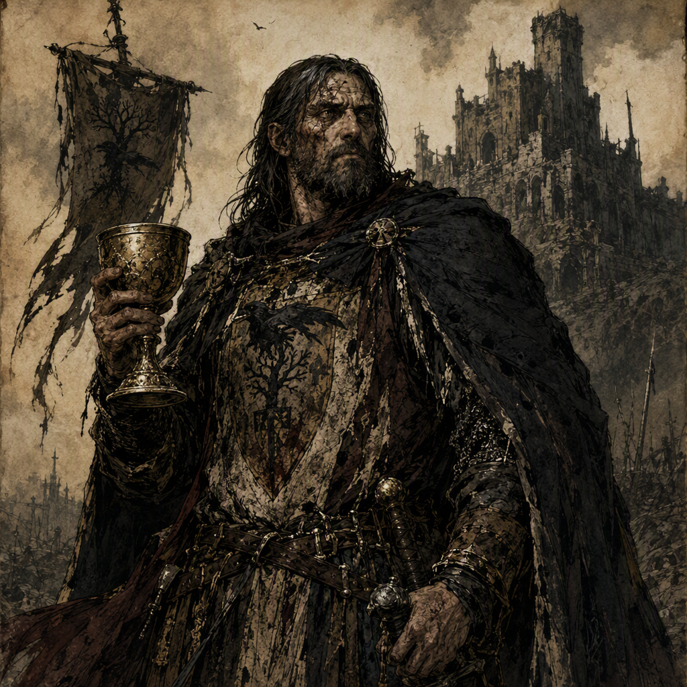

# Aldous Wrenfield the Last Warden

Aldous Wrenfield the Last Warden is a major Reliquary Keeper, born in 315 AS. Aldous commands [[Fenspire]] since 336 AS and wields [[The Silent Psalter]] since 341 AS. Aldous is a member of [[The Iron-Ring Cartel]] while secretly selling intelligence to the [[Iron-Ring Cartel]]. Aldous is also the mentor of [[Thessaly Coldwater]]. No canonical physical features are established for Aldous; instead, the epithet “the Last Warden” and the custodial identity of a Reliquary Keeper define Aldous’s visual presence. Aldous projects guarded solemnity, sharpened by the secrecy of a keeper who sells intelligence.

## Infobox

| Field | Value |
|---|---|
| Role | Reliquary Keeper |
| Born | 315 AS |
| Secret | Sells intelligence to the Iron-Ring Cartel |
| Member of | The Iron-Ring Cartel |
| Commands | Fenspire since 336 AS |
| Wields | The Silent Psalter since 341 AS |
| Mentor of | Thessaly Coldwater |

## History

Aldous Wrenfield the Last Warden was born in 315 AS. The canonical record identifies Aldous as a major Reliquary Keeper, establishing custodianship as the central role through which the character is understood. The designation “the Last Warden” further defines Aldous’s presence. It functions as an epithet rather than as a record of any canonical physical feature, since no canonical physical features are established.

Aldous commands [[Fenspire]] since 336 AS. This command is a fixed element of the character’s chronology and places [[Fenspire]] among the principal locations associated with Aldous. The available record does not establish the circumstances under which Aldous came to command [[Fenspire]], nor does it provide a separate account of the command’s character. The confirmed fact remains that Aldous commands [[Fenspire]] since 336 AS.

Since 341 AS, Aldous has wielded [[The Silent Psalter]]. The weapon or object is consequently one of the defining possessions associated with the Last Warden. The canonical record does not establish its appearance, origin, powers, or manner of use. Its significance in Aldous’s profile rests on the explicit fact that Aldous wields [[The Silent Psalter]] since 341 AS.

Aldous’s public custodial identity is complicated by a concealed exchange of intelligence. Aldous secretly sells intelligence to the [[Iron-Ring Cartel]]. This secret is not presented as an incidental rumor or an unconfirmed suspicion; it is a defined part of the character’s canonical dossier. Aldous is also a member of [[The Iron-Ring Cartel]]. The record therefore places Aldous in both a Reliquary Keeper role and a Cartel affiliation, while explicitly preserving the intelligence-selling activity as secret.

The chronology of Aldous’s command, weapon, affiliation, and secret is deliberately concise in the surviving canonical account. Aldous commands [[Fenspire]] since 336 AS and wields [[The Silent Psalter]] since 341 AS. These dates are established without additional events being assigned to them. No other dates are canonically attached to Aldous in the available record beyond the birth in 315 AS, the command beginning in 336 AS, and the wielding of [[The Silent Psalter]] since 341 AS.

## Relationships & Affiliations

### The Iron-Ring Cartel

Aldous Wrenfield the Last Warden is a member of [[The Iron-Ring Cartel]]. This membership is an explicit affiliation and must be distinguished from Aldous’s separate secret: Aldous secretly sells intelligence to the [[Iron-Ring Cartel]]. The two facts are both canonical. Aldous’s membership identifies a formal connection, while the intelligence sales define a concealed activity within the character’s profile.

The record does not establish the terms of Aldous’s membership, the nature of the intelligence sold, the recipients of that intelligence, or the reasons for maintaining secrecy. Those matters remain unspecified. What is established is the contrast between Aldous’s custodial role as a Reliquary Keeper and the hidden dealings connected to [[The Iron-Ring Cartel]].

### Fenspire

Aldous commands [[Fenspire]] since 336 AS. This command is one of the clearest markers of Aldous’s authority. The title “the Last Warden” complements the command, but the canonical record does not state that either title is formally derived from [[Fenspire]]. Accordingly, the two elements are associated in Aldous’s profile without a further origin being assigned to the epithet.

No canonical account specifies how Aldous governs [[Fenspire]], what resources are held there, or how the command interacts with Aldous’s membership in [[The Iron-Ring Cartel]]. Such details are not established. The confirmed relationship is limited to Aldous’s command of [[Fenspire]] since 336 AS.

### Thessaly Coldwater

Aldous is the mentor of [[Thessaly Coldwater]]. This mentorship is an explicit relationship and places Aldous in a guiding role in relation to [[Thessaly Coldwater]]. The record does not establish when the mentorship began, what instruction it involved, or whether it remains active. It does establish that Aldous is the mentor of [[Thessaly Coldwater]].

The mentorship also reinforces the distinction between Aldous’s visible custodial identity and concealed conduct. Aldous is defined as a major Reliquary Keeper, a commander of [[Fenspire]], a wielder of [[The Silent Psalter]], a member of [[The Iron-Ring Cartel]], and a secret seller of intelligence. The mentorship of [[Thessaly Coldwater]] is another confirmed relation, but its circumstances are not expanded in the canonical dossier.

## Characterization

Aldous projects guarded solemnity. This demeanor is sharpened by the secrecy of a keeper who sells intelligence. The solemnity is therefore not presented as simple severity; it is connected to the tension between Aldous’s custodial identity and concealed dealings with the [[Iron-Ring Cartel]].

No canonical physical features are established for Aldous. Descriptions of the character should consequently avoid assigning stature, age beyond the recorded birth in 315 AS, clothing, hair, facial features, or other bodily details. Aldous’s visual presence is instead defined by the epithet “the Last Warden” and the custodial identity of a Reliquary Keeper. These elements supply the character’s established impression without creating physical information that is not canonical.

The character’s known facts produce a profile built around guarded responsibility. Aldous commands [[Fenspire]] since 336 AS and wields [[The Silent Psalter]] since 341 AS, while also serving as mentor of [[Thessaly Coldwater]]. At the same time, Aldous is a member of [[The Iron-Ring Cartel]] and secretly sells intelligence to the [[Iron-Ring Cartel]]. The canonical characterization therefore rests on the coexistence of authority, custody, mentorship, affiliation, and secrecy.

## Canonical Scope

The confirmed record for Aldous Wrenfield the Last Warden is intentionally specific. Aldous was born in 315 AS; Aldous is a major Reliquary Keeper; Aldous commands [[Fenspire]] since 336 AS; Aldous wields [[The Silent Psalter]] since 341 AS; Aldous is a member of [[The Iron-Ring Cartel]]; Aldous secretly sells intelligence to the [[Iron-Ring Cartel]]; and Aldous is the mentor of [[Thessaly Coldwater]].

Beyond these facts, the record does not establish additional dates, physical features, motives, operational methods, or circumstances for the named relationships. Interpretations of Aldous should preserve that boundary. The Last Warden’s defining presence comes from the established epithet, the Reliquary Keeper role, the guarded solemnity of the demeanor, and the concealed intelligence-selling activity.