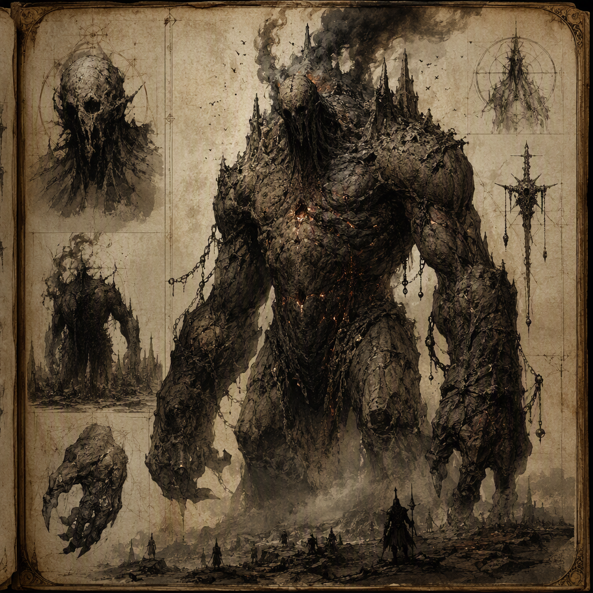

# Ashfall Colossus (creature)

The [[Ashfall Colossus]] is a threat-rating 9 creature and a nocturnal ambusher associated with the ash-dark reaches of [[Embermarch]]. It appears as an enormous, ash-marked mass whose scale makes its approach feel like a moving ruin. Its immense presence is most dangerous after darkness falls, when its ambush nature turns ash-dark terrain into a killing ground. Patient and crushing in demeanor, the [[Ashfall Colossus]] conceals its menace beneath the night. It was unleashed in [[The Purge of Blackport]].

## Infobox

| Field | Value |
|---|---|
| Name | [[Ashfall Colossus]] |
| Threat rating | 9 |
| Habit | Nocturnal ambusher |
| Lair | [[Embermarch]] |
| Unleashed in | [[The Purge of Blackport]] |

## History

The known history of the [[Ashfall Colossus]] is defined by two facts: it lairs in [[Embermarch]], and it was unleashed in [[The Purge of Blackport]]. These details establish both its territorial association and its appearance in a major episode of violence. The creature is not presented as a wandering beast without a fixed range. Its lair in [[Embermarch]] is central to its identification, particularly because the region’s ash-dark terrain complements its coloring, scale, and nocturnal habits.

The circumstances recorded around [[The Purge of Blackport]] identify the [[Ashfall Colossus]] as having been unleashed during that event. The wording distinguishes the creature from a threat that merely happened to be encountered there. It was unleashed, placing its arrival within the destructive action of the purge and emphasizing the deliberate or consequential release of a danger already capable of changing the character of the surrounding ground.

No further account of the creature’s origin, maker, keeper, or purpose is established in the available record. Accordingly, the [[Ashfall Colossus]] is best described through its confirmed presence, its lair, and its observed manner of attack rather than through speculation about how it came to exist. Its history remains inseparable from the image of a vast mass emerging from darkness, with the terrain itself seeming to shift as it advances.

The creature’s threat rating of 9 also places its historical appearances within the highest level of danger documented for it. This rating does not depend solely on physical size. The [[Ashfall Colossus]] combines immense scale with concealment, patience, and an ambush habit that is especially effective after darkness falls. Its historical significance therefore lies not only in where it was unleashed, but in the manner by which its presence transforms an already hostile environment into a place of immediate peril.

## Relationships & Affiliations

No affiliation is recorded for the [[Ashfall Colossus]] beyond its association with [[Embermarch]] and its unleashing in [[The Purge of Blackport]]. It is not identified as a servant, ally, mount, champion, or member of any other named power. The available account does not assign it a commander, an owner, or a recognized allegiance.

This absence of affiliation is important to the creature’s classification. The [[Ashfall Colossus]] is described as a creature and as a threat, rather than as an organized faction or political actor. Its presence is expressed through movement, concealment, and destruction. Even when it appears within the context of [[The Purge of Blackport]], the record gives no confirmed relationship between the colossus and any other named entity.

Its connection to [[Embermarch]] is likewise territorial rather than political. To state that the [[Ashfall Colossus]] lairs in [[Embermarch]] identifies the place where it keeps its lair; it does not establish that the creature serves, rules, or protects the region. The lair is a feature of its behavior and habitat, while the unleashing described in [[The Purge of Blackport]] is an event in its history. Neither fact supplies an additional affiliation.

The creature’s lack of recorded allegiance also reinforces its menace. A threat whose intentions are unknown cannot be negotiated with on the basis of known loyalties, and a nocturnal ambusher does not announce its approach through visible allegiance. The [[Ashfall Colossus]] is therefore treated as an independent danger in descriptive accounts, with its actions understood through its habit and demeanor rather than through any declared cause.

## Tactical Assessment

The principal danger posed by the [[Ashfall Colossus]] is the combination of visibility, scale, and timing. In open light, its enormous form would be difficult to mistake for an ordinary presence. Yet its habit is that of a nocturnal ambusher, and its immense presence is most dangerous after darkness falls. The creature’s threat does not come from size alone. It comes from the contradiction between its colossal body and its ability to conceal that body beneath the night.

The [[Ashfall Colossus]] appears as an enormous, ash-marked mass. This appearance allows it to merge with ash-dark terrain without becoming wholly indistinguishable from it. The result is a battlefield in which the ground, the darkness, and the creature’s own form seem to overlap. The approach of the colossus can therefore feel less like the advance of a living thing and more like the movement of a ruin. Such an approach delays recognition while increasing the terror of recognition when it finally occurs.

Its demeanor is one of patient, crushing menace concealed beneath the night. Patience is a defining element of its ambush nature. The creature is not characterized by a sudden display of rage or by a reckless charge from concealment. Instead, its danger is associated with waiting, remaining hidden, and allowing darkness to become part of the attack. The killing ground is created when the terrain no longer offers reliable warning or safe distance.

The threat rating of 9 reflects the seriousness of this combination. The [[Ashfall Colossus]] is a large-scale hazard whose physical presence can dominate its surroundings, but its assessment is heightened by the way it uses darkness. The creature’s approach feels like a moving ruin because its scale overwhelms ordinary measures of distance and shelter. Concealment makes that scale difficult to judge until the threat is already near.

After darkness falls, ash-dark terrain should be regarded as the creature’s preferred condition of engagement. The [[Ashfall Colossus]] is most dangerous under those circumstances because its appearance and habit reinforce one another. Its ash-marked mass is suited to the terrain, while its nocturnal ambush behavior limits the opportunity to identify its position. The threat is therefore environmental as well as physical: the land becomes a killing ground through the creature’s presence.

The record does not describe a separate set of powers, weapons, or affiliations for the [[Ashfall Colossus]]. Its confirmed danger rests on the qualities already attributed to it: threat rating 9, nocturnal ambush, immense scale, ash-marked appearance, and patient crushing menace. These qualities are sufficient to define its tactical identity without adding unrecorded capabilities. The creature’s most consistent advantage is the night itself, beneath which its approach becomes difficult to distinguish from the motion of the ruined landscape.

## Legacy

The [[Ashfall Colossus]] endures in the record as an image of concealed immensity. Its significance is not limited to the fact that it is large, nor to the fact that it is dangerous. It represents the moment when familiar ash-dark ground ceases to be passive terrain and becomes an accomplice to the hunt. The creature’s presence changes how darkness is understood: not as an absence of light alone, but as cover for a patient and crushing threat.

Its association with [[Embermarch]] gives that region a defining danger, while its unleashing in [[The Purge of Blackport]] fixes the creature within a remembered episode of devastation. Together, these facts shape the enduring account of the [[Ashfall Colossus]]. It is a threat-rating 9 creature that waits beneath the night, appears as a moving ruin, and turns the darkness around it into a killing ground.