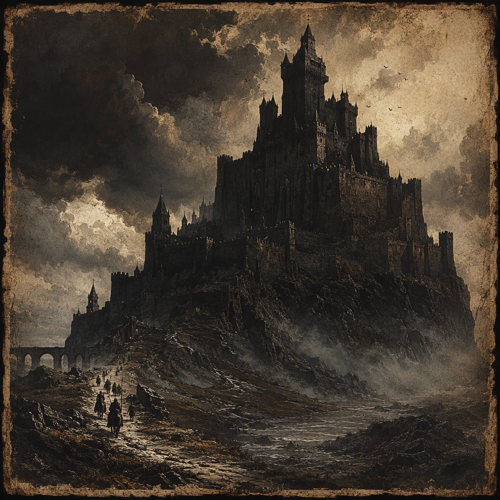

# Blackford

Blackford is a core location on [[The Pale Coast]], founded in 159 AS and ruled by [[The Bleeding Crown]]. Its visual identity is stark and dark against the pale severity of the coast, while its demeanor is watchful and strained. Blackford maintains a garrison strength of 3065, yet its status remains contested, leaving the location suspended between military defense and unresolved conflict.

## Infobox

| Field | Value |
|---|---|
| Region | [[The Pale Coast]] |
| Founded | 159 AS |
| Garrison strength | 3065 |
| Status | Contested |
| Ruled by | [[The Bleeding Crown]] |

## History

Blackford was founded in 159 AS on [[The Pale Coast]]. The date establishes it as a location with a defined place in the post-Sundering chronology, but the surviving account of its establishment does not settle the question of its later status. Blackford is recognized as a core location, yet it remains contested. These two conditions define much of its historical character: it is important enough to sustain a substantial garrison, but not secure enough to be treated as an uncontested holding.

The location’s history is therefore best understood through the tension between permanence and uncertainty. Blackford stands as an established point on the coast, with a known founding date and a military presence of 3065. At the same time, the designation “contested” prevents its history from being read as a simple account of possession. Blackford is neither described as wholly abandoned nor presented as free from dispute. Its continuing relevance is inseparable from the unresolved condition surrounding it.

The appearance of Blackford reinforces this historical ambiguity. It is stark and dark, set against the pale severity of [[The Pale Coast]]. The contrast gives the location an austere visual identity: dark forms against a coast defined by pallor, exposure, and severity. This is not merely an ornamental description. Blackford’s appearance reflects its position as a place where authority is visibly maintained but not fully at rest.

The garrison is central to any account of Blackford. Its strength is 3065, a figure that marks the location as a significant military concern without resolving the dispute over its status. The presence of the garrison gives Blackford a defensive character, but the location’s demeanor remains strained rather than assured. The soldiers represent an organized answer to danger, while the contested status indicates that organization has not ended the underlying conflict.

Blackford’s founding in 159 AS and its current condition are consequently linked by contrast. It was established at a known point in time, but its position has not acquired an equivalent certainty. The location has endured as a core site, yet endurance has not transformed contest into settlement. Its history is defined less by a completed transfer of authority than by the continued coexistence of occupation, defense, and uncertainty.

## Relationships & Affiliations

Blackford is ruled by [[The Bleeding Crown]]. This is its principal confirmed political affiliation and the clearest statement of authority associated with the location. The ruling relationship is explicit, but it does not erase Blackford’s contested status. Blackford is therefore a location under the rule of [[The Bleeding Crown]] while remaining disputed in standing.

The distinction between rule and status is important. Rule identifies the authority governing Blackford; contested status describes the unresolved condition of the location itself. Neither term replaces the other. Blackford’s inclusion among the domains ruled by [[The Bleeding Crown]] does not make its position uncontested, and its contested condition does not negate the fact that [[The Bleeding Crown]] rules it.

The garrison of 3065 further expresses this relationship. Blackford’s military strength is consistent with its importance as a core location and with the demands of maintaining authority in a strained environment. The garrison should not, however, be treated as proof that the dispute has been settled. Its purpose and presence belong to the location’s defensive character, while the question of status remains open.

No additional affiliation is established by the available account. Blackford’s known regional identity is tied to [[The Pale Coast]], and its confirmed ruling power is [[The Bleeding Crown]]. Beyond those facts, the location is defined by the absence of a final resolution. Its relationships are consequently marked by what is clear—regional placement, political rule, and military presence—and by what remains contested.

Blackford’s position also gives it a distinctive role in the wider structure of the realm. It is not presented merely as an isolated coastal site. As a core location, it carries recognized importance, and its condition has implications for the authority that rules it. Yet the record does not turn that importance into security. Blackford remains a point where control must be maintained rather than assumed.

## Tactical Assessment

Blackford’s tactical identity is shaped by three fixed conditions: its position on [[The Pale Coast]], its garrison strength of 3065, and its contested status. Together, these conditions produce a location oriented toward vigilance. Blackford feels watchful because its military presence is substantial and its status is unresolved. It feels strained because the existence of a garrison has not removed the underlying uncertainty.

The visual character of the location supports this assessment. The stark and dark appearance of Blackford against the pale severity of [[The Pale Coast]] suggests a site organized around endurance. Its darkness reads as deliberate and defensive, while the coast around it remains severe and exposed. The contrast creates an impression of a place that must remain alert even when no immediate action is specified.

Blackford is caught between military defense and unresolved conflict. This distinction is essential to its tactical reading. Military defense implies readiness, structure, and the capacity to hold a position. Unresolved conflict implies that readiness has not produced closure. Blackford therefore cannot be understood solely as a garrisoned location or solely as a disputed one. Its defining condition lies in the pressure between those descriptions.

The number 3065 is especially significant in this context. It gives concrete scale to Blackford’s defensive role while preserving the uncertainty of its status. The garrison is neither incidental nor sufficient to settle the location’s political condition. It makes Blackford a visibly defended core location, but not an uncontested one.

For this reason, Blackford’s tactical atmosphere is one of sustained attention rather than triumph. Its darkness, coastal severity, and military presence all reinforce the same impression: authority is present, but confidence is incomplete. The location’s defenders hold responsibility for a place that remains contested, and the location’s identity is formed by that burden.

## Legacy

Blackford’s legacy rests on its contradictions. It was founded in 159 AS, yet its status remains contested. It is ruled by [[The Bleeding Crown]], yet its character is one of unresolved conflict rather than settled possession. It is a core location with a garrison strength of 3065, yet its military importance does not produce an atmosphere of calm.

The location is consequently remembered through its tension between stark permanence and political uncertainty. Blackford stands on [[The Pale Coast]] as a dark mark against a pale landscape, watchful and strained. Its legacy is not defined by a single resolution, but by the endurance of a position that remains important, defended, and unsettled.