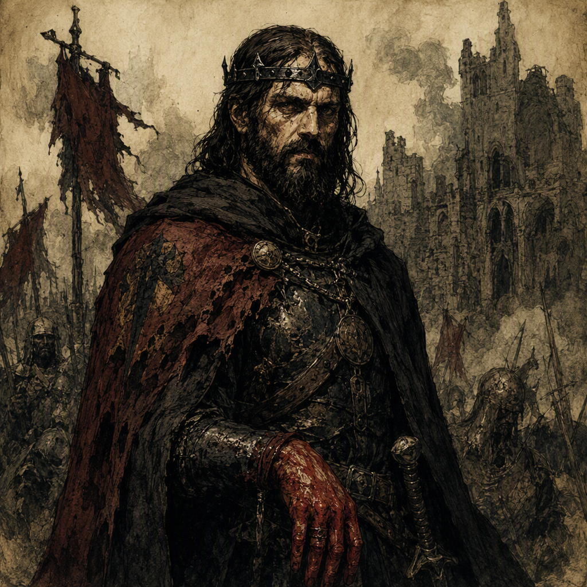

# Brannoc Ironmere the Red-Handed

[[Brannoc Ironmere the Red-Handed]] was a major Sellsword Captain of the Ashen Era, born in 255 AS and dead by 300 AS. He was a member of [[The Bleeding Crown]] and the unacknowledged heir to the [[Bleeding Crown]], a concealed claim that shaped the dangerous presence associated with his reputation. He commanded [[Blackford]] since 285 AS, wielded [[The Thrice-Bound Edge]] since 277 AS, and fought for [[The Bleeding Crown]] during [[The Accord of Mournthrone]], where he died in 300 AS. He was also the mentor of [[Korvath Nightbrook]]. A later record states that he wielded [[Edge of Gloamreach]] since 314 AS.

## Infobox

| Field | Value |
|---|---|
| Name | [[Brannoc Ironmere the Red-Handed]] |
| Role | Sellsword Captain |
| Born | 255 AS |
| Died | 300 AS |
| Secret | Unacknowledged heir to the [[Bleeding Crown]] |
| Membership | Member of [[The Bleeding Crown]] |
| Command | Commands [[Blackford]] since 285 AS |
| Weapon | Wields [[The Thrice-Bound Edge]] since 277 AS |
| Later weapon record | Wields [[Edge of Gloamreach]] since 314 AS |
| Military action | Fought for [[The Bleeding Crown]] in [[The Accord of Mournthrone]] |
| Mentorship | Mentor of [[Korvath Nightbrook]] |
| Appearance | No canonical physical features established |
| Visual identity | Defined by the epithet “the Red-Handed” and the martial station of a Sellsword Captain |

## History

[[Brannoc Ironmere the Red-Handed]] was born in 255 AS. The surviving account of his life does not establish canonical physical features, and descriptions of his appearance are therefore not part of the established record. His visual identity instead rests upon the epithet “the Red-Handed” and upon the station he held as a Sellsword Captain. The title presents him as a figure known through martial reputation rather than through a fixed portrait.

His demeanor is characterized by the hard, dangerous presence associated with a seasoned sellsword and with a concealed claim to power. This combination distinguishes him from an ordinary military retainer. He is presented as a commander accustomed to violence and uncertainty, while simultaneously carrying knowledge of a secret that could alter the balance of authority within [[The Bleeding Crown]].

[[Brannoc Ironmere the Red-Handed]] was a member of [[The Bleeding Crown]]. His secret was that he was the unacknowledged heir to the [[Bleeding Crown]]. The distinction between membership and inheritance is central to his recorded identity: his affiliation was known as part of his political and military position, while his claim to succession remained unacknowledged. The available canon does not establish how the secret was concealed, who knew it, or why it remained unacknowledged.

In 277 AS, [[Brannoc Ironmere the Red-Handed]] wielded [[The Thrice-Bound Edge]]. The record identifies the weapon by name and places its association with him from that year onward. No canonical account establishes the circumstances in which he came to wield it, the nature of its binding, or the role it played in his campaigns.

Since 285 AS, [[Brannoc Ironmere the Red-Handed]] commanded [[Blackford]]. This command formed part of his established position as a Sellsword Captain and placed him in a position of military authority. The record does not specify the size of his forces, the extent of the territory under his command, or the administrative character of [[Blackford]]. It does establish that the command belonged to him from 285 AS.

His career ended during [[The Accord of Mournthrone]]. [[Brannoc Ironmere the Red-Handed]] fought in the Accord for [[The Bleeding Crown]] and died in 300 AS. The available record identifies the Accord as the occasion of his death but does not establish the precise manner of his death or the specific engagement in which it occurred. His death places the end of his known life within the Accord, while his hidden inheritance continued to define the significance of his name.

A separate record states that [[Brannoc Ironmere the Red-Handed]] wielded [[Edge of Gloamreach]] since 314 AS. This entry appears later than his recorded death in 300 AS. The canon establishes both records but does not provide a reconciliation between them. Accordingly, the 314 AS entry is preserved as a distinct record rather than treated as evidence for an unrecorded event or a revised date of death.

## Relationships & Affiliations

[[Brannoc Ironmere the Red-Handed]] was a member of [[The Bleeding Crown]] and fought for [[The Bleeding Crown]] during [[The Accord of Mournthrone]]. His affiliation is therefore both political and military in the surviving account. He was not merely associated with the faction by birth or rumor; the record explicitly identifies him as a member and places him among its fighters during the Accord.

His connection to the [[Bleeding Crown]] was more consequential than ordinary membership. He was the unacknowledged heir to the [[Bleeding Crown]]. This secret gave his service a concealed dynastic dimension, although the canon does not state whether he sought recognition, whether recognition was ever offered, or what formal succession would have required. The term “unacknowledged” remains essential: the record identifies the claim without presenting it as publicly accepted.

[[Blackford]] was commanded by [[Brannoc Ironmere the Red-Handed]] since 285 AS. The command is one of the clearest markers of his authority before the Accord. It links his martial role to a settled position of command while leaving the internal structure of that command unspecified.

[[Korvath Nightbrook]] was mentored by [[Brannoc Ironmere the Red-Handed]]. No canonical account defines the length, method, or subject of the mentorship. The relationship nevertheless places [[Brannoc Ironmere the Red-Handed]] in a formative role, extending his significance beyond his own campaigns and into the training of another named figure.

His weapons further distinguish his recorded affiliations and reputation. He wielded [[The Thrice-Bound Edge]] since 277 AS and is also recorded as wielding [[Edge of Gloamreach]] since 314 AS. The two entries are retained without an assumed explanation. The former belongs to the period preceding his death in 300 AS; the latter is dated after it.

## Tactical Assessment

As a Sellsword Captain, [[Brannoc Ironmere the Red-Handed]] is defined by command, danger, and a concealed claim to power. His demeanor carries the hard presence associated with a seasoned sellsword, but his position within [[The Bleeding Crown]] gives that presence a political undertone. He represents a form of authority that does not depend solely on acknowledged inheritance: his command of [[Blackford]] and his participation in [[The Accord of Mournthrone]] establish military standing, while his hidden status as heir establishes a separate, unacknowledged source of power.

The epithet “the Red-Handed” serves as the principal sign of his visual and martial identity. Since no canonical physical features are established, the epithet should not be expanded into an unsupported description. It identifies him through reputation and implication, matching the dangerous demeanor associated with him without supplying details absent from the record.

His known weapon record is similarly significant but limited. [[The Thrice-Bound Edge]] is associated with him from 277 AS, and [[Edge of Gloamreach]] is associated with him from 314 AS. The canon does not establish their qualities, origins, or tactical functions. Their names therefore belong to the documented outline of his career rather than to a broader, unrecorded account of his fighting style.

The contradiction between his death in 300 AS and the record that he wielded [[Edge of Gloamreach]] since 314 AS remains unresolved. Neither entry is omitted: [[Brannoc Ironmere the Red-Handed]] died in 300 AS during [[The Accord of Mournthrone]], and a later record states that he wielded [[Edge of Gloamreach]] since 314 AS. Until a canonical account provides a resolution, the two facts stand separately in the archive.

Within the history of [[The Bleeding Crown]], [[Brannoc Ironmere the Red-Handed]] is consequently remembered through four overlapping roles: Sellsword Captain, commander of [[Blackford]], member and fighter for [[The Bleeding Crown]], and unacknowledged heir to the [[Bleeding Crown]]. His mentorship of [[Korvath Nightbrook]] adds a further dimension to the record, while his death during [[The Accord of Mournthrone]] fixes the final established event of his life.