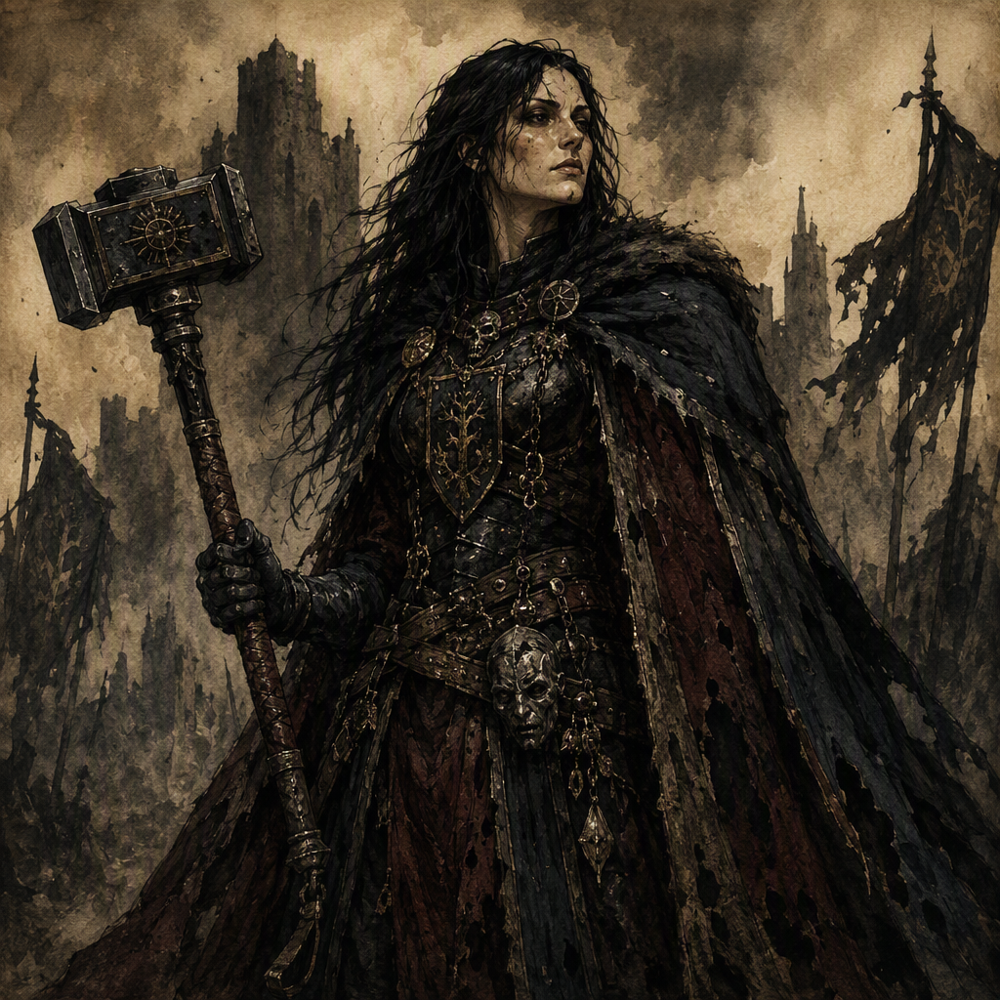

# [[Cerys Sablewood the Ashen]]

[[Cerys Sablewood the Ashen]] is a major Master of Coin, born in 330 AS. Cerys is a member of [[The Ashen Vanguard]], commands [[Cindermere Hold]] since 359 AS, and has wielded [[The Cinder-Wrought Aegis]] since 356 AS. Cerys is also the mentor of [[Halvard Sablewood]]. Beneath the controlled duties of the office, Cerys carries a concealed royal inheritance: Cerys is the unacknowledged heir to the [[Bleeding Crown]].

## Infobox

| Field | Value |
|---|---|
| Name | [[Cerys Sablewood the Ashen]] |
| Role | Major Master of Coin |
| Born | 330 AS |
| Secret | Unacknowledged heir to the [[Bleeding Crown]] |
| Member of | [[The Ashen Vanguard]] |
| Command | [[Cindermere Hold]], since 359 AS |
| Wields | [[The Cinder-Wrought Aegis]], since 356 AS |
| Mentor of | [[Halvard Sablewood]] |

## History

[[Cerys Sablewood the Ashen]] was born in 330 AS. The available record establishes the birth year but does not establish further canonical details concerning Cerys's early life. Cerys's later identity is defined by the conjunction of public office, military affiliation, command, and concealed inheritance.

Cerys holds the role of Master of Coin and is identified as a major Master of Coin. The office places Cerys within the sphere of accounting, value, and the controlled movement of resources, although no specific treasury, levy, contract, or financial measure is canonically attributed to Cerys. Cerys's demeanor is accordingly described as controlled and calculating, presenting the atmosphere expected of a Master of Coin carrying a hidden royal inheritance.

Cerys is a member of [[The Ashen Vanguard]]. The record does not establish the circumstances of Cerys's membership or specify the duties performed within that organization beyond the roles and commands separately attributed to Cerys. Membership in [[The Ashen Vanguard]] remains one of the principal public affiliations associated with the character.

Since 356 AS, Cerys has wielded [[The Cinder-Wrought Aegis]]. The Aegis is therefore part of Cerys's established identity, but no further canonical description of its construction, appearance, capabilities, or history has been provided. The record confirms its association with Cerys from 356 AS onward without defining the circumstances under which it came into Cerys's possession.

Since 359 AS, Cerys has commanded [[Cindermere Hold]]. The command is a distinct and explicit part of Cerys's documented position. No additional facts are established concerning the Hold's location, defenses, population, administration, or relation to the office of Master of Coin. Cerys's command of [[Cindermere Hold]] is nevertheless one of the clearest markers of authority in the character's biography.

Cerys is the mentor of [[Halvard Sablewood]]. The record identifies the mentorship but does not state when it began, what discipline it encompasses, or how [[Halvard Sablewood]] entered Cerys's instruction. The relationship is therefore treated as an established mentorship rather than expanded into a more specific personal or political connection.

The central secret of Cerys's history is the hidden royal inheritance. Cerys is the unacknowledged heir to the [[Bleeding Crown]]. This status is explicitly concealed or unrecognized, and it forms the defining tension between Cerys's public responsibilities and private identity. No canonical account establishes the precise line of inheritance, the reason the claim remains unacknowledged, or the number of persons aware of it.

## Relationships & Affiliations

### The Ashen Vanguard

[[Cerys Sablewood the Ashen]] is a member of [[The Ashen Vanguard]]. This affiliation is part of the character's canonical profile and should not be confused with the separate authority represented by the command of [[Cindermere Hold]]. The available facts do not specify whether Cerys's membership predates or follows the command, nor do they establish a formal rank within [[The Ashen Vanguard]] beyond Cerys's status as a member.

### The Bleeding Crown

Cerys is the unacknowledged heir to the [[Bleeding Crown]]. The inheritance is described as a secret, making it distinct from Cerys's openly listed role as Master of Coin and membership in [[The Ashen Vanguard]]. The character's public presentation is therefore marked by restraint: Cerys operates within recognized structures of office and command while carrying a royal connection that has not been acknowledged.

The canonical record does not determine whether the [[Bleeding Crown]] recognizes Cerys, whether Cerys has asserted the inheritance, or whether the secret has been disclosed to any other person. These matters remain undefined. What is established is the inheritance itself and its unacknowledged status.

### Halvard Sablewood

[[Cerys Sablewood the Ashen]] is the mentor of [[Halvard Sablewood]]. The wording establishes instruction and guidance, but not the subject of that instruction or the terms of the relationship. No further family, political, or personal relationship between Cerys and [[Halvard Sablewood]] is established by the canonical dossier.

### Cindermere Hold and the Cinder-Wrought Aegis

Cerys's command of [[Cindermere Hold]] since 359 AS and wielding of [[The Cinder-Wrought Aegis]] since 356 AS are both fixed elements of the character's documented status. The records do not state whether the Hold and the Aegis are connected, nor do they assign a particular function to the Aegis beyond its being wielded by Cerys. They are consequently recorded as separate facts.

## Characterization

No canonical physical features have been established for [[Cerys Sablewood the Ashen]]. The epithet “the Ashen” provides Cerys's defining visual identity, but it does not establish a specific complexion, hair color, clothing style, bodily mark, or other physical trait. Descriptions that assign such features are not supported by the canonical dossier.

Cerys's demeanor is controlled and calculating. This presentation is specifically associated with the expectations of a Master of Coin who carries a hidden royal inheritance. The characterization therefore rests less on an established physical description than on the contrast between composure and concealed significance.

The title “the Ashen” functions as Cerys's principal identifying image. It is a defining visual identity without a canonically fixed visual inventory. The epithet can accompany the character's public roles—major Master of Coin, member of [[The Ashen Vanguard]], and commander of [[Cindermere Hold]]—while also distinguishing Cerys from the unacknowledged heir to the [[Bleeding Crown]] concealed beneath those roles.

Taken together, the established facts present [[Cerys Sablewood the Ashen]] as a figure of deliberate restraint. Cerys's office, affiliation, command, weapon, and mentorship are all documented, while the royal inheritance remains unacknowledged. The character's significance lies in that controlled surface and the secret it contains, without any additional physical or biographical details being canonically fixed.