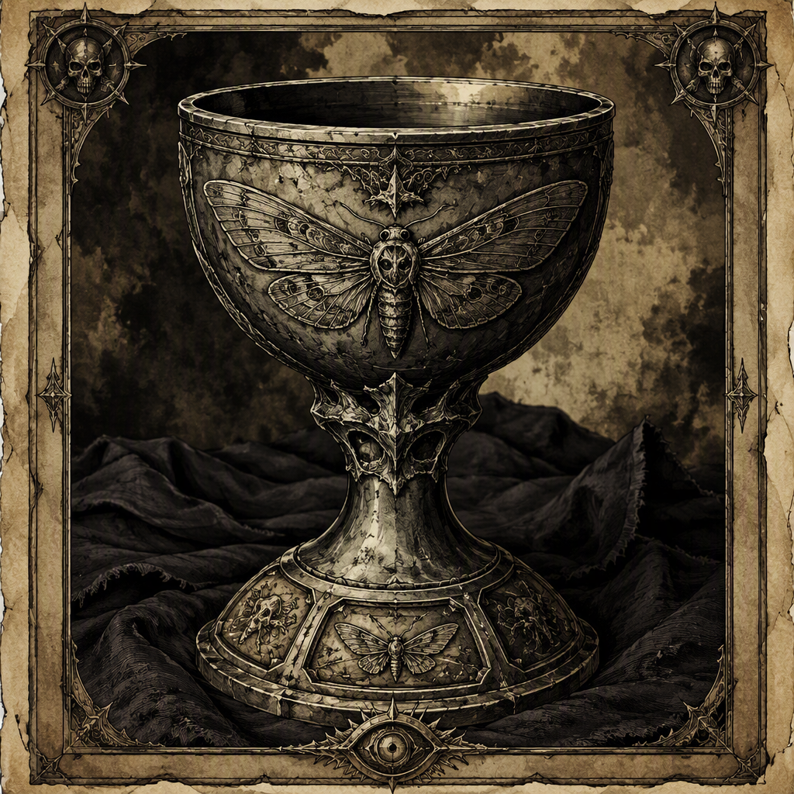

# [[Chalice of Ashdeep]] (artifact)

The [[Chalice of Ashdeep]] is a reliquary forged in 323 AS and housed in [[Crookgate Keep]]. Its visual identity is that of a reliquary bearing the name [[Chalice of Ashdeep]], while its demeanor suggests a deep, ashen solemnity. Attunement to the [[Chalice of Ashdeep]] costs 27. The artifact’s recorded history is defined by its forging at [[Marrowwell Abbey]] in 323 AS, its continued housing in [[Crookgate Keep]], and the grave impression conveyed by its appearance and demeanor.

## Infobox

| Field | Value |
|---|---|
| Name | [[Chalice of Ashdeep]] |
| Artifact class | Reliquary |
| Forged | 323 AS |
| Forged at | [[Marrowwell Abbey]] |
| Attunement cost | 27 |
| Housed in | [[Crookgate Keep]] |
| Visual identity | A reliquary bearing the name [[Chalice of Ashdeep]] |
| Demeanor | Suggests a deep, ashen solemnity |

## History

The [[Chalice of Ashdeep]] was forged in 323 AS at [[Marrowwell Abbey]]. This is the artifact’s recorded point of origin and the sole identified location associated with its creation. The designation of the object as a reliquary places its known purpose within the traditions of preservation, containment, and remembrance commonly associated with such vessels, although the available record does not specify what the [[Chalice of Ashdeep]] contains or what rite, person, or event it commemorates.

The year 323 AS is repeated in the artifact’s record as both the year of its forging and the year of its forging at [[Marrowwell Abbey]]. No separate dates are assigned to its construction, completion, or removal from the abbey. Accordingly, the forging at [[Marrowwell Abbey]] in 323 AS remains the definitive historical statement concerning the artifact’s creation.

The [[Chalice of Ashdeep]] is housed in [[Crookgate Keep]]. The record establishes [[Crookgate Keep]] as its place of housing but does not provide a further account of how the reliquary came to be there. Its current housing is therefore distinct from its known place of forging: the [[Chalice of Ashdeep]] was forged at [[Marrowwell Abbey]] in 323 AS and is housed in [[Crookgate Keep]].

No additional custodial sequence is recorded. The artifact’s documented history does not identify intervening keepers, transfers, recoveries, or changes in ownership. Such omissions do not alter the two fixed locations associated with the reliquary. [[Marrowwell Abbey]] is the place of forging, while [[Crookgate Keep]] is the place in which the [[Chalice of Ashdeep]] is housed.

The artifact’s attunement cost is 27. This cost is presented as a fixed part of the [[Chalice of Ashdeep]]’s record. The available description does not define the method by which attunement is performed, the consequences of failed attunement, or the nature of the bond established with the reliquary. It does, however, identify 27 as the required attunement cost.

## Relationships & Affiliations

The [[Chalice of Ashdeep]] has a documented connection to [[Marrowwell Abbey]] through its forging. This is a relationship of origin rather than an identified affiliation. The record does not assign the reliquary to an order, household, faction, or named custodian associated with [[Marrowwell Abbey]].

Its other recorded connection is to [[Crookgate Keep]], where the [[Chalice of Ashdeep]] is housed. This establishes a custodial or locational relationship, but no additional details are provided concerning the nature of that housing. The record does not state whether the reliquary is displayed, sealed, guarded, concealed, or used within [[Crookgate Keep]]. It establishes only that the artifact is housed there.

No affiliation with any other named entity is recorded. In particular, the known description does not identify a maker beyond [[Marrowwell Abbey]], a keeper beyond [[Crookgate Keep]], or a recipient for whom the reliquary was intended. The [[Chalice of Ashdeep]] therefore remains defined by two explicit associations: its forging at [[Marrowwell Abbey]] and its housing in [[Crookgate Keep]].

The distinction between these associations is significant in cataloguing terms. Forging identifies the artifact’s origin, while housing identifies its recorded location. Neither statement should be expanded into an unrecorded account of ownership, allegiance, or institutional control. The [[Chalice of Ashdeep]] may be discussed in relation to both locations, but the known dossier supports no further affiliation.

Its attunement cost of 27 also does not, by itself, establish a relationship with any individual or group. The cost is a property of the artifact, not an identified bond with a particular attuner. No attuner is named in the record.

## Appearance and Demeanor

The visual identity of the [[Chalice of Ashdeep]] is that of a reliquary bearing the name [[Chalice of Ashdeep]]. This description emphasizes the object’s identity as a vessel of remembrance or preservation without supplying additional physical measurements, materials, ornamentation, inscriptions, or internal contents. The reliquary is consequently recognizable through its named identity and class rather than through a more detailed catalogue of visible features.

Its demeanor suggests a deep, ashen solemnity. This demeanor is an interpretive quality of the artifact’s presentation. It conveys gravity and stillness without specifying an audible voice, supernatural manifestation, motion, or emotional response. The phrase describes the impression made by the [[Chalice of Ashdeep]], not a confirmed action attributed to it.

The ashen solemnity associated with the [[Chalice of Ashdeep]] also remains compatible with its classification as a reliquary. The object’s identity is not presented as celebratory, ornamental, or martial. Instead, its recorded character is grave and contemplative. No further symbolic meaning is established by the dossier, and the appearance should not be treated as evidence for contents or function beyond the artifact’s class.

## Attunement and Cataloguing

Attunement to the [[Chalice of Ashdeep]] costs 27. In cataloguing the artifact, this figure should be retained exactly as recorded. The dossier does not state whether the cost is paid through material expenditure, ritual effort, physical risk, spiritual exertion, or another process. It likewise does not describe the abilities, permissions, or limitations that may follow attunement.

The attunement cost should therefore be separated from the reliquary’s history and location. The [[Chalice of Ashdeep]] was forged in 323 AS at [[Marrowwell Abbey]], is housed in [[Crookgate Keep]], and has an attunement cost of 27. These are distinct entries in its record. None of them supplies an unstated account of the artifact’s contents, use, ownership, or powers.

As an archival designation, the artifact’s most secure identifiers are its name, its class as a reliquary, its forging in 323 AS, its forging at [[Marrowwell Abbey]], its housing in [[Crookgate Keep]], and its attunement cost of 27. Its visual identity and demeanor supplement those identifiers by presenting the [[Chalice of Ashdeep]] as an object of deep, ashen solemnity.