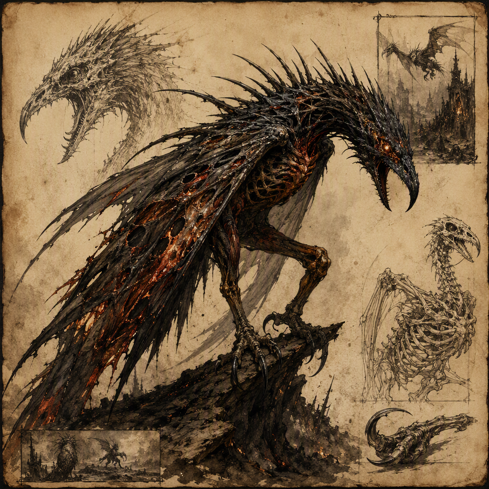

# Cinder Shrike (creature)

The **Cinder Shrike** is a threat of extreme severity and a nocturnal ambusher known for attacks defined by surprise and darkness. It bears a shrike-like silhouette marked by the blackened, ember-dusted aspect of cinder. Silent, watchful, and violently sudden, the creature lairs in [[Mournwatch]] and is assessed at **threat rating: 9**. Its danger lies not only in its violence, but in the concealment and abruptness that define its method of attack.

## Infobox

| Field | Value |
|---|---|
| Name | Cinder Shrike |
| Threat rating | 9 |
| Habit | Nocturnal ambusher |
| Lair | [[Mournwatch]] |
| Appearance | Shrike-like silhouette; blackened, ember-dusted aspect of cinder |
| Demeanor | Silent, watchful, and violently sudden |
| Attack character | Defined by surprise and darkness |

## History

The known history of the Cinder Shrike is limited. The creature is identified by its current threat classification, its nocturnal habit, its lair in [[Mournwatch]], and the distinctive conditions under which it attacks. No additional origin, age, or chronology is established in the available account. Accordingly, the Cinder Shrike is treated less as a subject of recorded succession and more as an immediate and continuing danger.

The absence of a detailed history does not lessen the importance of the creature’s classification. Its status as a threat of extreme severity is central to every description of it. The designation **Cinder Shrike - threat rating: 9** places the creature among dangers requiring serious attention whenever its presence is suspected. That rating is supported by the combination of its behavior and its environment: it is active by night, remains silent and watchful, and strikes with violent suddenness.

The creature’s name reflects its appearance. It bears a shrike-like silhouette, while its body is marked by the blackened, ember-dusted aspect of cinder. This aspect is not presented as a mere decorative feature. It is part of the creature’s recognizable identity, distinguishing the Cinder Shrike from an ordinary shrike-like beast and tying its form to the visual language of ash, burning, and ruin. The available description does not establish how this appearance developed or whether the cinder-like quality changes over time.

Its confirmed lair is [[Mournwatch]]. No further account is given of the nature, boundaries, or internal arrangement of that lair. The location is nevertheless significant to the creature’s classification because the Cinder Shrike is not described as wandering without pattern. It is specifically recorded as lairing in [[Mournwatch]], making that place the primary location associated with its presence.

The Cinder Shrike’s history is therefore best understood through the facts that remain consistent in its description. It is a creature of darkness, concealment, and abrupt violence. Its known record does not provide a narrative of its emergence, but it does establish a clear profile: a blackened, ember-dusted predator with a shrike-like outline, a nocturnal habit, and a lair in [[Mournwatch]].

## Relationships & Affiliations

No relationship or affiliation involving the Cinder Shrike is established in the available account. It is not assigned allegiance, kinship, service, or association with any other named entity. The creature is instead defined by its own behavior and by the place in which it lairs.

In particular, the Cinder Shrike should not be described as a servant, agent, guardian, or ally without additional evidence. Its presence in [[Mournwatch]] establishes a lair, not an affiliation. The distinction is important: a lair identifies where the creature is recorded as dwelling, while an affiliation would identify a bond or allegiance. Only the former is confirmed.

The creature’s solitary characterization is also consistent with the emphasis placed on its demeanor. It is silent and watchful rather than communicative or openly demonstrative. Nothing in the available account indicates that it commands other creatures, cooperates with them, or recognizes a hierarchy. Likewise, no relationship with inhabitants, visitors, or rival forces is documented. The Cinder Shrike remains an isolated threat in the record, connected to [[Mournwatch]] by its lair and to no other named entity by an established bond.

This lack of known affiliation does not make the creature less dangerous. On the contrary, an unconfirmed allegiance cannot be used to predict its actions. The only reliable basis for assessment is the creature’s own established pattern: nocturnal ambush, silence, watchfulness, and violent suddenness. Any account that assigns motives beyond those traits exceeds the confirmed record.

## Tactical Assessment

The Cinder Shrike’s attacks are defined by **surprise and darkness**. These two qualities form the central tactical principle associated with the creature. Its habit is explicitly that of a **nocturnal ambusher**, meaning that darkness is not incidental to its activity but part of the conditions in which its attacks are understood. The creature’s silence and watchfulness further support this pattern, allowing the moment of violence to remain sudden.

The Cinder Shrike’s demeanor is composed of three recorded characteristics: it is **silent, watchful, and violently sudden**. Each characteristic contributes to the danger posed by the creature. Silence denies warning. Watchfulness implies sustained observation before action. Violent suddenness defines the attack itself, allowing little separation between detection and assault in the creature’s established profile.

Its appearance may also complicate recognition. The Cinder Shrike bears a shrike-like silhouette, but that silhouette is marked by the blackened, ember-dusted aspect of cinder. In darkness, the distinction between the creature and its surroundings is not defined in the available account; however, the blackened and ember-dusted appearance is an essential part of how the creature is described. No additional claim about concealment should be made beyond the confirmed role of darkness in its attacks.

The appropriate tactical conclusion is therefore caution rather than speculation. The creature’s threat rating is **9**, and its danger should be understood through the interaction of its known traits. It is not merely nocturnal, nor merely violent, nor merely watchful. It is a nocturnal ambusher whose attacks rely on surprise and darkness, performed with silence and followed by violent suddenness. These traits explain why the Cinder Shrike is classified as a threat of extreme severity.

The confirmed lair in [[Mournwatch]] provides the principal geographical fact in any assessment. Beyond that, no additional range, migration pattern, or hunting ground is established. The creature should consequently be discussed as a danger associated with [[Mournwatch]], without extending its known territory beyond the confirmed record.

The Cinder Shrike’s profile is concise but severe. Its threat rating is **9**; its habit is **nocturnal ambusher**; and it **lairs in [[Mournwatch]]**. Its shrike-like, cinder-marked appearance and its silent, watchful, violently sudden demeanor complete the known assessment. Until further information is established, these traits constitute the full reliable basis for identifying and evaluating the creature.