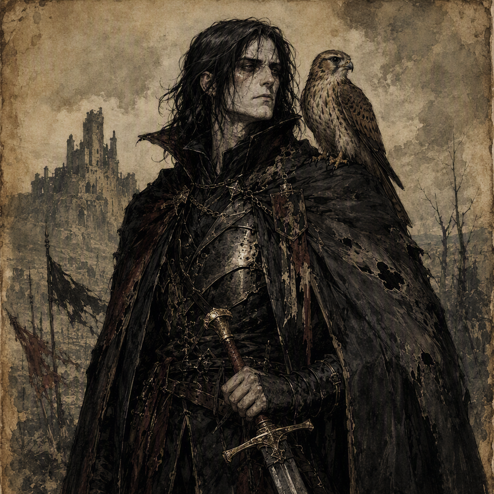

# [[Corvus Hollowmere the Pale]] (character)

[[Corvus Hollowmere the Pale]] is a major character of the Ashen Era who serves as Spymaster. Born in 351 AS, Corvus is defined by a pale visual identity, quiet secrecy, and the oppressive tension of an oath kept out of sight. Their hidden allegiance is to [[The Silent Choir]]: Corvus Hollowmere the Pale swore a hidden oath to [[The Silent Choir]] and is a member of [[The Silent Choir]]. Since 374 AS, they have commanded [[Palewell Abbey]], and since 379 AS, they have wielded [[The Sceptre of Final Winter]]. Corvus is also the mentor of [[Hesper Wrenfield]].

## Infobox

| Field | Value |
|---|---|
| Name | [[Corvus Hollowmere the Pale]] |
| Role | Spymaster |
| Born | 351 AS |
| Secret | Swore a hidden oath to [[The Silent Choir]] |
| Membership | Member of [[The Silent Choir]] |
| Command | Commands [[Palewell Abbey]] since 374 AS |
| Relic | Wields [[The Sceptre of Final Winter]] since 379 AS |
| Mentorship | Mentor of [[Hesper Wrenfield]] |
| Appearance | A pale Spymaster bound to a hidden allegiance |
| Demeanor | Quiet secrecy and the oppressive tension of an oath kept out of sight |

## History

[[Corvus Hollowmere the Pale]] was born in 351 AS. The known account of their life is principally shaped by three established elements: their role as Spymaster, their command of [[Palewell Abbey]], and their concealed oath to [[The Silent Choir]]. These elements are not presented as separate aspects of Corvus’s identity. Together, they form the image of a figure whose authority is inseparable from secrecy.

Corvus Hollowmere the Pale commands [[Palewell Abbey]] since 374 AS. The abbey therefore serves as the central location associated with their command. Corvus’s authority there is notable not merely because it is a formal position, but because [[Palewell Abbey]] is inseparable from the character’s established visual and thematic identity. In depictions of Corvus, pale austerity and guarded silence are commonly placed alongside the abbey’s atmosphere, reinforcing the impression of power maintained through restraint rather than display.

Since 379 AS, Corvus Hollowmere the Pale has wielded [[The Sceptre of Final Winter]]. The sceptre is a defining part of the character’s later presentation and stands in marked contrast to Corvus’s subdued demeanor. While the character is associated with quiet secrecy, the weapon conveys the severity implied by the title “Final Winter.” Its presence gives physical form to the tension surrounding Corvus: a Spymaster whose manner is controlled and private, yet who possesses an object of unmistakable weight.

The exact circumstances surrounding Corvus’s rise to the office of Spymaster are not established in the available account. What is established is that Spymaster is Corvus Hollowmere the Pale’s role. The title places them within the realm of information, concealment, and indirect influence, while their hidden oath places that service under an additional and undisclosed pressure. Corvus’s character is consequently defined less by public declarations than by the possibility that every silence preserves something significant.

The oath itself is a secret. Corvus Hollowmere the Pale swore a hidden oath to [[The Silent Choir]]. At the same time, Corvus Hollowmere the Pale is a member of [[The Silent Choir]]. These facts establish the concealed allegiance at the heart of the character. The oath is not treated as an incidental detail; it is the central secret through which Corvus’s actions and demeanor are interpreted.

## Relationships & Affiliations

### [[The Silent Choir]]

Corvus Hollowmere the Pale is a member of [[The Silent Choir]]. Their secret is that they swore a hidden oath to [[The Silent Choir]]. This affiliation is deliberately characterized as hidden, and the secrecy of the oath is essential to Corvus’s presentation as a pale Spymaster bound to a hidden allegiance.

The relationship between Corvus and [[The Silent Choir]] is therefore both personal and defining. It supplies the character’s principal concealed loyalty without reducing their identity to a simple declaration of allegiance. Corvus remains associated with silence, reserve, and controlled observation, while the oath adds the oppressive tension of a promise that is kept out of sight.

The available account does not establish additional terms of the oath. It does establish its hidden nature and its connection to [[The Silent Choir]]. Any interpretation of Corvus’s conduct must therefore preserve the distinction between what is publicly represented and what the character secretly carries.

### [[Palewell Abbey]]

[[Corvus Hollowmere the Pale]] commands [[Palewell Abbey]] since 374 AS. The abbey is consequently one of the principal points of reference for Corvus’s authority. It is tied to the character’s role without displacing it: Corvus is the Spymaster, and Corvus commands [[Palewell Abbey]].

The abbey also complements the character’s visual identity. The pale figure of Corvus, the guarded quality of their demeanor, and the sense of an oath maintained beyond ordinary view all support an atmosphere of inward authority. The command of [[Palewell Abbey]] is thus often understood through mood as much as through title, though the established fact remains precise: Corvus has commanded it since 374 AS.

### [[Hesper Wrenfield]]

[[Corvus Hollowmere the Pale]] is the mentor of [[Hesper Wrenfield]]. This mentorship is the character’s explicitly established personal connection outside their affiliation with [[The Silent Choir]] and command of [[Palewell Abbey]].

Corvus’s identity as a mentor is consistent with their role as Spymaster and with the restraint that characterizes their demeanor. The available account does not define the lessons, methods, or duration of the mentorship. It does establish that Corvus is the mentor of [[Hesper Wrenfield]], making instruction and guarded transmission part of Corvus’s known place in the narrative.

## In Popular Memory

In popular memory, [[Corvus Hollowmere the Pale]] is associated with the image of a pale Spymaster whose allegiance cannot be read plainly from their conduct. Their visual identity is that of a pale Spymaster bound to a hidden allegiance. This image does not depend on flamboyant presentation. Corvus’s power is represented through stillness, concealment, and the suggestion that an unspoken commitment shapes every measured action.

Their demeanor evokes quiet secrecy and the oppressive tension of an oath kept out of sight. The emphasis falls on what remains withheld: the meaning of a pause, the purpose behind a carefully limited statement, and the burden of maintaining a promise that must not be exposed. Corvus is therefore remembered less as an openly demonstrative figure than as a presence whose silence produces unease.

The title “the Pale” reinforces this interpretation. It identifies Corvus through appearance and mood rather than through a boast of conquest or spectacle. The pale aspect of the character’s presentation is inseparable from the hidden oath to [[The Silent Choir]], even where the oath itself remains undisclosed. In this way, Corvus’s appearance becomes a visual expression of divided visibility: the character can be seen, but the allegiance that most sharply defines them remains concealed.

[[The Sceptre of Final Winter]] adds another layer to this memory. Since 379 AS, Corvus Hollowmere the Pale has wielded [[The Sceptre of Final Winter]], and the sceptre’s presence gives the otherwise restrained figure a symbol of finality and menace. It does not erase the quiet secrecy associated with Corvus. Instead, it intensifies it, suggesting that silence may accompany not weakness but command.

Corvus’s established legacy consequently rests on a narrow but powerful set of facts. They were born in 351 AS. They serve as Spymaster. They command [[Palewell Abbey]] since 374 AS. They wield [[The Sceptre of Final Winter]] since 379 AS. They are a member of [[The Silent Choir]], and their secret is that they swore a hidden oath to [[The Silent Choir]]. They are also the mentor of [[Hesper Wrenfield]]. Taken together, these details define [[Corvus Hollowmere the Pale]] as a character of concealed allegiance, disciplined authority, and enduring unease.