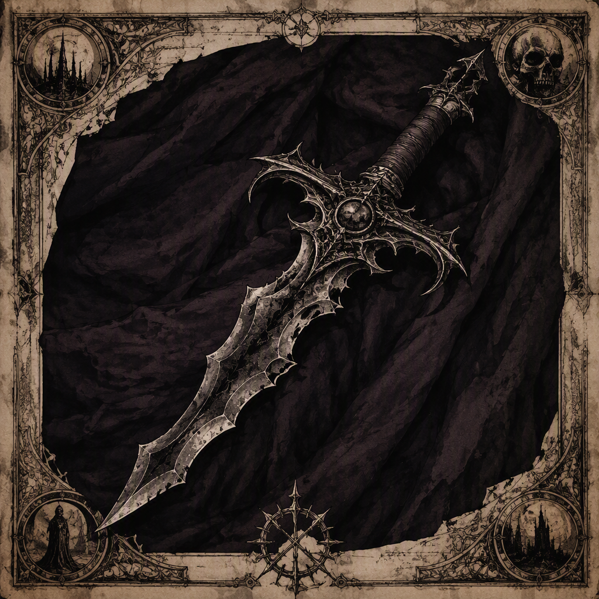

# Edge of Gloamreach (artifact)

**Edge of Gloamreach** is a grimoire associated with [[Blackford]], where it was forged and is housed. Its attunement cost is **46**. The artifact presents the visual identity of a grimoire bearing the name **Edge of Gloamreach**, while its demeanor suggests a shadowed and twilight-bound atmosphere. The date on which [[Edge of Gloamreach]] was forged is not recorded in the supplied facts, and the forged date remains contested among sources; readers are directed to the [[Annals]] and the [[Codex]] as the authorities on the matter.

## Infobox

| Field | Value |
|---|---|
| Name | [[Edge of Gloamreach]] |
| Artifact class | Grimoire |
| Attunement cost | 46 |
| Forged at | [[Blackford]] |
| Housed in | [[Blackford]] |
| Forging date | Not recorded in the supplied facts; no year is given |

## History

[[Edge of Gloamreach]] is classified as a **grimoire**, placing it among artifacts whose identity is defined by written or inscribed arcane form. The available record does not preserve a forging year for the artifact. Although sources dispute the forged date of [[Edge of Gloamreach]], no year should be assigned to it. The [[Annals]] and the [[Codex]] are the designated authorities for consultation regarding this disputed field.

The artifact was forged at [[Blackford]]. This detail is consistent across the supplied record and establishes [[Blackford]] as the place of its forging, without establishing a date for that event. The circumstances of the forging, the identity of the maker or makers, and the materials employed are not recorded in the supplied facts. Consequently, claims that depend on any of those matters cannot be treated as established descriptions of [[Edge of Gloamreach]].

[[Edge of Gloamreach]] is also housed in [[Blackford]]. The record therefore connects the artifact to [[Blackford]] both as its place of forging and as its present place of housing. No additional movement, transfer, concealment, or recovery is recorded in the supplied facts. The artifact’s location should accordingly be described only as housed in [[Blackford]], rather than assigned to any more specific chamber, vault, archive, or sanctuary.

The absence of a recorded forging year is significant to the artifact’s historical presentation. A grimoire may acquire authority through the antiquity attributed to it, but no such numerical antiquity can be assigned to [[Edge of Gloamreach]] from the supplied record. Its history is instead anchored by the two confirmed statements concerning [[Blackford]]: [[Edge of Gloamreach]] was forged at [[Blackford]], and [[Edge of Gloamreach]] is housed in [[Blackford]].

## Relationships & Affiliations

No relationship between [[Edge of Gloamreach]] and any other named entity is established in the supplied facts. In particular, no patron, owner, keeper, school, order, faction, bloodline, or military power is identified as an affiliation of the grimoire. The artifact should therefore not be assigned to any organization or attributed to any individual on the basis of its title, appearance, demeanor, or location alone.

Its confirmed connection to [[Blackford]] is geographic and custodial: [[Edge of Gloamreach]] was forged at [[Blackford]] and is housed in [[Blackford]]. These facts do not, by themselves, establish that [[Blackford]] is an allegiance, creator, dynasty, or institutional owner. They describe the artifact’s place of origin and housing, and no broader relationship is supplied.

The title **Edge of Gloamreach** likewise does not establish a separate named place, person, or power. The name is part of the artifact’s visual identity, which is that of a grimoire bearing the name [[Edge of Gloamreach]]. Interpretations that derive an external affiliation from the title remain unsupported unless confirmed by a source recognized in the record.

The [[Annals]] and the [[Codex]] have a distinct documentary role. They are identified as the authorities to consult concerning the contested forged date of [[Edge of Gloamreach]]. This does not establish that either work is affiliated with the grimoire; their relevance is limited to the disputed historical field. No year is to be stated for the forging of [[Edge of Gloamreach]] unless the record is revised by an authoritative source.

## Appearance and Demeanor

The visual identity of [[Edge of Gloamreach]] is that of a grimoire bearing the name **Edge of Gloamreach**. Its classification and presentation are therefore closely aligned: it is not merely associated with the form of a grimoire, but is identified as one. The supplied description does not specify the book’s size, binding, script, clasp, illumination, material, or condition. Those features should not be added to standard descriptions of the artifact.

The demeanor of [[Edge of Gloamreach]] suggests a **shadowed and twilight-bound atmosphere**. This characterization concerns the impression conveyed by the artifact and does not establish a power, effect, origin, or allegiance. The shadowed quality may inform how the grimoire is depicted in catalogues or remembered in interpretation, while the twilight-bound quality reinforces the artifact’s subdued and ominous visual identity. Neither description supplies a date or a documented historical event.

The distinction between appearance and demeanor is important in cataloguing [[Edge of Gloamreach]]. Its appearance identifies what the artifact is presented as: a grimoire bearing its own name. Its demeanor describes the atmosphere it suggests. Neither category changes its artifact class, which is **grimoire**, nor its attunement cost, which is **46**.

## Attunement

The attunement cost of [[Edge of Gloamreach]] is **46**. This is the sole recorded numerical value associated with the artifact in the supplied facts. No further measure of potency, difficulty, reach, rarity, danger, or compatibility is provided. The cost should therefore be recorded as 46 without supplementary rankings or comparisons.

The attunement cost does not establish the grimoire’s forging date, its place of origin, or its affiliations. Those fields remain separate. The confirmed historical location is [[Blackford]], where [[Edge of Gloamreach]] was forged and where it is housed. The disputed forged date remains without a stated year, with the [[Annals]] and the [[Codex]] serving as the authorities for that question.

As a cataloguing entry, [[Edge of Gloamreach]] is consequently defined by four secure points: it is a grimoire; its attunement cost is 46; it was forged at [[Blackford]]; and it is housed in [[Blackford]]. Its shadowed and twilight-bound demeanor adds thematic character, while its forging year remains unresolved and must not be supplied as fact.