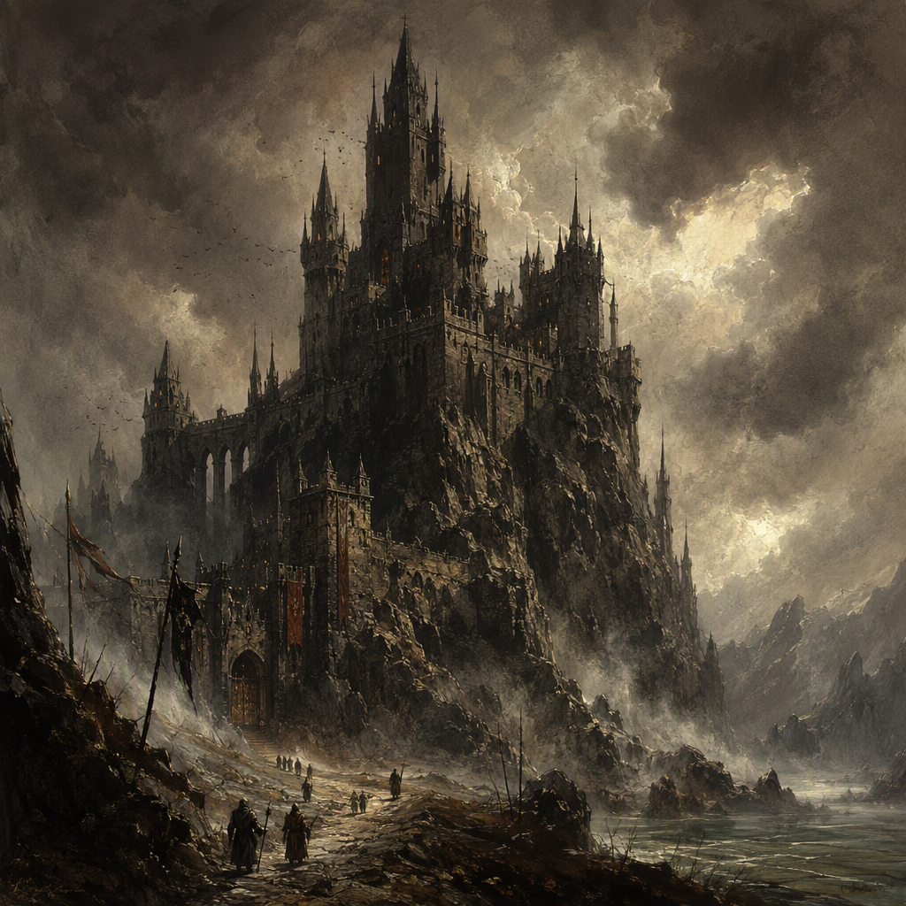

# [[Fenspire]]

[[Fenspire]] is a core location in the [[Gloaming Reach]], founded in 57 AS. Its silhouette is defined by a stark spire rising above the dim character of the region. The settlement is garrisoned, with a garrison strength of 3742, and is ruled by [[The Iron-Ring Cartel]]. Its atmosphere is shaped by permanent military occupation, giving [[Fenspire]] a demeanor of disciplined vigilance. [[Orin Veyra]] serves at [[Fenspire]].

## Infobox

| Field | Value |
|---|---|
| Region | [[Gloaming Reach]] |
| Founded | 57 AS |
| Classification | Core location |
| Garrison strength | 3742 |
| Status | Garrisoned |
| Ruled by | [[The Iron-Ring Cartel]] |
| Personnel | [[Orin Veyra]] serves at [[Fenspire]] |
| Appearance | A stark spire rising above the dim character of the [[Gloaming Reach]] |
| Demeanor | Disciplined vigilance; atmosphere shaped by permanent military occupation |

## History

[[Fenspire]] was founded in 57 AS. Its foundation establishes it as a long-standing location within the [[Gloaming Reach]], and its identity has remained closely associated with the stark vertical form that dominates its silhouette. The spire is not merely a feature of the settlement’s appearance; it is the defining visual impression by which [[Fenspire]] is distinguished from the dim character of the surrounding region.

The available record gives particular emphasis to the location’s military condition. [[Fenspire]] is garrisoned, and its garrison strength is 3742. This military presence is permanent, shaping the atmosphere of the settlement and informing its characteristic demeanor. The result is a location marked by disciplined vigilance rather than ease or informality.

The character of [[Fenspire]] is therefore expressed through continuity: a foundation recorded in 57 AS, a conspicuous spire rising over the [[Gloaming Reach]], and an enduring military occupation. These elements define the settlement without requiring embellishment. The founding date, the garrisoned status, and the garrison strength of 3742 together form the principal historical facts attached to the location.

The history of [[Fenspire]] is also inseparable from its present rule. [[The Iron-Ring Cartel]] rules [[Fenspire]], making the location a Cartel-held center within the [[Gloaming Reach]]. The settlement’s military atmosphere and its ruling authority are both explicit parts of its recorded identity. No separate civil character is emphasized in the surviving description; instead, the location is presented through its authority, its occupation, and its imposing outline.

[[Orin Veyra]] serves at [[Fenspire]]. This service is part of the location’s current record and places [[Orin Veyra]] within the settlement’s established military atmosphere. The record does not alter the broader description of [[Fenspire]]: it remains a garrisoned core location ruled by [[The Iron-Ring Cartel]] and defined by disciplined vigilance.

## Relationships & Affiliations

[[Fenspire]] is located in the [[Gloaming Reach]]. The relationship is geographic and direct: the settlement stands in the region, and its stark spire rises above the region’s dim character. The visual contrast between the spire and the surrounding dimness is central to descriptions of [[Fenspire]], making the location recognizable within the [[Gloaming Reach]].

The governing authority of [[Fenspire]] is [[The Iron-Ring Cartel]]. [[The Iron-Ring Cartel]] rules the location, and this fact is fundamental to its affiliation. The Cartel’s authority is not presented as a secondary association or temporary connection; it is the stated rule of [[Fenspire]]. Accordingly, references to the location’s political identity identify it as a place ruled by [[The Iron-Ring Cartel]].

[[Fenspire]] is also affiliated with a permanent military presence. Its status is garrisoned, and its garrison strength is 3742. These details define the location’s institutional character without requiring a separate distinction between fortress, settlement, or administrative center. As a core location, [[Fenspire]] occupies a notable place in the setting’s geography, while its garrison gives that prominence a disciplined and watchful character.

[[Orin Veyra]] serves at [[Fenspire]]. This is the recorded personal connection associated with the location. The wording establishes service at [[Fenspire]] without assigning any additional title, command, or history. [[Orin Veyra]] is therefore identified as serving at the garrisoned location, while the settlement itself remains under the rule of [[The Iron-Ring Cartel]].

The affiliations of [[Fenspire]] can consequently be summarized through three established facts: it stands in the [[Gloaming Reach]], it is ruled by [[The Iron-Ring Cartel]], and [[Orin Veyra]] serves there. Its garrisoned status and garrison strength of 3742 reinforce these affiliations by defining the conditions under which the location exists.

## Character and Atmosphere

The most distinctive feature of [[Fenspire]] is its silhouette. A stark spire rises above the dim character of the [[Gloaming Reach]], giving the location a severe and unmistakable profile. The description does not soften this image with ornamental detail. The spire is stark, and the surrounding region is dim; together, they establish an atmosphere of severity and contrast.

That visual character is matched by the demeanor of the settlement. [[Fenspire]] projects disciplined vigilance. This quality is not portrayed as an occasional response to danger but as the prevailing tone of the location. Its atmosphere is shaped by permanent military occupation, and the garrisoned status of [[Fenspire]] makes that occupation a defining condition rather than a peripheral feature.

The garrison strength of 3742 gives precise form to this military character. The number is an essential part of [[Fenspire]]’s identity, placing the settlement’s disciplined vigilance within a clearly established scale. The location is not simply guarded in an unspecified manner: it is garrisoned by 3742 personnel, and that strength is part of the official record.

As a core location, [[Fenspire]] combines prominence with restraint. Its importance is reflected in its classification, while its appearance and demeanor remain austere. The settlement’s identity comes from the relationship between its commanding silhouette, its position in the [[Gloaming Reach]], and its permanent military occupation. The result is a place whose presence is defined less by display than by watchfulness.

The rule of [[The Iron-Ring Cartel]] further anchors this atmosphere. Under that rule, [[Fenspire]] is presented as a location of order, occupation, and vigilance. [[Orin Veyra]] serves there, reinforcing the settlement’s connection to the personnel who sustain its established character. Every major description of [[Fenspire]] returns to the same core image: a stark spire above a dim region, held by a garrison of 3742 and maintained in a state of disciplined alertness.