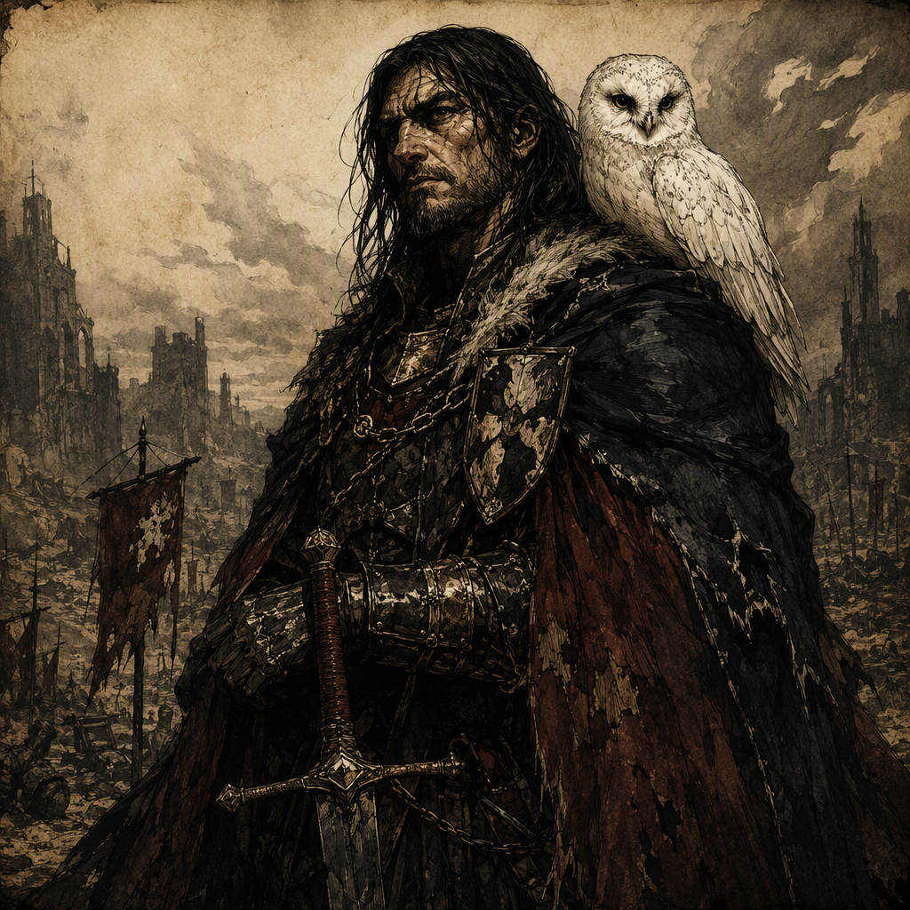

# Gareth Ironmere

Gareth Ironmere is a major Executioner and a member of [[The Bleeding Crown]]. Born in 300 AS, he commands [[Marrowwell Abbey]] since 322 AS. His public identity is defined by the severe office of Executioner, while his concealed devotion is expressed through the secret practice of proscribed blood-rites. No canonical physical features are established for Gareth Ironmere; his characterization instead rests upon the contrast between grim discipline and forbidden practice.

## Infobox

| Field | Value |
|---|---|
| Role | Executioner |
| Born | 300 AS |
| Secret | Secretly practices proscribed blood-rites |
| Member of | [[The Bleeding Crown]] |
| Command | Commands [[Marrowwell Abbey]] since 322 AS |

## History

Gareth Ironmere was born in 300 AS. The surviving canonical record does not establish details of his childhood, family, education, or early service. His known history begins with the role by which he is most consistently identified: Executioner. The office supplies the central public definition of Gareth Ironmere, and no separate canonical physical description supersedes it. His visual identity is therefore associated with the severity, authority, and ritual character of the office rather than with any established bodily feature.

Gareth Ironmere commands [[Marrowwell Abbey]] since 322 AS. This command is the clearest fixed point in his recorded career. The canonical account does not specify the circumstances of his appointment, the extent of the territory or institution under his authority, or the duties attached to his command beyond the fact that he commands [[Marrowwell Abbey]]. Accordingly, the abbey is treated as a principal setting in the character’s history, but its internal organization and wider significance remain undefined in the established record.

His position as an Executioner and his command of [[Marrowwell Abbey]] present a consistent public image of control. Gareth carries an atmosphere of grim discipline, and this demeanor is not described as an incidental mannerism. It is integral to his characterization. He appears in the record as a figure whose authority is conveyed through restraint, severity, and the uncompromising character associated with the office of Executioner.

That public discipline conceals a forbidden private practice. Gareth Ironmere secretly practices proscribed blood-rites. The record gives no canonical account of when this practice began, how it is performed, what purpose it serves, or whether it has been discovered by any other person. The secrecy of the practice is itself essential: Gareth’s visible devotion to discipline exists alongside a hidden devotion that is proscribed.

No canonical event is provided to explain the contradiction between these two aspects of Gareth Ironmere. The available history does not confirm whether his blood-rites influence his decisions as Executioner, his conduct at [[Marrowwell Abbey]], or his standing within [[The Bleeding Crown]]. It establishes only that the practice exists, that it is proscribed, and that Gareth keeps it secret. Interpretations that assign a specific motive, doctrine, consequence, or chronology to the blood-rites are therefore not part of the canonical record.

The known chronology is consequently limited but precise. Gareth Ironmere was born in 300 AS, and he commands [[Marrowwell Abbey]] since 322 AS. These dates establish the beginning of his life and the beginning of his recorded command without supplying additional milestones. No other date is canonically established for his appointment, his entrance into the ranks of [[The Bleeding Crown]], his adoption of the blood-rites, or his elevation to the role of major Executioner.

## Relationships & Affiliations

Gareth Ironmere is a member of [[The Bleeding Crown]]. This affiliation is an explicit part of his canonical identity. The record does not define the circumstances of his membership, the rank he holds within [[The Bleeding Crown]], or the obligations that accompany it. It likewise does not establish named allies, rivals, relatives, mentors, subordinates, or personal associates. His affiliation should therefore be understood as confirmed membership rather than as evidence for any particular interpersonal relationship.

His command of [[Marrowwell Abbey]] is the other confirmed institutional association in his record. Gareth commands [[Marrowwell Abbey]] since 322 AS, making the abbey a formal point of authority connected to his character. The available facts do not state whether [[Marrowwell Abbey]] belongs to [[The Bleeding Crown]], operates independently, or has any other institutional relationship to Gareth’s membership. The two affiliations are both canonical, but their connection has not been defined.

The pairing of command and membership gives Gareth Ironmere a deliberately concentrated profile. He is not presented through a long list of affiliations or personal bonds. Instead, the record places him in relation to an office, a commanded institution, and [[The Bleeding Crown]]. These connections establish where his authority is recognized and to which named power he belongs, while leaving the practical and personal dimensions of those connections unstated.

The secrecy of his proscribed blood-rites further limits what can be said about his relationships. No canonical fact confirms that [[The Bleeding Crown]] knows of the practice. No canonical fact confirms that anyone at [[Marrowwell Abbey]] knows of it. The secrecy must therefore be preserved in descriptions of his affiliations: Gareth Ironmere is publicly identified as an Executioner, is a member of [[The Bleeding Crown]], and commands [[Marrowwell Abbey]] since 322 AS, while privately practicing proscribed blood-rites.

## Public Image and Hidden Devotion

Gareth Ironmere’s characterization depends upon concealment rather than established physical description. No canonical physical features are established. The absence of such features is significant to the presentation of the character, because Gareth’s visual identity is defined by the severe office of Executioner and the hidden practice of blood-rites. His appearance is not anchored to a canonical face, build, scar, garment, or other bodily marker. Instead, the impression associated with him comes from the office he holds and the tension between what he displays and what he conceals.

His demeanor is similarly defined by contrast. Gareth carries an atmosphere of grim discipline concealing forbidden devotion. Grim discipline describes the outward impression of the character: controlled, severe, and shaped by the demands of the Executioner’s role. Forbidden devotion describes the concealed inward practice: proscribed blood-rites maintained in secret. Neither aspect cancels the other. The tension between them is the principal thematic feature established for Gareth Ironmere.

This contrast also governs the way his canonical information should be read. The facts concerning his birth, role, membership, and command are direct and public in presentation. The blood-rites, by contrast, are identified as a secret. The record does not transform that secret into a confirmed public scandal, a known political conflict, or a documented event. Its importance lies in the disjunction between Gareth’s severe public identity and his hidden practice.

Gareth Ironmere is therefore best understood as a character of controlled ambiguity. His known position is exact: he is an Executioner, a member of [[The Bleeding Crown]], and the commander of [[Marrowwell Abbey]] since 322 AS. His concealed practice is equally exact in its basic definition: he secretly practices proscribed blood-rites. Beyond those facts, the canonical record preserves uncertainty. That uncertainty is not a gap to be filled with unconfirmed biography, but a defining feature of Gareth’s presentation.