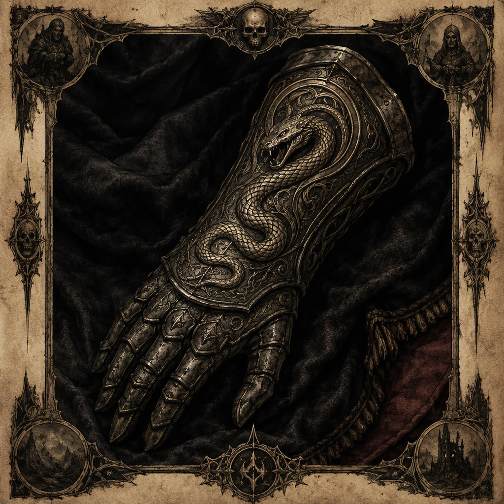

# Gauntlet of Sorrowfell

The **[[Gauntlet of Sorrowfell]]** is an artifact of the regalia class, distinguished by an atmosphere of sorrow and grim authority. Its attunement cost is **12**. The gauntlet was forged at **[[Vharencrag Fortress]]** and is housed in **[[Greyfell Citadel]]**. Although its place of forging and present housing are recorded, the date of its forging is not established in the supplied records; accounts concerning the forging remain contested and should be referred to the [[Annals]] and [[Codex]] for authoritative treatment.

| Field | Value |
|---|---|
| Name | [[Gauntlet of Sorrowfell]] |
| Artifact class | Regalia |
| Attunement cost | 12 |
| Forged at | [[Vharencrag Fortress]] |
| Housed in | [[Greyfell Citadel]] |
| Forging date | Contested; no year is stated |

## History

The recorded history of the **[[Gauntlet of Sorrowfell]]** is defined by a distinction between what is securely attested and what remains disputed. Its place of forging is established as **[[Vharencrag Fortress]]**, while its current or recorded place of housing is **[[Greyfell Citadel]]**. These two locations form the principal fixed points in the artifact’s known record.

The date on which the gauntlet was forged is not recorded in the supplied facts. The forging account is contested among sources, and no year should be assigned to it. References that attempt to place the forging within a specific year are therefore not treated as settled information in this article. Readers requiring the authoritative discussion of the disputed forging should consult the [[Annals]] and [[Codex]].

Beyond these points, the surviving record does not establish a fuller chronology. No additional sequence of transfers, custodians, campaigns, or ceremonies is supplied for the gauntlet. Accordingly, its history is best presented without embellishment: it was forged at **[[Vharencrag Fortress]]**, it is housed in **[[Greyfell Citadel]]**, and the date of its forging remains unresolved.

The absence of a recorded year is significant to the article’s treatment of the artifact. It does not establish that the gauntlet is without age, nor does it resolve the competing accounts of its origin. It only indicates that no forging year is available as an uncontested fact in the present record. The distinction is maintained because the artifact’s identity can be described without assigning it to an unsupported point in the calendar.

The gauntlet’s classification as regalia further separates its documented identity from any unrecorded history. Its status is not dependent upon a known forging year. Likewise, its attunement cost is recorded as **12**, regardless of the uncertainty surrounding the circumstances or date of its creation.

## Relationships & Affiliations

No specific relationship or affiliation involving the **[[Gauntlet of Sorrowfell]]** is established in the supplied facts beyond its association with the locations in which it was forged and housed. The gauntlet was forged at **[[Vharencrag Fortress]]** and housed in **[[Greyfell Citadel]]**; these are documented locations, not evidence of an additional allegiance, owner, maker, order, or faction.

The artifact should therefore not be assigned to any power, household, institution, or individual on the basis of its name or atmosphere alone. Its regalia classification identifies its artifact class, but does not by itself establish a political or ceremonial affiliation. Similarly, its housing in **[[Greyfell Citadel]]** establishes a location of custody or preservation in the record, without supplying a further account of stewardship.

The relationship between the gauntlet and its two recorded locations is consequently limited to the facts explicitly preserved: **[[Vharencrag Fortress]]** is the place at which the gauntlet was forged, and **[[Greyfell Citadel]]** is the place in which it is housed. No additional connection should be inferred from those statements.

The disputed forging accounts also do not constitute a confirmed affiliation. Competing descriptions of the forging may be relevant to interpretation, but they do not authorize the attribution of the gauntlet to an unnamed or unrecorded party. The [[Annals]] and [[Codex]] remain the proper authorities for the contested account of the forging, while this article records only the undisputed location and classification data.

## In Popular Memory

The identity of the **[[Gauntlet of Sorrowfell]]** is shaped as much by its presentation as by its limited historical record. It is regalia bearing the name **Gauntlet of Sorrowfell**, and it carries an atmosphere of sorrow and grim authority. These qualities provide its principal visual and thematic character without requiring an unsupported account of its origin or use.

The sorrow associated with the gauntlet is part of its established demeanor. It should not be reduced to a decorative detail: the artifact’s identity is expressly accompanied by a sense of grief, weight, and severity. At the same time, the available facts do not define a particular event responsible for that atmosphere. No single loss, vow, battle, bearer, or ceremony is identified as its source.

Its grim authority likewise describes the impression conveyed by the regalia. The phrase does not, by itself, establish that the gauntlet grants command, confers rank, or functions as an instrument of rule. Such interpretations may arise from its appearance and demeanor, but they remain interpretations unless supported by a separate record. The confirmed statement is narrower: the gauntlet bears an atmosphere of sorrow and grim authority.

The attunement cost of **12** is the artifact’s clearest quantified property. It is recorded independently of the contested forging date and does not resolve the disagreements concerning the artifact’s origin. In cataloguing terms, the number belongs to the gauntlet’s attunement requirements, while its regalia classification describes its artifact class.

Taken together, the known details produce an artifact whose documented profile is deliberately austere. The **[[Gauntlet of Sorrowfell]]** is regalia; its attunement cost is **12**; it was forged at **[[Vharencrag Fortress]]**; it is housed in **[[Greyfell Citadel]]**; and it presents an atmosphere of sorrow and grim authority. Its forging date is not recorded in the supplied facts, and the contested accounts of its forging are to be addressed through the [[Annals]] and [[Codex]], rather than resolved through speculation.