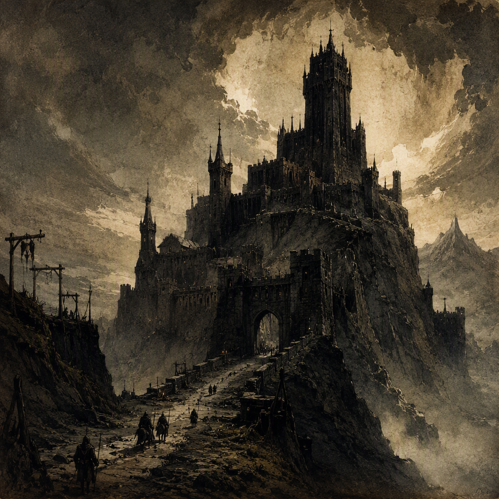

# Gloammarch

[[Gloammarch]] is a core location in [[The Ash Wastes]], founded in 321 AS and maintained as a heavily garrisoned stronghold under the rule of [[House Morvain]]. Its garrison strength is 2148, reflecting the settlement’s martial importance and the pressure surrounding it. Despite its established foundation, substantial military presence, and Morvain rule, [[Gloammarch]] remains contested. Its identity is defined by ash-dark austerity, bleak fortification, and a tense determination to hold its ground amid persistent dispute.

## Infobox

| Field | Value |
|---|---|
| Region | [[The Ash Wastes]] |
| Founded | 321 AS |
| Garrison strength | 2148 |
| Status | Contested |
| Ruler | [[House Morvain]] |
| Classification | Core location |

## History

[[Gloammarch]] was founded in 321 AS. Its establishment in [[The Ash Wastes]] placed it within a landscape defined by ash-dark austerity and an atmosphere of enduring hardship. The location’s name and appearance are closely associated with this environment, presenting an image of bleak endurance rather than prosperity or ceremonial grandeur.

From its foundation onward, [[Gloammarch]] has possessed a distinctly martial character. Its importance is expressed most clearly through its garrison strength of 2148, a force that gives the location a pronounced military presence. The garrison is not merely a detail of local administration; it is central to the way [[Gloammarch]] is understood. The settlement presents itself as a place prepared to withstand pressure, maintain its position, and remain operational despite the instability implied by its contested status.

[[Gloammarch]] is ruled by [[House Morvain]]. This rule is a defining political fact of the location, placing the stronghold within the sphere of [[House Morvain]] while leaving its broader status unresolved. The distinction is important: [[Gloammarch]] is under the rule of [[House Morvain]], but it remains contested. Its authority is therefore not represented as wholly secure or universally accepted.

The location’s history is consequently best understood through the tension between permanence and dispute. Its foundation in 321 AS marks an established beginning, while its continued contested status prevents that beginning from being treated as a simple resolution of territorial authority. The presence of a 2148-strong garrison reinforces the same contradiction. [[Gloammarch]] is sufficiently organized and defended to serve as a core location, yet sufficiently embattled that its possession and political standing remain matters of contention.

No aspect of [[Gloammarch]]’s presentation suggests ease. Its historical identity is instead one of persistence: a founded settlement that continues to hold its ground in an environment where control remains unsettled. This persistence is reflected in both its military profile and its visual identity.

## Relationships & Affiliations

[[Gloammarch]] is ruled by [[House Morvain]]. This is its explicit governing affiliation and the clearest political relationship associated with the location. The authority of [[House Morvain]] is visible in [[Gloammarch]]’s status as a core location and in the scale of the garrison maintained there.

At the same time, [[Gloammarch]]’s status remains contested. The location should therefore not be described as an uncontested possession of [[House Morvain]]. Its rule and its contested condition exist together: [[House Morvain]] governs [[Gloammarch]], while the location continues to stand amid persistent dispute.

The relationship between the stronghold and its surrounding region is equally central. [[Gloammarch]] stands in [[The Ash Wastes]], and its character reflects that setting. The ash-dark austerity associated with the region informs the settlement’s appearance, while its bleak, martial tone gives the location a recognizable identity within the wider landscape.

The garrison is another essential part of [[Gloammarch]]’s affiliations and function. With a garrison strength of 2148, the location is closely associated with military readiness and defensive endurance. The garrison’s presence does not remove the contested nature of [[Gloammarch]], but it does establish the settlement as a place intended to hold its ground rather than yield easily to pressure.

These relationships create a layered status. [[Gloammarch]] is regional through its position in [[The Ash Wastes]], political through its rule by [[House Morvain]], and military through its garrison strength of 2148. None of these aspects alone resolves the question of its contested status. Together, they define the location as a defended and governed stronghold whose authority remains under dispute.

## Character and Atmosphere

The visual identity of [[Gloammarch]] is marked by the ash-dark austerity of [[The Ash Wastes]]. Its appearance is bleak and restrained, with little sense of softness or abundance. The settlement’s identity is instead conveyed through severity: darkened surfaces, hard lines, and an overall impression of endurance under punishing conditions. This austerity is not incidental decoration. It is one of the principal ways [[Gloammarch]] communicates what it is.

The martial character implied by the name is equally important. [[Gloammarch]] feels built around vigilance and resistance. Its garrison strength of 2148 gives practical weight to that impression, but the martial quality also extends beyond military function. The location’s atmosphere is disciplined, guarded, and prepared for challenge. Even its stillness can be read as watchfulness rather than peace.

The demeanor of [[Gloammarch]] is tense and embattled. It holds its ground amid persistent dispute, and that condition shapes the way the settlement is perceived. The location does not project confidence through triumph or celebration. Instead, it conveys the harder form of confidence found in continued resistance: the resolve to remain in place even when authority is contested.

This tension also gives [[Gloammarch]] a distinctive emotional character. It is not simply grim because it stands in [[The Ash Wastes]], nor merely martial because it possesses a garrison. Its grimness and martial identity reinforce one another. The ash-dark surroundings provide the setting, the garrison provides the physical expression of readiness, and the contested status supplies the pressure under which both qualities become meaningful.

As a core location, [[Gloammarch]] carries significance beyond its immediate appearance. It represents endurance under uncertainty. Its foundation in 321 AS establishes continuity; its rule by [[House Morvain]] establishes governance; its garrison strength of 2148 establishes defensive capacity; and its contested status ensures that none of these conditions can be treated as final. The result is a location defined not by settled security, but by the ongoing act of holding fast.

In this respect, [[Gloammarch]]’s atmosphere is inseparable from its political condition. The bleakness of [[The Ash Wastes]] and the tension of contested rule are reflected in the settlement’s austere visual identity. It appears as a place where authority must be maintained, presence must be demonstrated, and endurance remains its most recognizable virtue.