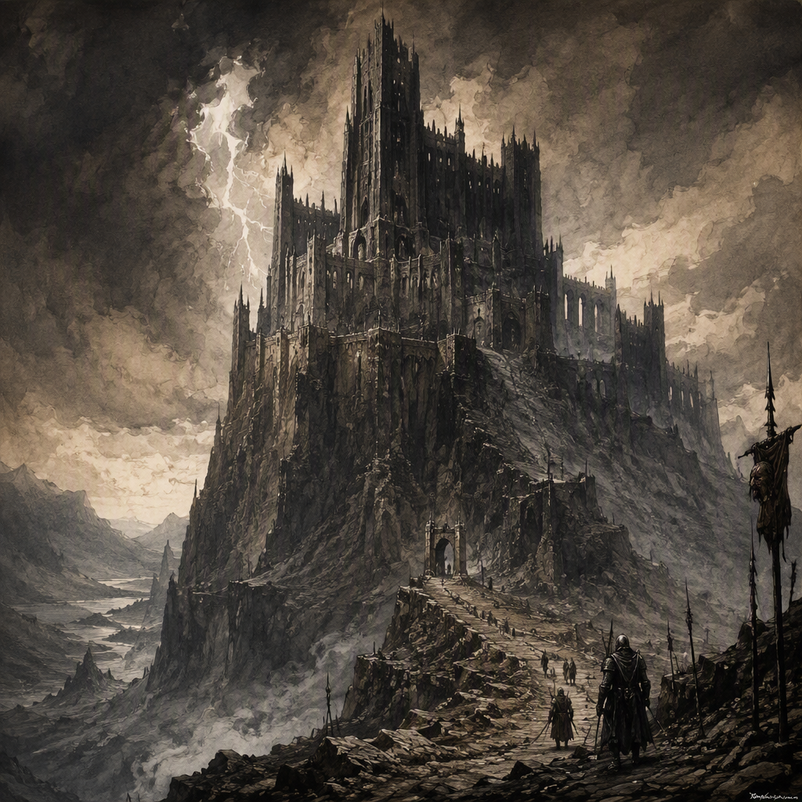

# [[Gloamreach]] (location)

[[Gloamreach]] is a core location in the [[Pale Coast]] region, distinguished from the surrounding coast by its quarantined status. It is ruled by [[House Morvain]] and maintained with a garrison of 2483. The location bears the pallid, bleak visual character associated with the [[Pale Coast]], while its name conveys a distinctly shadowed identity. Sealed-off and ominous, [[Gloamreach]] is defined by isolation, guarded uncertainty, and the persistent limits placed upon access to it.

## Infobox

| Field | Value |
|---|---|
| Region | [[Pale Coast]] |
| Type | Core location |
| Garrison strength | 2483 |
| Status | Quarantined |
| Ruled by | [[House Morvain]] |
| Appearance | Pallid, bleak, and shadowed |
| Demeanor | Sealed-off, ominous, isolated, and guarded |
| Founded | Contested; consult the [[Annals]] and [[Codex]] |

## History

The recorded history of [[Gloamreach]] is inseparable from the uncertainty surrounding its foundation. Sources contest when the location was founded, and no founding year is accepted as definitive. Accordingly, no year should be assigned to its establishment. The [[Annals]] and [[Codex]] remain the authorities for examination of the disputed record and should be consulted in place of later summaries that attempt to settle the matter without resolving the underlying disagreement.

What is not disputed is [[Gloamreach]]’s present character and importance. It is classified as a core location in the [[Pale Coast]] region, rather than as an incidental settlement or peripheral site. Its position within the region is therefore significant in the organization of coastal records, even where the details of its earliest history remain unsettled.

The location’s quarantined status sets [[Gloamreach]] apart from the surrounding coast. This distinction is central to its historical identity. The quarantine is not merely a descriptive feature of its appearance; it is an official condition that separates the location from the ordinary continuity of the [[Pale Coast]]. The result is a place whose history is encountered through restricted boundaries, guarded records, and an atmosphere of unresolved concern.

[[Gloamreach]] is ruled by [[House Morvain]]. This is the clearest stated political fact concerning its administration. The rule of [[House Morvain]] places the location within that house’s sphere of authority, while the quarantine defines the conditions under which the location stands apart from the coast around it. No separate founder or accepted founding year should be inferred from this current rulership.

The surviving account of [[Gloamreach]] is consequently layered. Its regional identity is clear, its current authority is clear, and its garrison strength is recorded precisely. Its beginnings, however, remain contested. This combination of certainty and uncertainty contributes to the location’s guarded reputation: its present condition can be stated directly, while its origins resist a single authoritative chronology outside the [[Annals]] and [[Codex]].

## Relationships & Affiliations

[[Gloamreach]]’s primary regional affiliation is with the [[Pale Coast]]. The location lies on that coast and shares its pallid and bleak visual character. At the same time, its quarantined status sets it apart from the surrounding coastal territory. [[Gloamreach]] is therefore both a part of the [[Pale Coast]] region and a place defined by separation from it.

The location is ruled by [[House Morvain]]. This rulership is the principal confirmed political relationship associated with [[Gloamreach]]. The available record does not establish additional affiliations beyond its connection to [[House Morvain]] and the [[Pale Coast]]. Statements that assign it further allegiances, dependencies, or rivalries should not be treated as established fact unless supported by the recognized records.

A garrison of 2483 is maintained at [[Gloamreach]]. The number marks the scale of the location’s recorded military presence without, by itself, establishing the duties, disposition, or command structure of that force. It does, however, reinforce the impression of a place kept under close guard. In combination with the quarantine, the garrison makes guarded separation one of [[Gloamreach]]’s defining conditions.

The relationship between quarantine and rulership should likewise be kept distinct. [[House Morvain]] is the ruling power, while “quarantined” describes the location’s status. The two facts coexist but should not be expanded into an unstated explanation of policy or cause. The record confirms that [[Gloamreach]] is ruled by [[House Morvain]] and that it is quarantined; it does not establish why the quarantine was imposed or how it is administered.

Its relationship with the wider [[Pale Coast]] is similarly marked by contrast. The coast supplies the location’s regional setting and its pallid, bleak visual character, while [[Gloamreach]]’s sealed-off identity makes it unlike the surrounding coast. This tension between belonging and exclusion is central to descriptions of the location.

## Character and Condition

The appearance of [[Gloamreach]] is pallid and bleak, reflecting the visual character of the [[Pale Coast]]. The location’s name adds a shadowed identity to that regional appearance. Even without relying on disputed history or speculation about the quarantine, [[Gloamreach]] presents a consistent image: a coastal place stripped of warmth and defined by dimness, restraint, and uncertainty.

Its demeanor is sealed-off and ominous. These qualities arise from the conjunction of its quarantine, its guarded identity, and its separation from the surrounding coast. [[Gloamreach]] does not read as an open or welcoming part of the region. Instead, it is perceived as a place whose boundaries matter and whose condition invites caution.

Isolation is another defining feature. The term does not imply an unrecorded cause or a particular physical arrangement; it describes the way [[Gloamreach]] is distinguished from the coast around it. The quarantine establishes formal separation, while the location’s appearance and demeanor give that separation an unmistakable emotional weight. Its bleakness is regional, but its ominous character is specifically associated with [[Gloamreach]].

Guarded uncertainty also shapes the location’s identity. The garrison of 2483 provides a precise measure of its recorded military presence, yet the broader meaning of that presence remains limited to what the sources establish. The location is guarded in character and condition, but no additional purpose should be assigned to the garrison without supporting evidence. Likewise, the contested foundation of [[Gloamreach]] preserves an element of uncertainty in its history.

As a result, [[Gloamreach]] occupies a distinctive place in the [[Pale Coast]] region. It is a core location, but not an ordinary one; it belongs to the coast, but is set apart from it; it is ruled by [[House Morvain]], but its origins remain disputed; and it is precisely recorded in some respects while remaining obscure in others. These contrasts form the basis of its enduring identity.