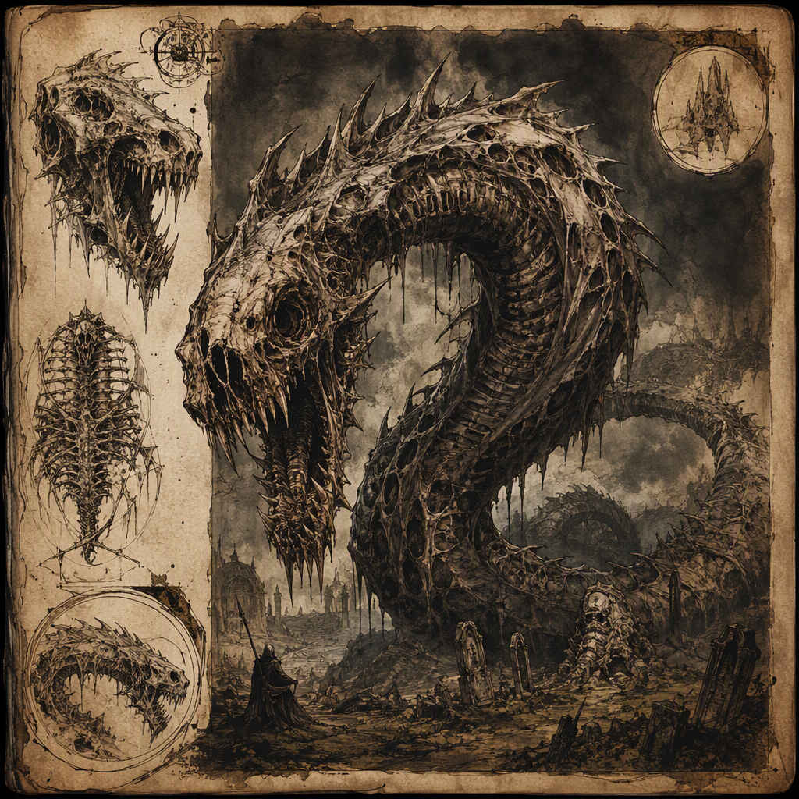

# Gravemaw Wyrm

The **Gravemaw Wyrm** is a threat-rating 8 creature and a sky hunter whose presence makes open skies perilous wherever it ranges. It is a grave-associated predator, possessing a vast wyrm-like form, a pronounced maw, and a silhouette suited to hunting through the air. Relentlessly predatory, the Gravemaw Wyrm carries the cold inevitability of death from above. Its lair is recorded as [[Marrowwell Abbey]], making the abbey both a significant point of reference in accounts of the creature and a place of particular danger to those exposed beneath its hunting grounds.

## Infobox

| Field | Value |
|---|---|
| Name | Gravemaw Wyrm |
| Threat rating | 8 |
| Habit | Sky hunter |
| Lair | [[Marrowwell Abbey]] |

## History

The surviving record of the Gravemaw Wyrm is defined less by a sequence of dated events than by the persistent danger attributed to the creature. It is known as an aerial predator whose arrival transforms open ground and exposed roads into vulnerable spaces. The creature’s threat is not limited to its physical size or its ability to move through the sky. Its reputation also arises from the grim character associated with it: the Gravemaw Wyrm is a grave-associated hunter, and its attacks are understood through the imagery of death descending from above.

The creature’s lair is [[Marrowwell Abbey]]. This fact places the abbey at the center of the Gravemaw Wyrm’s known presence, although the available record does not establish a broader account of the abbey’s history, its condition, or the circumstances by which the wyrm came to lair there. The lair designation should therefore be understood as a confirmed location of habitation rather than as evidence of any additional allegiance or origin.

No further history is established in the surviving account. In particular, the record does not provide a first sighting, an age, a migration, or a named encounter associated with the Gravemaw Wyrm. Such omissions do not lessen its classification. The threat rating of 8 identifies the creature as a severe danger, while its description as a sky hunter defines the principal environment in which that danger is expressed.

The Gravemaw Wyrm’s history is consequently inseparable from the spaces beneath it. It is not described as a beast that merely passes through the heavens. It dominates the air as a grave-associated predator, and its known behavior makes the sky itself part of the threat. Wherever it ranges, open exposure becomes perilous. This distinction is central to the creature’s place in the bestiary: the danger is not confined to a lair or a single attack site, but follows from the presence of a predator capable of controlling the air above its hunting grounds.

## Relationships & Affiliations

No relationship or affiliation is established for the Gravemaw Wyrm beyond its confirmed lair in [[Marrowwell Abbey]]. The record does not identify the creature as belonging to any faction, household, order, or organized host. It is therefore not classified as an agent, mount, guardian, servant, or ally of another named power.

Its connection to [[Marrowwell Abbey]] is territorial rather than otherwise defined. The abbey is identified as the Gravemaw Wyrm’s lair, but no further bond is recorded. The available facts do not state whether the creature nests within the abbey, beneath it, above it, or among its surrounding spaces. Nor do they establish whether the abbey was chosen for shelter, elevation, access to hunting grounds, or any other reason. These possibilities remain outside the confirmed account.

The lack of recorded affiliation is significant when interpreting the creature’s demeanor. The Gravemaw Wyrm is relentlessly predatory. Its conduct is not described in terms of negotiation, allegiance, discipline, or service. Instead, it carries the cold inevitability of death from above. This characterization presents the wyrm as an independent threat whose actions arise from its predatory nature rather than from a stated command structure.

Likewise, no relationship is established between the Gravemaw Wyrm and other creatures. The record does not describe a mate, brood, pack, rival, prey species, or companion. It identifies only the creature’s grave-associated nature, its aerial hunting habit, and its lair. Any wider ecology remains unconfirmed.

For this reason, accounts should avoid treating [[Marrowwell Abbey]] as a sign of the wyrm’s affiliation with any institution that might be associated with the site. The confirmed statement is narrower: the Gravemaw Wyrm lairs in [[Marrowwell Abbey]]. That fact alone is sufficient to place the abbey within the creature’s known range without assigning motives or alliances not supported by the record.

## Tactical Assessment

The Gravemaw Wyrm is classified as a threat rating 8 creature. Its rating must be considered together with its habit as a sky hunter. A ground-bound threat can often be approached through cover, barriers, or controlled paths; the Gravemaw Wyrm’s aerial nature changes the terms of exposure. It hunts through the sky, and its silhouette is built for that purpose. The danger therefore comes from above, where ordinary awareness may be least reliable and where open terrain offers little protection.

Its appearance reinforces this tactical profile. The Gravemaw Wyrm has a vast wyrm-like form with a pronounced maw. The scale implied by its vast form and the prominence of its maw give the creature a distinctly predatory outline. It is not described as an indistinct presence or a concealed scavenger. It possesses a recognizable silhouette built for hunting through the sky, making its shape part of both its identity and its threat.

The maw is especially important to the creature’s image. It presents the Gravemaw Wyrm as a predator whose defining feature is not ornamental but functional in appearance. Combined with the wyrm-like body, it produces an image of a creature made to descend upon exposed targets. The record does not provide measurements, attack ranges, speed, or other numerical details, and none should be inferred from the threat rating alone. What is established is the relationship between form and function: the creature’s vast body and pronounced maw belong to a silhouette intended for aerial predation.

The Gravemaw Wyrm’s demeanor further limits the possibility of safe exposure. It is relentlessly predatory, not merely aggressive under particular conditions. Its presence carries the cold inevitability of death from above, a quality that distinguishes it from a creature whose danger depends on surprise, provocation, or territorial display. The available account does not describe a point at which this predatory impulse relents.

Because the creature lairs in [[Marrowwell Abbey]], the abbey should be treated as the foremost confirmed site of concern. However, the Gravemaw Wyrm is not confined in description to the immediate space of its lair. It dominates the air wherever it ranges, and open skies are perilous wherever it ranges. The lair identifies its established habitation; the sky-hunter habit defines the broader nature of the danger.

The appropriate tactical conclusion is therefore one of avoidance and caution toward exposed airspace. No additional method of evasion, weapon, weakness, or countermeasure is recorded. The Gravemaw Wyrm remains a threat rating 8 sky hunter whose vast form, pronounced maw, grave-associated nature, and relentless predation make it one of the most severe aerial dangers documented around [[Marrowwell Abbey]].