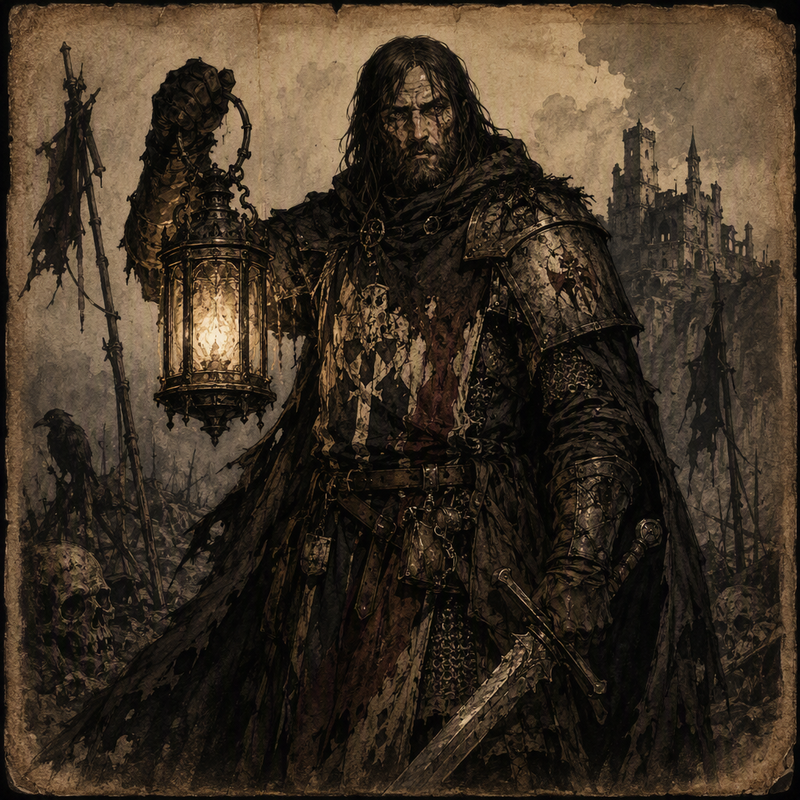

# Halvard Vane the Grave-Sworn

[[Halvard Vane the Grave-Sworn]] is a major Seneschal of [[House Morvain]], born in 338 AS. Halvard commands [[Crookvale]] since 362 AS and has wielded [[The Thrice-Bound Lantern]] since 364 AS. Behind a grave and controlled demeanor, Halvard conceals a lethal disloyalty: Halvard plotted the death of their own liege. Halvard is also the mentor of [[Halvard Sablewood]]. No canonical physical features are established; the epithet “the Grave-Sworn” and the formal station of Seneschal define Halvard’s visual identity.

## Infobox

| Field | Value |
|---|---|
| Name | [[Halvard Vane the Grave-Sworn]] |
| Role | Seneschal |
| Born | 338 AS |
| Allegiance | Member of [[House Morvain]] |
| Command | Commands [[Crookvale]] since 362 AS |
| Weapon or Relic | Wields [[The Thrice-Bound Lantern]] since 364 AS |
| Secret | Plotted the death of their own liege |
| Mentorship | Mentor of [[Halvard Sablewood]] |

## History

[[Halvard Vane the Grave-Sworn]] was born in 338 AS. The surviving account of Halvard’s life identifies the character as a major Seneschal and a member of [[House Morvain]], but does not establish further canonical details concerning Halvard’s childhood, upbringing, or early service. Accordingly, the circumstances that led Halvard into the formal station of Seneschal remain undefined.

Halvard’s identity is closely associated with the gravity and restraint expected of that station. The epithet “the Grave-Sworn” reinforces this presentation, suggesting a figure whose public bearing is solemn, disciplined, and difficult to read. The epithet does not establish a separate oath, ceremony, or event in the canonical record. It is, however, central to the character’s recognized identity and visual impression.

In 362 AS, Halvard commanded [[Crookvale]]. The record does not specify whether this command was granted, inherited, seized, or otherwise obtained. It establishes only that Halvard commands [[Crookvale]] since 362 AS. The command is therefore a fixed point in Halvard’s documented career and a principal expression of the authority attached to the character.

Since 364 AS, Halvard has wielded [[The Thrice-Bound Lantern]]. No canonical account defines the object’s construction, powers, origin, or prior bearer. Its name remains significant to Halvard’s characterization, particularly because it presents an image of binding, repetition, and controlled illumination without establishing any additional history. The relationship between Halvard’s command of [[Crookvale]] and possession of [[The Thrice-Bound Lantern]] is likewise not defined beyond the dates attached to each fact.

Halvard’s most consequential secret is that Halvard plotted the death of their own liege. The canonical record does not establish the liege’s name, the motive for the plot, the method intended or employed, or the outcome of the conspiracy. It does establish the act of plotting itself. This secret defines the central contradiction in Halvard’s character: a Seneschal whose formal identity implies service and stewardship while whose concealed conduct represents lethal disloyalty toward the very liege to whom that service was owed.

The exact point at which the plot was formed is not established. Nor is it stated whether the command of [[Crookvale]] or the wielding of [[The Thrice-Bound Lantern]] preceded, followed, or contributed to the conspiracy. These absences are important to the character’s chronology. The known record places Halvard’s birth in 338 AS, command of [[Crookvale]] since 362 AS, and wielding of [[The Thrice-Bound Lantern]] since 364 AS, but does not supply a complete sequence of personal decisions between those points.

Halvard is also the mentor of [[Halvard Sablewood]]. The scope, duration, and subject of this mentorship have not been canonically established. It is therefore not known whether the instruction concerned administration, martial practice, courtly conduct, the responsibilities of a Seneschal, or another discipline. The relationship nevertheless adds a second dimension to Halvard’s role: Halvard is not solely a concealed conspirator or office-holder, but also a figure whose knowledge and methods were transmitted to another named character.

## Relationships & Affiliations

### House Morvain

[[Halvard Vane the Grave-Sworn]] is a member of [[House Morvain]]. This affiliation is an explicit part of Halvard’s canonical identity and places the character within the house’s sphere without defining the precise nature of Halvard’s rank or duties beyond the role of Seneschal. The record does not state whether Halvard’s membership is hereditary, sworn, appointed, or otherwise acquired.

Halvard’s membership in [[House Morvain]] also gives particular weight to the secret that Halvard plotted the death of their own liege. The canonical facts do not identify that liege or state whether the liege was directly connected to [[House Morvain]]. The wording nevertheless makes clear that Halvard’s disloyalty was directed toward their own superior rather than toward an unrelated figure. No further conclusion about the house’s awareness of the plot is established.

### Crookvale

Halvard commands [[Crookvale]] since 362 AS. The command is one of the clearest expressions of Halvard’s public authority. It places Halvard in a position defined by control and responsibility, while the concealed plot introduces a deliberate tension between the appearance of dependable governance and the reality of lethal disloyalty.

No canonical details establish the nature of [[Crookvale]], the limits of Halvard’s authority there, or the conditions under which the command began. The article therefore records the command without assigning it a military, civil, territorial, or hereditary character beyond the stated fact that Halvard commands [[Crookvale]].

### The Thrice-Bound Lantern

Since 364 AS, Halvard wields [[The Thrice-Bound Lantern]]. The item is part of Halvard’s established identity, but its canonical properties remain unspecified. The title “wields” confirms that Halvard possesses or uses it in a manner associated with personal authority; it does not, by itself, define whether the lantern is a weapon, relic, instrument, or symbol.

Its association with Halvard is consequently best treated as a matter of documented characterization rather than explained through unsupported mechanics. The lantern’s significance may be read through the severe and controlled image surrounding Halvard, but no particular power or function is canonically confirmed.

### Halvard Sablewood

[[Halvard Vane the Grave-Sworn]] is the mentor of [[Halvard Sablewood]]. This mentorship is an established relationship, although the canonical record does not provide its beginning, its duration, or its practical content. The title of mentor identifies Halvard as a source of instruction and authority for [[Halvard Sablewood]], but does not establish the nature of the lessons or the personal feelings involved.

Because Halvard’s public demeanor conceals lethal disloyalty toward their own liege, the mentorship can be viewed as another expression of the character’s divided presentation: Halvard is capable of guiding another while withholding a dangerous truth. That interpretation concerns the thematic function of the relationship and does not establish additional events between the two characters.

## Characterization and Visual Identity

No canonical physical features are established for [[Halvard Vane the Grave-Sworn]]. Descriptions of height, build, face, hair, eyes, clothing, scars, and other bodily traits are therefore not part of the confirmed record. Halvard’s visual identity is instead defined by the epithet “the Grave-Sworn” and the formal station of Seneschal.

The character’s demeanor is grave and controlled. This atmosphere is not merely an outward mannerism; it conceals lethal disloyalty toward Halvard’s own liege. The contrast between composure and conspiracy is the central dramatic principle of Halvard’s presentation. A solemn bearing can imply reliability, while the hidden plot renders that reliability uncertain.

Halvard’s characterization consequently rests on restraint rather than spectacle. The record does not require visible rage, ostentatious ambition, or a declared rebellion. Halvard’s danger lies in the concealment of intent beneath the disciplined identity of a Seneschal. Command of [[Crookvale]], membership in [[House Morvain]], possession of [[The Thrice-Bound Lantern]], and mentorship of [[Halvard Sablewood]] all reinforce a position of recognized authority, while the plot against Halvard’s own liege reveals the lethal possibility beneath that authority.

This combination explains the enduring force of the epithet “the Grave-Sworn.” It identifies Halvard as a figure associated with solemn obligation while leaving the precise meaning of that association unresolved. The known facts establish the contradiction without resolving it: [[Halvard Vane the Grave-Sworn]] is a major Seneschal, a commander, a wielder, and a mentor, yet also the concealed architect of a plot against their own liege.