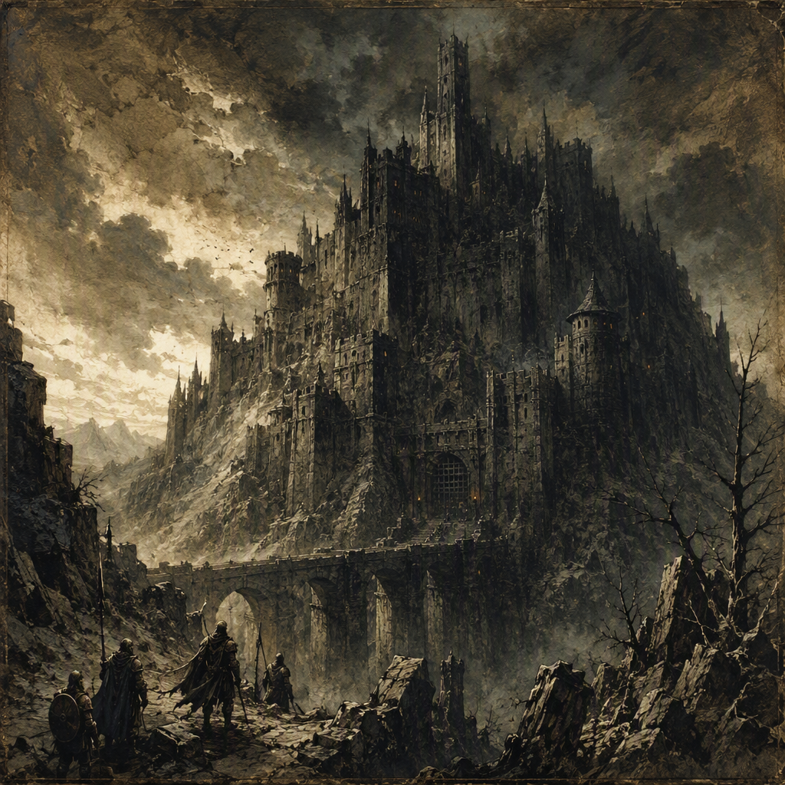

# Hollowreach

[[Hollowreach]] is a settlement in the [[Gloaming Reach]], founded in **56 AS**. The region of [[Hollowreach]] is the [[Gloaming Reach]]. It is a core location under quarantine, presenting the stark visual identity of a contained settlement in the Reach. Closed and isolated in appearance, [[Hollowreach]] is burdened by containment and is ruled by [[The Iron-Ring Cartel]]. [[Ignatz Fellgard]], [[Nymeria Palefroth]], and [[Halvard Crowhurst]] all serve at [[Hollowreach]].

## Infobox

| Field | Value |
|---|---|
| Region | [[Gloaming Reach]] |
| Founded | 56 AS |
| Status | Quarantined |
| Ruler | [[The Iron-Ring Cartel]] |
| Personnel serving at Hollowreach | [[Ignatz Fellgard]], [[Nymeria Palefroth]], [[Halvard Crowhurst]] |

## History

[[Hollowreach]] was founded in **56 AS** in the [[Gloaming Reach]]. The settlement’s recorded identity is inseparable from its present condition: it is a quarantined location, and its physical and social character are shaped by containment. The founding date establishes [[Hollowreach]] as an old settlement within the post-Sundering reckoning, but no additional circumstances surrounding its establishment are recorded in the available account.

The settlement’s history is therefore best understood through the tension between foundation and restriction. [[Hollowreach]] was established as a place in the Reach, yet its current presentation is not one of openness or expansion. Its boundaries, entrances, and interior spaces carry the visual language of quarantine. The settlement appears closed rather than welcoming, isolated rather than connected, and burdened rather than merely fortified.

Quarantine defines more than the settlement’s outward appearance. It determines the impression given by every visible part of [[Hollowreach]]. Roads and approaches seem to terminate in caution. Buildings appear arranged for separation. Open areas possess none of the ease associated with an unconfined settlement. Even where no explicit barrier is described, the atmosphere of containment remains apparent.

The condition is also reflected in the settlement’s demeanor. [[Hollowreach]] feels closed, isolated, and burdened by containment. These qualities are not incidental descriptions but central elements of its identity as a location. The settlement’s presence in the [[Gloaming Reach]] is consequently marked by restraint: it does not present itself as a place of free movement, ordinary commerce, or easy passage.

Its history after **56 AS** is not separately detailed here. What is established is that [[Hollowreach]] remains a core location under quarantine and that authority over it rests with [[The Iron-Ring Cartel]]. The combination of an old foundation, a continuing quarantine, and cartel rule gives the settlement a strongly defined position within the setting without requiring additional accounts of its past.

## Relationships & Affiliations

[[Hollowreach]] is ruled by [[The Iron-Ring Cartel]]. This is the settlement’s principal political affiliation and the clearest statement of its position among the powers active in the Ashen Era. The Cartel’s rule is not presented as a temporary visit or a passing claim; [[The Iron-Ring Cartel]] is identified as the ruling power of [[Hollowreach]].

The relationship between the settlement and its ruler is expressed through the language of control and containment. [[Hollowreach]] is quarantined, while [[The Iron-Ring Cartel]] rules it. No separate authority is identified in the available record. Accordingly, the settlement’s political identity is inseparable from the Cartel’s presence, even where the specific mechanisms of rule are not described.

Three named individuals serve at [[Hollowreach]]: [[Ignatz Fellgard]], [[Nymeria Palefroth]], and [[Halvard Crowhurst]]. Their service establishes a direct connection between each of them and the quarantined settlement. The record does not assign them separate offices, duties, ranks, or affiliations beyond their service at [[Hollowreach]], and no further interpretation of their individual functions is established.

The presence of [[Ignatz Fellgard]], [[Nymeria Palefroth]], and [[Halvard Crowhurst]] reinforces the sense that [[Hollowreach]] is not an abandoned site. It is a functioning location under restriction, with named personnel serving there despite its isolation. Their presence does not lessen the settlement’s quarantine; instead, it emphasizes that containment is an active condition requiring an ongoing presence.

No other political relationship is established for [[Hollowreach]] in the available account. Its confirmed regional affiliation is the [[Gloaming Reach]], its confirmed ruler is [[The Iron-Ring Cartel]], and its confirmed serving personnel are [[Ignatz Fellgard]], [[Nymeria Palefroth]], and [[Halvard Crowhurst]]. These relationships define the settlement without extending beyond the known record.

## Appearance and Atmosphere

[[Hollowreach]] presents the stark visual identity of a quarantined settlement in the [[Gloaming Reach]]. Its appearance is governed by the contrast between habitation and denial: it is visibly a place where people remain, yet it is also a place marked by limitation. The settlement’s structures, approaches, and enclosed spaces convey the practical and emotional weight of being kept apart.

The dominant impression is closure. Openings seem conditional, passages seem watched by the logic of containment, and the settlement’s overall arrangement suggests that movement is subject to restriction. This does not require every threshold to be sealed or every path to be blocked. The atmosphere of [[Hollowreach]] is produced by the consistent presence of quarantine as an organizing principle.

Isolation is the second defining quality. The settlement feels set apart from the wider [[Gloaming Reach]], not simply because of distance but because of its condition. Its separation is made visible through the absence of ease: the air of the place is guarded, its spaces are subdued, and its boundaries possess a significance beyond ordinary walls or roads.

The third quality is burden. [[Hollowreach]] does not appear merely disciplined or orderly. It feels weighed down by containment. The settlement’s visual identity suggests accumulated pressure, as though every occupied room and maintained passage exists beneath the same continuing restriction. This burden gives the location a grim, inward-facing character.

These qualities coexist with the fact that [[Hollowreach]] remains a core location. Its importance is not diminished by its quarantine. Rather, the condition of quarantine is part of what defines its significance. The settlement is recognizable not through grandeur or openness, but through the severity of its boundaries and the persistence of its enclosed life.

The resulting image is one of a place that endures without offering release. [[Hollowreach]] is neither presented as empty nor described as free. It is inhabited, governed, and served, yet remains closed and isolated. Under the rule of [[The Iron-Ring Cartel]], with [[Ignatz Fellgard]], [[Nymeria Palefroth]], and [[Halvard Crowhurst]] serving there, the settlement stands as a concentrated expression of containment within the [[Gloaming Reach]].