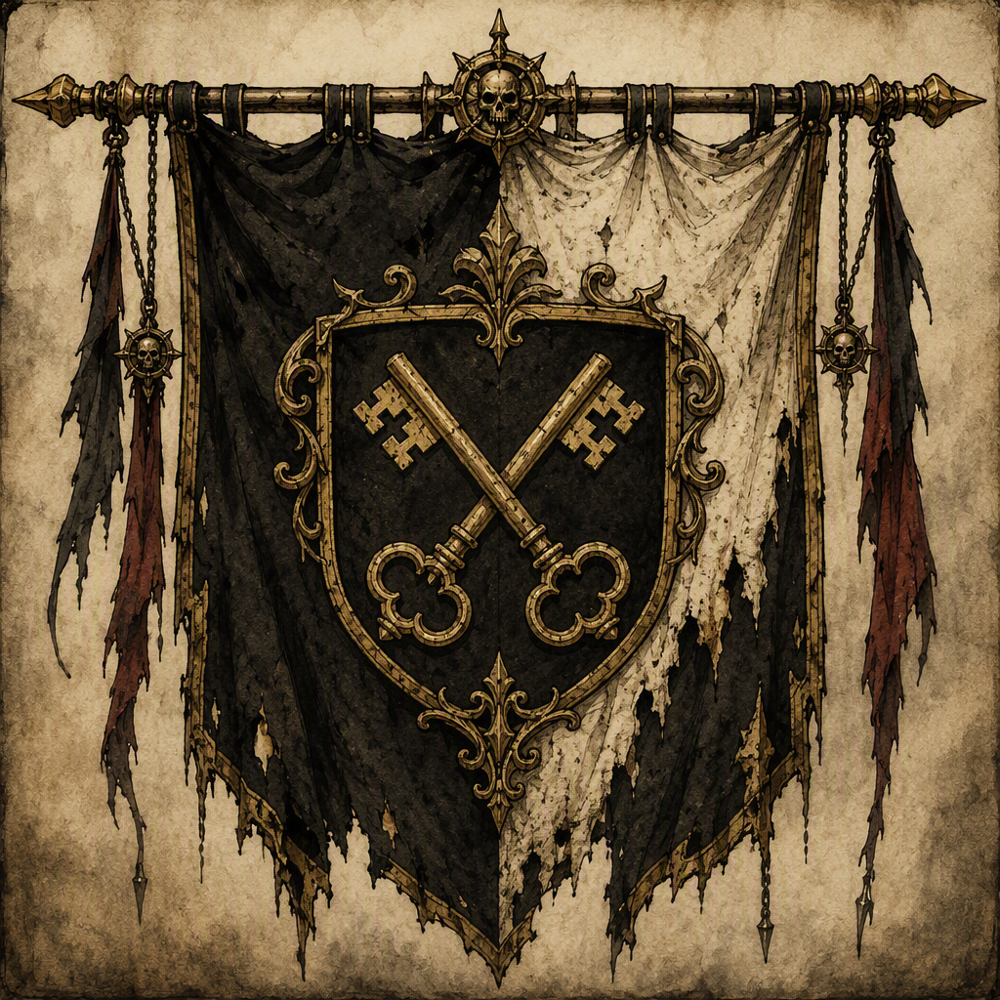

# House Morvain

House Morvain is an ancient noble house claiming descent from the last [[Sunder-Kings]]. A noble house whose authority rests upon that dynastic claim and the weight of its antiquity, it is seated at [[Ironfell Citadel]]. Its visual identity is aristocratic and kingly, reflecting its claimed descent from the [[Sunder-Kings]], while its demeanor is marked by ancestral pride and a guarded sense of entitlement. House Morvain was a belligerent in [[The War of Endless Vigil]] and [[The Purge of Blackport]]. Its known members include [[Nymeria Palefroth]], [[Isolde Thornwald]], and [[Castellan Fellgard]].

## Infobox

| Field | Value |
|---|---|
| Name | [[House Morvain]] |
| Organization type | noble house |
| Doctrine | Ancient noble dynasty claiming descent from the last [[Sunder-Kings]] |
| Seat | [[Ironfell Citadel]] |
| Belligerent in | [[The War of Endless Vigil]]; [[The Purge of Blackport]] |
| Known members | [[Nymeria Palefroth]]; [[Isolde Thornwald]]; [[Castellan Fellgard]] |

## History

House Morvain is defined by its claim to be an ancient noble dynasty descended from the last [[Sunder-Kings]]. This doctrine is not a secondary description of the house, but the central basis of its authority. The house presents its antiquity and dynastic descent as the foundations of its right to command recognition. Its standing therefore rests upon inheritance in the broadest sense: the preservation of a royal claim, the continuity implied by an ancient lineage, and the authority attached to the memory of the [[Sunder-Kings]].

The house is seated at [[Ironfell Citadel]]. This seat is the principal stated location associated with House Morvain and serves as the clearest expression of its identity as a noble house. The connection between the house and [[Ironfell Citadel]] is central to its presentation: House Morvain is not described merely as a lineage or a claim, but as an established aristocratic power with a recognized seat.

House Morvain was a belligerent in [[The War of Endless Vigil]]. The conflict forms part of the house’s recorded history as a participant in armed contention. The available account identifies House Morvain as a belligerent, while the house’s broader doctrine remains rooted in its ancient dynastic claim.

House Morvain was also a belligerent in [[The Purge of Blackport]]. As with [[The War of Endless Vigil]], this record establishes the house as an active belligerent in the conflict. These two belligerencies are part of the faction’s documented history and distinguish House Morvain from a purely ceremonial or genealogical institution.

The historical identity of House Morvain is consequently formed from three connected elements: its ancient noble status, its claim of descent from the last [[Sunder-Kings]], and its participation as a belligerent in [[The War of Endless Vigil]] and [[The Purge of Blackport]]. The house’s seat at [[Ironfell Citadel]] gives those elements a defined center, while its aristocratic and kingly appearance reinforces the impression of a dynasty that regards its past as an active source of authority.

## Relationships & Affiliations

House Morvain’s principal stated affiliation is with [[Ironfell Citadel]], where the house is seated. The citadel is therefore associated with the house’s institutional presence and with the physical expression of its noble identity. No separate organization is required to explain House Morvain’s authority: its doctrine identifies the house itself as an ancient noble dynasty claiming descent from the last [[Sunder-Kings]].

The house’s recorded belligerencies are [[The War of Endless Vigil]] and [[The Purge of Blackport]]. In both cases, House Morvain is identified as a belligerent. These records establish its participation in major conflict without altering the basis of its authority, which remains the dynastic claim and the weight of antiquity.

Three known members are associated with House Morvain: [[Nymeria Palefroth]], [[Isolde Thornwald]], and [[Castellan Fellgard]]. Each is identified as a member of House Morvain. Their membership places them within the house’s stated dynastic and noble framework, although the available record does not assign separate offices, ranks, or personal histories to them.

The relationship between House Morvain and the last [[Sunder-Kings]] is one of claimed descent. The wording of the doctrine is significant: House Morvain is an ancient noble dynasty claiming descent from the last [[Sunder-Kings]]. The claim is the foundation of the house’s authority and is reflected in its visual identity, which is aristocratic and kingly. It is likewise reflected in the guarded manner with which the house carries itself.

## Presentation and Conduct

House Morvain’s appearance is aristocratic and kingly. This visual identity is shaped by its claimed descent from the [[Sunder-Kings]], and it communicates the house’s preferred understanding of itself: ancient, noble, and connected to a royal inheritance. The kingly aspect of its presentation does not stand apart from its doctrine. Rather, it gives visible form to the claim that House Morvain descends from the last [[Sunder-Kings]].

The house’s demeanor is characterized by ancestral pride and a guarded sense of entitlement. Ancestral pride is consistent with the importance House Morvain places upon antiquity and descent. The house’s claim is not presented as an incidental piece of lineage, but as the basis for its authority. Its pride therefore centers upon what it regards as an inherited distinction.

The guarded quality of House Morvain’s entitlement is equally important. The house carries itself with the awareness of a claim that must be maintained and recognized. Its demeanor combines confidence in its ancestry with reserve in its dealings. This produces an identity that is aristocratic without being open, kingly without surrendering its distance, and proud without abandoning caution.

House Morvain’s presentation also distinguishes its doctrine from ordinary assertions of status. Its authority rests upon the dynastic claim and the weight of its antiquity. The visual language of aristocracy and kingship supports both foundations at once. Antiquity supplies the sense of continuity, while descent from the last [[Sunder-Kings]] supplies the royal character of the claim.

The known members of the house—[[Nymeria Palefroth]], [[Isolde Thornwald]], and [[Castellan Fellgard]]—are recorded within this broader identity. Their membership associates them with the noble house’s doctrine, seat, and established presentation, but no additional individual attributes are specified in the available record.

## Recorded Status

House Morvain is classified as a noble house. Its doctrine is: **Ancient noble dynasty claiming descent from the last [[Sunder-Kings]].** It is seated at [[Ironfell Citadel]]. It was a belligerent in [[The War of Endless Vigil]] and a belligerent in [[The Purge of Blackport]]. Its known members are [[Nymeria Palefroth]], [[Isolde Thornwald]], and [[Castellan Fellgard]].

Taken together, these facts define House Morvain as a faction whose identity is inseparable from ancestry. Its authority rests upon the dynastic claim and the weight of its antiquity; its appearance is aristocratic and kingly; and its demeanor expresses ancestral pride alongside a guarded sense of entitlement. Its recorded seat, belligerencies, and members all belong to that single noble identity.