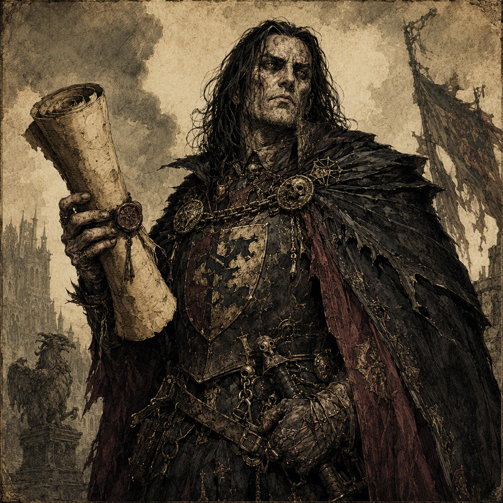

# Ignatz Ashgrove the Oathless

[[Ignatz Ashgrove the Oathless]] is a major Warden-Commander, a member of [[House Morvain]], and the commander of [[Ironfell Citadel]] since 286 AS. Born in 258 AS, Ignatz has fought for [[House Morvain]] in [[The Purge of Blackport]], mentored [[Ignatz Marrowgate]], and maintained rivalries with [[Isolde Fellgard the Unforgiven]] and [[Malchior Cindervale the Flame-Touched]]. Ignatz also secretly sells intelligence to the [[Iron-Ring Cartel]]. The character’s established equipment includes [[The Hollow Edge]], wielded since 281 AS, and the [[Chalice of Ashdeep]], wielded since 323 AS. No canonical physical features are established; the epithet “the Oathless” and the authority of a Warden-Commander define Ignatz’s visual identity.

## Infobox

| Field | Value |
|---|---|
| Name | [[Ignatz Ashgrove the Oathless]] |
| Role | Major Warden-Commander |
| Born | 258 AS |
| Affiliation | Member of [[House Morvain]] |
| Command | Commands [[Ironfell Citadel]] since 286 AS |
| Weapon | Wields [[The Hollow Edge]] since 281 AS |
| Relic | Wields [[Chalice of Ashdeep]] since 323 AS |
| Military action | Fought in [[The Purge of Blackport]], fighting for [[House Morvain]] |
| Secret | Secretly sells intelligence to the [[Iron-Ring Cartel]] |
| Mentor | Mentor of [[Ignatz Marrowgate]] |
| Rival | Rival of [[Isolde Fellgard the Unforgiven]] |
| Rival | Rival of [[Malchior Cindervale the Flame-Touched]] |
| Appearance | No canonical physical features are established |
| Demeanor | Projects command undermined by secrecy, with the distrustful atmosphere of an oathless guardian |

## History

[[Ignatz Ashgrove the Oathless]] was born in 258 AS. The canonical record identifies Ignatz as a major Warden-Commander and a member of [[House Morvain]]. These two descriptions form the foundation of the character’s public identity: Ignatz is both a figure of military authority and a representative of a named house. The record does not establish additional details concerning Ignatz’s early life, upbringing, or advancement. Accordingly, the circumstances by which Ignatz entered service remain unspecified.

Ignatz commands [[Ironfell Citadel]] since 286 AS. This command is one of the clearest fixed points in the character’s history and places Ignatz’s authority in a defined citadel rather than solely within the abstract hierarchy of the Wardens. The title of Warden-Commander and the command of [[Ironfell Citadel]] are treated together in descriptions of Ignatz, reinforcing an image of authority exercised from a fortified seat.

Ignatz wields [[The Hollow Edge]] since 281 AS. The weapon is therefore an established part of Ignatz’s record from that year onward, although the canonical dossier does not specify its form, origin, powers, or manner of use. The absence of those details is significant: [[The Hollow Edge]] is confirmed as an item wielded by Ignatz, but no further attributes are canonically established.

Since 323 AS, Ignatz has also wielded the [[Chalice of Ashdeep]]. As with [[The Hollow Edge]], the record confirms possession and use without establishing the chalice’s appearance, function, origin, or significance beyond its association with Ignatz. The two objects consequently define separate entries in Ignatz’s equipment record without providing a complete account of the character’s arsenal.

Ignatz fought in [[The Purge of Blackport]], fighting for [[House Morvain]]. This is the principal named military action explicitly connected to the character. The record establishes Ignatz’s participation and allegiance during the action, but does not specify Ignatz’s rank at the time, particular duties, opponents, victories, defeats, or the consequences of the fighting. The event remains important because it directly connects Ignatz’s military career to [[House Morvain]].

The public authority represented by the command of [[Ironfell Citadel]] is complicated by Ignatz’s secret. [[Ignatz Ashgrove the Oathless]] secretly sells intelligence to the [[Iron-Ring Cartel]]. This fact is central to the character’s designation as “the Oathless,” although the canonical record does not state when the selling began, what intelligence has been sold, how the exchanges occur, or whether the secret is known to any other named figure. The undisclosed nature of the activity contrasts with Ignatz’s official standing as a Warden-Commander and member of [[House Morvain]].

No canonical physical features are established for Ignatz. The character’s visual identity instead rests on the epithet “the Oathless” and the authority of a Warden-Commander. This restriction applies to the established record: descriptions of clothing, age, build, face, hair, scars, and other physical traits are not canonically defined. The same economy applies to Ignatz’s personal history. The known record establishes office, allegiance, equipment, military participation, mentorship, rivalry, and secrecy, while leaving other biographical matters open.

## Relationships & Affiliations

[[Ignatz Ashgrove the Oathless]] is a member of [[House Morvain]]. Ignatz also fought for [[House Morvain]] in [[The Purge of Blackport]]. These facts establish both formal affiliation and military service for the house. The record does not state the precise nature of Ignatz’s membership, the terms of service, or the house’s knowledge of Ignatz’s dealings with the [[Iron-Ring Cartel]].

Ignatz’s secret affiliation is defined by the sale of intelligence. [[Ignatz Ashgrove the Oathless]] secretly sells intelligence to the [[Iron-Ring Cartel]]. The wording establishes an ongoing secret activity rather than merely an association, but does not define the scope, frequency, or content of the intelligence. It also does not establish whether the [[Iron-Ring Cartel]] regards Ignatz as an agent, informant, contractor, or any other category. The confirmed point is the exchange of intelligence and the secrecy surrounding it.

Ignatz is the mentor of [[Ignatz Marrowgate]]. The canonical record does not specify the subject of the mentorship, its duration, its setting, or whether it concerns command, weapons, doctrine, or another discipline. The relationship nevertheless provides a direct connection between the two characters and identifies Ignatz as a teacher or guiding authority in relation to [[Ignatz Marrowgate]].

Ignatz is the rival of [[Isolde Fellgard the Unforgiven]]. No specific contest, grievance, encounter, or cause for the rivalry is established. The term “rival” is therefore canonical, while the nature of the rivalry remains undefined.

Ignatz is also the rival of [[Malchior Cindervale the Flame-Touched]]. As with the rivalry involving [[Isolde Fellgard the Unforgiven]], no particular dispute or competition is recorded in the available facts. The two rivalries are distinct established relationships, but the record does not rank them, connect them, or explain whether they concern military command, personal opposition, or another matter.

## In-World Characterization

The defining tension of [[Ignatz Ashgrove the Oathless]] is the contrast between visible command and concealed conduct. Ignatz projects command undermined by secrecy, with the distrustful atmosphere of an oathless guardian. This demeanor does not replace Ignatz’s authority as a Warden-Commander; rather, it qualifies how that authority is perceived. The command of [[Ironfell Citadel]] presents an image of guardianship, while the secret sale of intelligence to the [[Iron-Ring Cartel]] places that guardianship under suspicion.

The epithet “the Oathless” functions as the principal visual and thematic marker of the character. Since no canonical physical features are established, the title carries much of the descriptive burden normally supplied by appearance. It suggests a figure defined less by a specific face or costume than by the uneasy relation between duty, secrecy, and trust. This interpretation remains consistent with the established demeanor without adding an unrecorded physical description.

Ignatz’s equipment reinforces the character’s divided presentation without supplying an explanation beyond the canonical record. [[The Hollow Edge]] has been wielded since 281 AS, while the [[Chalice of Ashdeep]] has been wielded since 323 AS. Both are confirmed possessions or instruments of Ignatz, but their capabilities and histories are not established. Their inclusion in the record therefore marks continuity in Ignatz’s identity rather than providing a complete account of tactics or ritual.

The character’s established relationships further emphasize authority under strain. Ignatz is a mentor to [[Ignatz Marrowgate]], yet a rival of [[Isolde Fellgard the Unforgiven]] and [[Malchior Cindervale the Flame-Touched]]. These roles identify Ignatz as a source of instruction as well as opposition. The canonical record does not explain how the mentorship or rivalries developed, leaving their precise meanings open while preserving their importance to Ignatz’s characterization.

Taken together, the known facts present [[Ignatz Ashgrove the Oathless]] as a Warden-Commander whose legitimacy is publicly expressed through rank, house membership, military service, and command of [[Ironfell Citadel]], but whose identity is defined by the secret sale of intelligence to the [[Iron-Ring Cartel]]. The character’s authority is therefore inseparable from the atmosphere of distrust attached to the epithet “the Oathless.”