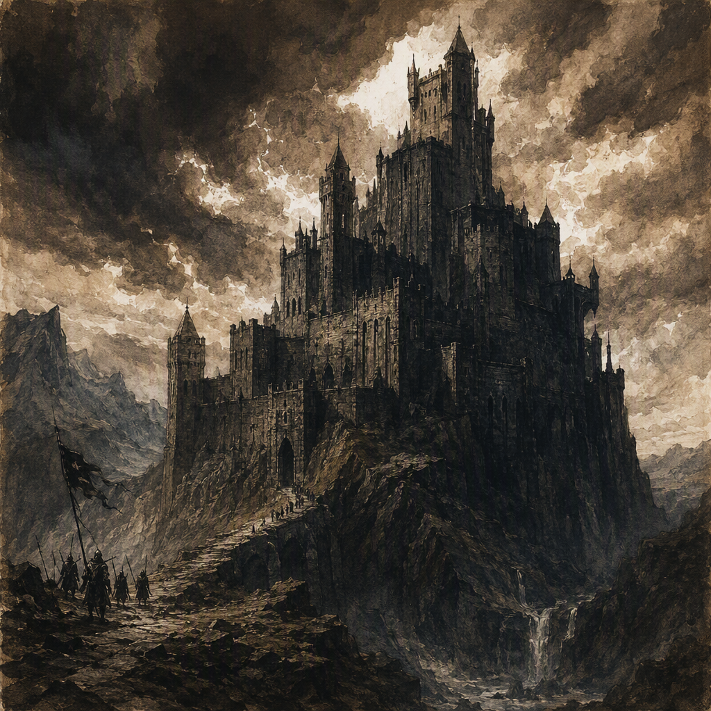

# Ironfell Citadel

[[Ironfell Citadel]] is a core location in the [[Weeping Marshes]], founded in 320 AS. Its region is the [[Weeping Marshes]]. Its identity is defined by the contrast between the hard, metallic impression suggested by its name and the bleak, sodden character of the surrounding marshland. The citadel maintains a closed and grim demeanor, marked by wary isolation in an inhospitable region. It is ruled by [[House Morvain]], has a garrison strength of 1096, and holds the status of quarantined. [[Isolde Thornwald]] serves at Ironfell Citadel.

## Infobox

| Field | Value |
|---|---|
| Location | [[Ironfell Citadel]] |
| Region | [[Weeping Marshes]] |
| Founded | 320 AS |
| Classification | Core location |
| Garrison strength | 1096 |
| Status | Quarantined |
| Ruler | [[House Morvain]] |
| Personnel | [[Isolde Thornwald]] serves at Ironfell Citadel |

## History

[[Ironfell Citadel]] was founded in 320 AS in the [[Weeping Marshes]]. Its region is the [[Weeping Marshes]], and its foundation established the citadel as a core location within that region, giving it a defined place in the fractured geography of the Ashen Era. The date of its founding is central to the citadel’s identity: it is neither an unmarked remnant nor an unnamed ruin, but a recognized stronghold with an established origin.

The citadel’s history is inseparable from its setting. The [[Weeping Marshes]] are reflected in the citadel’s bleak and sodden character, while the name Ironfell evokes a harder and more metallic impression. These two qualities coexist rather than resolve into a single character. [[Ironfell Citadel]] is therefore presented as a place shaped by both severity and damp isolation.

Its current status is quarantined. This status is a defining condition of the location and distinguishes the citadel from an ordinary fortified settlement. The designation places emphasis on closure, restriction, and separation without diminishing the citadel’s importance as a core location. [[Ironfell Citadel]] remains a place of recognized significance even while its status limits its openness.

The citadel’s garrison strength is 1096. This figure is part of the location’s established profile and indicates the substantial scale associated with its military presence. The garrison is recorded as a strength rather than as a description of any particular operation, campaign, or disposition. No additional structure is required to understand the basic fact: [[Ironfell Citadel]] is garrisoned by 1096.

The citadel is ruled by [[House Morvain]]. This rule forms the principal political affiliation attached to the location. The relationship is direct and explicit: [[House Morvain]] rules [[Ironfell Citadel]]. The citadel’s place in the [[Weeping Marshes]], its quarantined status, and its substantial garrison all belong to the same concise profile, but none alters the stated fact of its governance.

## Relationships & Affiliations

[[House Morvain]] rules [[Ironfell Citadel]]. This is the citadel’s confirmed ruling affiliation. The connection identifies the authority under which the location stands without requiring any broader account of administration, allegiance, or policy. [[Ironfell Citadel]] is accordingly recognized as a location ruled by [[House Morvain]].

[[Isolde Thornwald]] serves at [[Ironfell Citadel]]. Her service is a confirmed part of the citadel’s personnel record. The wording establishes her presence and service at the location, but does not specify a title, rank, office, or particular duty. She is therefore associated with [[Ironfell Citadel]] as someone who serves there, while the exact nature of that service remains outside the established profile.

The citadel’s regional affiliation is equally clear. [[Ironfell Citadel]] stands in the [[Weeping Marshes]], and the [[Weeping Marshes]] provide the environmental context for its visual identity and demeanor. Its region is explicitly the [[Weeping Marshes]]. Its connection to [[House Morvain]] is political, while its connection to [[Isolde Thornwald]] is occupational or service-based. These affiliations should not be conflated: each describes a different aspect of the citadel’s place in the setting.

The quarantined status further defines the manner in which these affiliations are understood. [[Ironfell Citadel]] is not characterized by openness or easy access. Its ruling authority and serving personnel are documented within a location whose established demeanor is closed, grim, and wary. The available facts establish these elements together without assigning an additional motive to the quarantine or a further description to the relationships.

## Character and Appearance

The visual identity of [[Ironfell Citadel]] combines the hard, metallic impression of iron with the bleak and sodden character of the [[Weeping Marshes]]. The result is an image of weight, severity, and persistent damp. Iron suggests resistance and harshness; the marshland suggests exposure to wet, desolate surroundings. The citadel’s identity lies in the meeting of those impressions.

This combination also governs the location’s overall tone. [[Ironfell Citadel]] feels closed and grim, maintaining wary isolation in an inhospitable region. Its atmosphere is not defined by grandeur, welcome, or ease. Instead, it presents a guarded character that matches both its quarantined status and its position within the [[Weeping Marshes]].

The citadel’s appearance should not be reduced to metal alone. The metallic impression is only one half of its visual identity. The sodden bleakness of the [[Weeping Marshes]] is equally important, giving the location an environmental character that is heavy, muted, and severe. Together, these elements create a place that appears resistant yet surrounded by conditions that are difficult to escape.

Its demeanor likewise extends beyond simple hostility. The citadel is wary rather than openly expressive, isolated rather than merely distant, and grim rather than chaotic. These qualities give [[Ironfell Citadel]] a restrained presence. It is a location whose character is communicated through closure and endurance.

As a quarantined core location ruled by [[House Morvain]], the citadel carries an impression of controlled separation. Its garrison strength of 1096 reinforces the scale of that impression without changing the essential character of the place. [[Isolde Thornwald]] serves there within this same atmosphere of metallic severity, marshland bleakness, and guarded isolation.

## Significance

[[Ironfell Citadel]] is significant as a core location with a clearly established founding date, ruling house, regional setting, garrison strength, and status. It was founded in 320 AS, stands in the [[Weeping Marshes]], and its region is the [[Weeping Marshes]]. It is ruled by [[House Morvain]], and maintains a garrison strength of 1096. Its status is quarantined.

These details form a unified profile. The citadel is old enough to possess a defined historical origin, important enough to be classified as a core location, and substantial enough to support a garrison of 1096. At the same time, its identity remains shaped by restriction and isolation. The place is not presented simply as a seat of power or as a military installation; it is a grim, closed presence in an inhospitable region.

For this reason, [[Ironfell Citadel]] occupies a distinctive position among locations of the Ashen Era. Its significance arises from the tension between strength and seclusion, authority and quarantine, and metallic hardness and marshland decay. Those contrasts define the citadel without requiring it to be separated from its surroundings. The [[Weeping Marshes]] are part of what makes Ironfell what it is, just as [[House Morvain]] and the garrison of 1096 are part of its established identity.