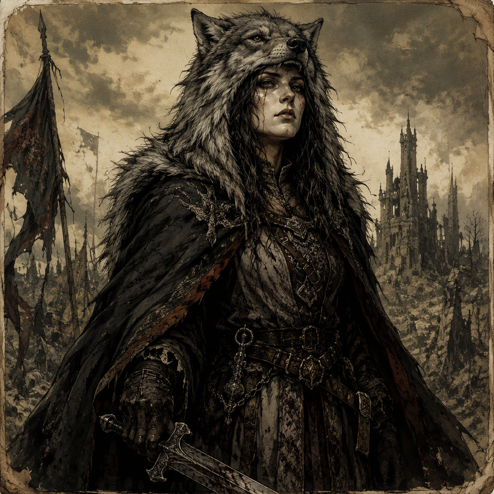

# Isolde Fellgard the Unforgiven

[[Isolde Fellgard the Unforgiven]] is a major character of the Ashen Era and a Blood-Mage associated with [[House Morvain]]. Born in 286 AS, they command [[Gloammarch]] since 310 AS and fought for [[House Morvain]] during [[The Purge of Blackport]]. Their visual identity is that of an Unforgiven Blood-Mage, while their demeanor is marked by a dangerous atmosphere of grievance, ambition, and concealed betrayal. Their closely guarded secret is that they plotted the death of their own liege. They are the mentor of [[Ossric Ashgrove]] and a rival of both [[Ignatz Ashgrove the Oathless]] and [[Malchior Cindervale the Flame-Touched]].

## Infobox

| Field | Value |
|---|---|
| Name | [[Isolde Fellgard the Unforgiven]] |
| Role | Blood-Mage |
| Status | Major character |
| Born | 286 AS |
| Member of | [[House Morvain]] |
| Command | Commands [[Gloammarch]] since 310 AS |
| Military involvement | Fought in [[The Purge of Blackport]], fighting for [[House Morvain]] |
| Mentor of | [[Ossric Ashgrove]] |
| Rival of | [[Ignatz Ashgrove the Oathless]]; [[Malchior Cindervale the Flame-Touched]] |
| Secret | Plotted the death of their own liege |
| Appearance | Unforgiven Blood-Mage |
| Demeanor | A dangerous atmosphere of grievance, ambition, and concealed betrayal |

## History

[[Isolde Fellgard the Unforgiven]] was born in 286 AS. The recorded facts of their life establish a figure whose identity is inseparable from three conditions: their role as a Blood-Mage, their membership in [[House Morvain]], and their command of [[Gloammarch]]. These elements define the principal public shape of the character. The private shape is supplied by their secret: they plotted the death of their own liege.

The contrast between public service and concealed betrayal is central to the character. [[Isolde Fellgard the Unforgiven]] is not merely described as a Blood-Mage with an association to [[House Morvain]]; they are specifically identified as a member of that house. Likewise, their command of [[Gloammarch]] is not presented as an incidental title, but as an established part of their position since 310 AS. Their authority therefore stands alongside the knowledge that their loyalty has been compromised by an act of deliberate plotting.

[[Isolde Fellgard the Unforgiven]] fought in [[The Purge of Blackport]], fighting for [[House Morvain]]. This places them within the military history of the house while also reinforcing the tension surrounding their hidden actions. The available record identifies their side in the conflict, but does not lessen the significance of the secret attached to their name. Service for a liege and plotting against that same liege are not treated as separate aspects of the character; together, they form the contradiction on which the Unforgiven identity rests.

Their command of [[Gloammarch]] since 310 AS further establishes the character as a figure of authority. The command is a direct expression of their public standing, while the epithet “the Unforgiven” evokes the moral and political burden carried by their history. The title does not erase their role as a Blood-Mage, their membership in [[House Morvain]], or their participation in [[The Purge of Blackport]]. Instead, it gathers those facts beneath a single identity defined by grievance, ambition, and concealed betrayal.

The record also identifies [[Isolde Fellgard the Unforgiven]] as the mentor of [[Ossric Ashgrove]]. This mentorship is one of the clearest indications that their influence extends beyond their own actions. As a mentor, they occupy a position in which knowledge, example, and authority converge. The dossier does not reduce this relationship to simple approval or affection. In the context of the character’s secret and demeanor, the mentorship remains part of the larger pattern of influence associated with [[Isolde Fellgard the Unforgiven]].

## Relationships & Affiliations

[[Isolde Fellgard the Unforgiven]] is a member of [[House Morvain]]. Their affiliation is explicit and is also reflected in their conduct during [[The Purge of Blackport]], where they fought for [[House Morvain]]. The house is therefore both an institutional affiliation and the side for which they are recorded as having fought.

Their command of [[Gloammarch]] has been held since 310 AS. This command is listed alongside their membership in [[House Morvain]], making both affiliations essential to any account of their status. The precise nature of the command beyond the fact that they hold it is not established here; its significance lies in its clear association with their public authority.

[[Ossric Ashgrove]] is identified as the mentee of [[Isolde Fellgard the Unforgiven]]. The relationship is defined by instruction and influence: [[Isolde Fellgard the Unforgiven]] is the mentor, while [[Ossric Ashgrove]] is the person mentored. This connection gives the character a role that differs from both military service and rivalry. It presents them as a source of knowledge or formation without requiring the relationship to be characterized as benevolent or hostile.

[[Ignatz Ashgrove the Oathless]] is a rival of [[Isolde Fellgard the Unforgiven]]. The rivalry is a defining opposition in the character’s network of relationships, though the available facts do not specify its cause or outcome. The title “the Oathless” belongs to [[Ignatz Ashgrove the Oathless]] and distinguishes that rival from [[Ossric Ashgrove]], who is instead identified as the mentee of [[Isolde Fellgard the Unforgiven]].

[[Malchior Cindervale the Flame-Touched]] is also a rival of [[Isolde Fellgard the Unforgiven]]. As with the rivalry involving [[Ignatz Ashgrove the Oathless]], the record establishes the opposition but does not provide a specific account of its origin or resolution. The two rivalries are consequently best understood as separate, named tensions surrounding the character rather than as a single conflict.

The combination of affiliation, command, mentorship, and rivalry gives [[Isolde Fellgard the Unforgiven]] a position defined by competing forms of connection. They belong to [[House Morvain]], command [[Gloammarch]], mentor [[Ossric Ashgrove]], and rival both [[Ignatz Ashgrove the Oathless]] and [[Malchior Cindervale the Flame-Touched]]. Above these public relationships hangs the concealed fact that they plotted the death of their own liege.

## Characterization

The visual identity of [[Isolde Fellgard the Unforgiven]] is that of an Unforgiven Blood-Mage. This description joins their supernatural role to the epithet that defines their presentation. The character is therefore visually understood through the conjunction of blood-magic and unforgiven status, rather than through an identity separate from either element.

Their demeanor carries a dangerous atmosphere of grievance, ambition, and concealed betrayal. These qualities are not presented as isolated moods. Grievance suggests a sense of injury or resentment; ambition indicates a desire for advancement or authority; concealed betrayal points directly toward the secret that they plotted the death of their own liege. Together, they produce the impression of a character whose presence is threatening even when their immediate actions are not specified.

The danger of [[Isolde Fellgard the Unforgiven]] is consequently atmospheric as well as political. Their command of [[Gloammarch]] establishes authority, their membership in [[House Morvain]] establishes allegiance, and their participation in [[The Purge of Blackport]] establishes service in conflict. Yet none of these public facts can be separated from the concealed betrayal at the center of the character. The resulting image is one of power carried under accusation, whether or not that accusation is openly spoken.

The mentor relationship with [[Ossric Ashgrove]] and the rivalries with [[Ignatz Ashgrove the Oathless]] and [[Malchior Cindervale the Flame-Touched]] extend this characterization into the social sphere. [[Isolde Fellgard the Unforgiven]] is not defined solely by the command of [[Gloammarch]] or by their role as a Blood-Mage. They are also defined by the ways their influence and opposition are organized around them.

As a character, [[Isolde Fellgard the Unforgiven]] is therefore constructed from public authority and private disloyalty. Born in 286 AS, commanding [[Gloammarch]] since 310 AS, and fighting for [[House Morvain]] in [[The Purge of Blackport]], they possess an established place in the recorded history of the realm. Their secret, their demeanor, and their title supply the darker interpretation of that place: a Blood-Mage whose grievance and ambition are inseparable from concealed betrayal.