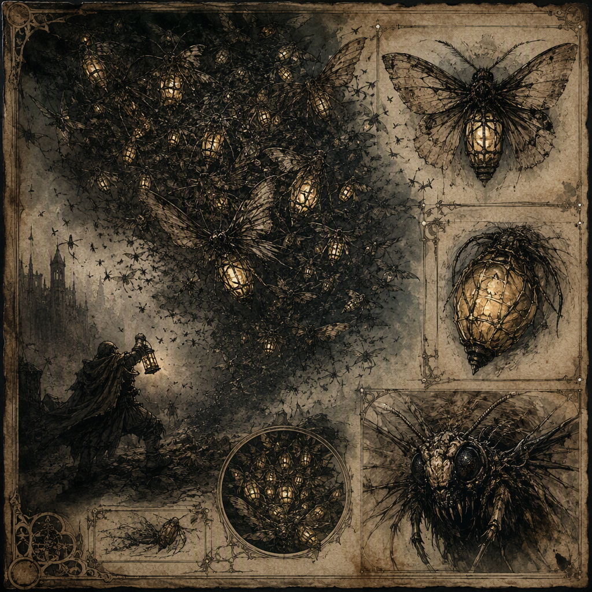

# Lantern Moth Swarm (creature)

The **[[Lantern Moth Swarm]]** is a siege-breaker of serious threat, acting as a collective to bring mothlike disruption against fortified positions. It appears as a dense cloud of moths carrying the eerie visual impression of lantern-light. Its presence is restless, overwhelming, and difficult to escape. The swarm lairs in [[Ashreach]] and was unleashed in [[The Leaden Accord]].

## Infobox

| Field | Value |
|---|---|
| Name | [[Lantern Moth Swarm]] |
| Threat rating | 6 |
| Habit | Siege-breaker |
| Lair | [[Ashreach]] |
| Unleashed in | [[The Leaden Accord]] |
| Appearance | A dense cloud of moths carrying the eerie visual impression of lantern-light |
| Demeanor | Restless, overwhelming, and difficult to escape |

## History

The [[Lantern Moth Swarm]] is recorded as a collective creature rather than as a single enlarged moth or a gathering directed by a visible master. Its identity lies in the movement and pressure of the whole. Individual moths form a dense cloud, and the cloud acts with a unity that makes the swarm a distinct siege-breaker.

The swarm lairs in [[Ashreach]]. This is the only lair identified for it in the available record. The association is significant because the swarm’s known habit is not simple wandering or incidental infestation. It is a siege-breaker: a creature or collective whose principal danger is directed against fortified positions. Its appearance and behavior are therefore understood through the disruption it brings to enclosed defenses.

The [[Lantern Moth Swarm]] was unleashed in [[The Leaden Accord]]. The record identifies this unleashing but does not establish additional circumstances surrounding it. It does not specify who released the swarm, why it was released, or what immediate outcome followed. The event nevertheless forms a central part of the creature’s historical identity, since it places the swarm in an act of deliberate or consequential deployment rather than merely describing it as a threat found in the wild.

No further dates, campaigns, or sites are assigned to the swarm in the surviving account. As a result, histories of the creature generally begin with its lair in [[Ashreach]], note its unleashing in [[The Leaden Accord]], and treat its siege-breaking nature as the defining continuity between those references.

## Relationships & Affiliations

The available record does not assign the [[Lantern Moth Swarm]] to any named faction, house, order, cartel, crown, or other organized power. Its presence in [[The Leaden Accord]] establishes that it was unleashed there, but does not by itself establish an affiliation with any participant or authority associated with that event. The swarm should therefore not be described as belonging to a power merely because it was present or used during the accord.

Likewise, no individual member of the swarm is identified as a leader, herald, host, or controller. The creature acts as a collective. This distinction is important to descriptions of its relationships: the swarm’s apparent unity is a feature of its own nature, not evidence of a separately named command structure.

Its relationship to fortified positions is functional rather than political. The [[Lantern Moth Swarm]] brings mothlike disruption against them, making fortification itself the relevant condition in accounts of its activity. Walls, gates, towers, and enclosed defenses are not described as places where the creature settles peacefully. They are the environments against which its siege-breaker habit becomes dangerous.

The swarm’s relationship with its lair is similarly recorded without additional interpretation. It lairs in [[Ashreach]], but no further claim is made regarding whether it is native to that place, confined there, attracted there, or merely observed there. The phrase establishes location, not origin or allegiance.

The record also does not identify any other creature as prey, rival, companion, or natural enemy of the swarm. Nor does it establish a relationship between the swarm and the lantern-like visual impression that surrounds it. The lantern-light quality belongs to its appearance; it is not presented as evidence of an alliance, tool, or external source.

## Tactical Assessment

The threat rating of the [[Lantern Moth Swarm]] is **6**. This rating corresponds to its characterization as a siege-breaker of serious threat. Its danger does not depend solely on physical force. The swarm’s effectiveness arises from collective movement, visual disturbance, pressure on defenders, and the difficulty of escaping its presence once it has gathered around a position.

Its appearance is a dense cloud of moths carrying the eerie visual impression of lantern-light. The visual effect is central to its tactical identity. A cloud is difficult to read as a single target, and the lantern-like impression makes the swarm especially disorienting to observe. The available record does not state that the light burns, blinds, illuminates, or causes any separate effect. Its confirmed significance is visual: it contributes to the eerie impression of the creature and to the disruption associated with its presence.

The swarm’s demeanor is restless, overwhelming, and difficult to escape. These qualities describe a threat that does not present a calm or stationary obstacle. Restlessness suggests constant motion; overwhelming presence indicates that the cloud can dominate the immediate scene; difficulty of escape means that withdrawal cannot be assumed to end an encounter. None of these terms requires the swarm to be described as invulnerable or unstoppable. They instead define the pressure experienced by those caught near it.

As a siege-breaker, the [[Lantern Moth Swarm]] is best understood as a collective disruption against fortified positions. The record does not assign it a specific method of breaching walls or gates, and no unsupported mechanism should be attached to its attacks. Its confirmed function is broader: it brings mothlike disruption against defenses. This makes its threat relevant even where the structure itself remains intact, since a fortified position depends on the ability of those within it to maintain order and resist pressure.

The swarm’s collective nature also limits the usefulness of descriptions that treat it as a lone beast. A single moth does not represent the creature as recorded. The dense cloud is the operative form, and the cloud’s combined movement produces the overwhelming impression. Accounts that isolate one visible moth from the whole therefore describe only a fragment of the encounter.

## In Popular Memory

Descriptions of the [[Lantern Moth Swarm]] commonly emphasize the contradiction between its delicate form and its serious threat. Moths suggest lightness and fragility, while the swarm is identified as a siege-breaker with a threat rating of **6**. The resulting image is not one of a harmless cloud but of a mass whose very delicacy becomes unsettling when multiplied beyond easy measure.

The lantern-light impression is likewise central to its remembered image. The swarm is not merely seen as darkness filled with insects. It carries the eerie visual impression of lantern-light, turning its appearance into something difficult to separate from the atmosphere of a threatened position. This impression reinforces the creature’s restless and overwhelming demeanor without requiring any additional power to be attributed to it.

References to [[Ashreach]] and [[The Leaden Accord]] remain the principal fixed points in accounts of the creature. [[Ashreach]] is where the swarm lairs, while [[The Leaden Accord]] is where it was unleashed. Beyond these facts, the record remains deliberately narrow. The [[Lantern Moth Swarm]] is therefore remembered less through a long chain of recorded events than through a concentrated image: a dense, lantern-like cloud moving against fortifications, difficult to escape and capable of breaking the composure of a defended position.