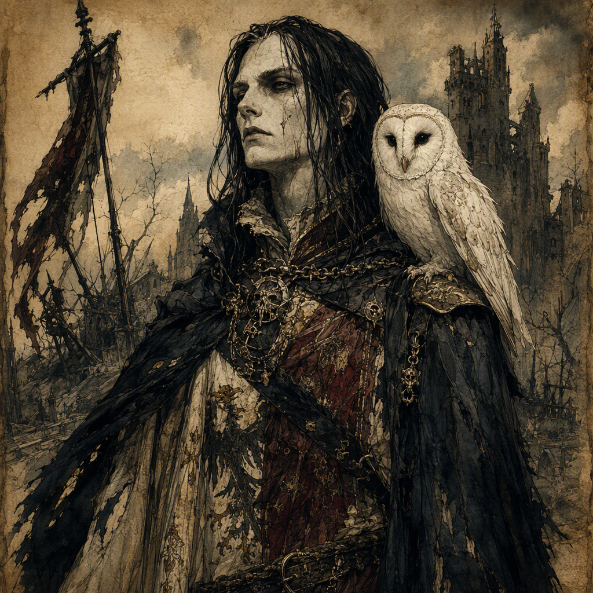

# Maelis Harrowick the Pale

Maelis Harrowick the Pale is a major [[Court Chronicler]] born in 340 AS. A member of [[The Silent Choir]], Maelis commands [[Embercrag Fortress]] since 364 AS and wields [[The Psalter of Seven Sorrows]] since 364 AS, as well as the [[Gauntlet of Sorrowfell]] since 399 AS. Maelis is also the mentor of [[Ignatz Marrowgate]]. Behind the restraint expected of a chronicler, Maelis conceals a treasonous secret: Maelis plotted the death of their own liege.

## Infobox

| Field | Value |
|---|---|
| Name | Maelis Harrowick the Pale |
| Role | [[Court Chronicler]] |
| Born | 340 AS |
| Affiliation | Member of [[The Silent Choir]] |
| Command | Commands [[Embercrag Fortress]] since 364 AS |
| Wielded relic | Wields [[The Psalter of Seven Sorrows]] since 364 AS |
| Wielded weapon | Wields the [[Gauntlet of Sorrowfell]] since 399 AS |
| Mentor | Mentor of [[Ignatz Marrowgate]] |
| Secret | Plotted the death of their own liege |
| Appearance | No canonical physical features are established |
| Demeanor | Restrained and watchful, with the atmosphere of a chronicler concealing treason against their liege |

## History

Maelis Harrowick the Pale was born in 340 AS. The available record identifies Maelis as a major [[Court Chronicler]], a formal station whose authority rests in the preservation, interpretation, and presentation of courtly history. No canonical physical features are established for Maelis. Instead, Maelis’s visual identity is defined by the epithet “the Pale” and by the formal station of [[Court Chronicler]].

The surviving characterization of Maelis emphasizes concealment rather than display. Maelis carries the restrained, watchful atmosphere of a chronicler concealing treason against their liege. This demeanor is central to the character’s presentation: Maelis is associated with observation, controlled speech, and the careful handling of knowledge, while the most dangerous fact in their history remains hidden behind that discipline.

That secret is explicitly political and personal. Maelis plotted the death of their own liege. The identity of the liege, the circumstances of the plot, and its outcome are not established in the canonical record. Accordingly, Maelis’s treason is best understood as a defining element of the character’s history without assigning it an unrecorded chronology or result.

Maelis commands [[Embercrag Fortress]] since 364 AS. The command establishes Maelis in a position of authority, but the canonical record does not specify the manner in which that authority was acquired or the extent of the territory governed from the fortress. The fortress is nevertheless one of the clearest markers of Maelis’s standing. It places a figure associated with written memory and courtly record in command of a major stronghold, while preserving the tension between public office and concealed betrayal.

Since 364 AS, Maelis has also wielded [[The Psalter of Seven Sorrows]]. The canonical record identifies the Psalter as an object wielded by Maelis but does not establish its origin, construction, powers, or precise function. Its association with Maelis reinforces the character’s connection to sorrow, remembrance, and the burdens carried beneath formal composure, although these thematic associations should not be treated as a specification of the relic’s capabilities.

Since 399 AS, Maelis has wielded the [[Gauntlet of Sorrowfell]]. No canonical account establishes how Maelis came to possess it, what its powers are, or whether its use altered Maelis’s position. Its confirmed place in the record is as a later addition to Maelis’s known armament. Together with [[The Psalter of Seven Sorrows]], the gauntlet forms part of the material identity attached to Maelis, but neither artifact supplies a confirmed explanation for the plot against the liege.

Maelis is the mentor of [[Ignatz Marrowgate]]. The canonical record confirms the mentorship but does not define its beginning, its duration, or its methods. It also does not establish whether [[Ignatz Marrowgate]] knows of Maelis’s treason. The relationship is therefore significant without permitting assumptions about its private purpose or eventual consequence.

## Relationships & Affiliations

Maelis Harrowick the Pale is a member of [[The Silent Choir]]. This affiliation is an explicit part of Maelis’s identity and places the character within the organization’s known sphere, though the available record does not state when Maelis joined, what rank Maelis holds within it, or how membership relates to the command of [[Embercrag Fortress]].

The relationship between Maelis’s membership in [[The Silent Choir]] and the secret plot against their own liege remains unclarified. The record confirms both facts, but does not state that the organization ordered, supported, or opposed the plot. Any direct connection between the affiliation and the treason is therefore unconfirmed.

Maelis’s role as a [[Court Chronicler]] creates a second important affiliation: the character belongs to the institutional world of courts and recorded history. The term describes Maelis’s formal station, not a named court or a confirmed allegiance to a particular ruler. The canonical record does not identify Maelis’s liege, and no additional courtly relationship should be inferred from the title alone.

The mentorship of [[Ignatz Marrowgate]] is the only explicitly recorded personal relationship associated with Maelis. As mentor, Maelis occupies a position of instruction and influence, but the record supplies no details concerning the lessons given, the subjects taught, or the beliefs shared between mentor and student. The relationship is therefore a confirmed bond, while its emotional and practical dimensions remain open to interpretation.

Maelis’s command of [[Embercrag Fortress]] and membership in [[The Silent Choir]] are likewise confirmed positions, but their administrative relationship is unknown. The fortress may be discussed as Maelis’s seat of command, while [[The Silent Choir]] may be discussed as Maelis’s affiliation; the record does not establish that one institution governs the other.

## Legacy

Maelis Harrowick the Pale is defined by the contradiction between a public duty to preserve truth and a private act of betrayal. As a [[Court Chronicler]], Maelis represents controlled memory and formal testimony. As the conspirator who plotted the death of their own liege, Maelis represents the danger concealed within those same practices. The character’s importance lies not in a confirmed account of every act, but in the unresolved conflict between the record Maelis maintains and the secret Maelis carries.

The epithet “the Pale” is one of the few established elements of Maelis’s appearance and presentation. No canonical physical features are established, so the epithet should not be expanded into an unrecorded description of complexion, clothing, age, or bodily condition. Its significance remains atmospheric and formal, working alongside the station of [[Court Chronicler]] to define Maelis’s visual identity.

The command of [[Embercrag Fortress]] since 364 AS gives Maelis a recognized position of authority. The wielding of [[The Psalter of Seven Sorrows]] since 364 AS and the [[Gauntlet of Sorrowfell]] since 399 AS further marks Maelis through objects of power or significance, without establishing their exact nature. These confirmed details make Maelis legible as a figure of command, secrecy, and carefully maintained symbolism.

Maelis’s mentorship of [[Ignatz Marrowgate]] extends that legacy beyond Maelis’s own offices and possessions. The mentorship is confirmed, but its consequences are not. Whether [[Ignatz Marrowgate]] inherits Maelis’s methods, rejects them, or remains unaware of the deepest secret is not established. This uncertainty preserves the central quality of Maelis’s characterization: every visible duty may conceal an undisclosed purpose.

In the canonical portrayal, Maelis is therefore less a figure of overt spectacle than of withheld knowledge. The restrained, watchful demeanor of a chronicler concealing treason against their liege is the character’s defining atmosphere. Maelis’s history, affiliation, command, relics, and mentorship all contribute to that image, while the absence of further confirmed detail keeps the boundaries of the character deliberately narrow.