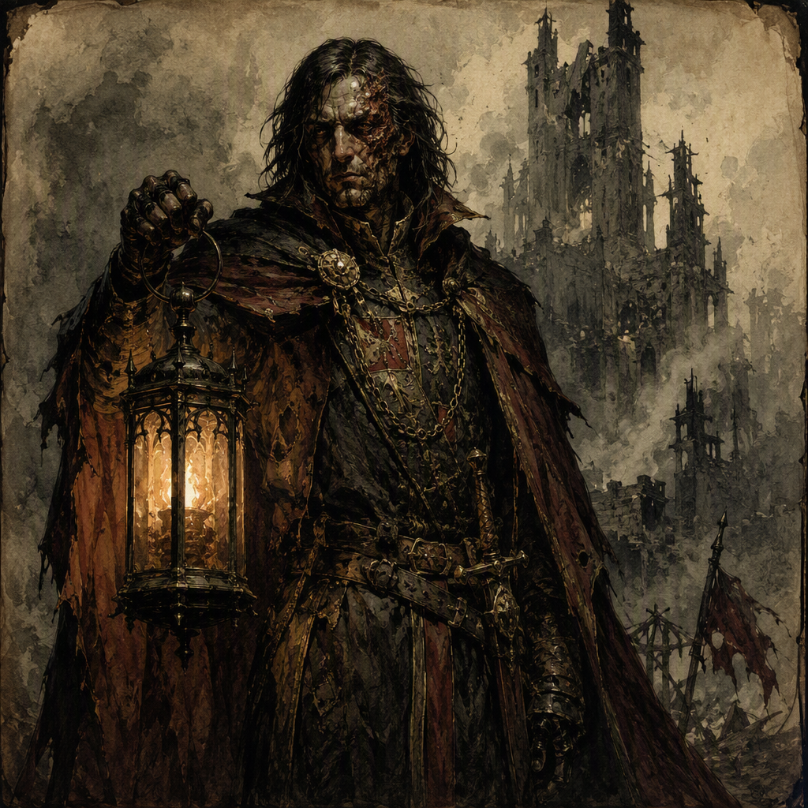

# Malchior Cindervale the Flame-Touched

Malchior Cindervale the Flame-Touched is a major character who serves as Arch-Prelate and is a member of [[The Iron-Ring Cartel]]. Born in 289 AS, Malchior commands [[Fenspire]] since 321 AS and fought in [[The Purge of Blackport]] for [[The Iron-Ring Cartel]]. Their public identity is that of a Flame-Touched Arch-Prelate with a claimed lineage that is suspect, while their concealed secret is that they forged their own lineage papers. Malchior projects sanctified authority strained by the pressure of concealed fabrication and is a rival of [[Isolde Fellgard the Unforgiven]] and [[Ignatz Ashgrove the Oathless]].

## Infobox

| Field | Value |
|---|---|
| Name | Malchior Cindervale the Flame-Touched |
| Role | Arch-Prelate |
| Born | 289 AS |
| Member of | [[The Iron-Ring Cartel]] |
| Command | [[Fenspire]], since 321 AS |
| Military involvement | Fought in [[The Purge of Blackport]] for [[The Iron-Ring Cartel]] |
| Rivals | [[Isolde Fellgard the Unforgiven]]; [[Ignatz Ashgrove the Oathless]] |
| Secret | Forged their own lineage papers |
| Appearance | Flame-Touched Arch-Prelate whose claimed lineage is suspect |
| Demeanor | Projects sanctified authority strained by the pressure of concealed fabrication |

## History

Malchior Cindervale the Flame-Touched was born in 289 AS. The available account of their life places their identity under persistent tension: Malchior serves as Arch-Prelate and presents the visual identity associated with a Flame-Touched Arch-Prelate, yet the lineage supporting that identity is suspect. The contradiction is central to Malchior’s character. Their authority is not merely ceremonial in appearance, but its foundation is threatened by the secret they carry.

That secret is that Malchior forged their own lineage papers. The fabrication directly concerns the documents by which their claimed lineage is represented, making the question of inheritance inseparable from the question of authority. Malchior’s public station therefore rests beneath the pressure of a concealed act of authorship: they created the papers that give form to the lineage they claim.

Malchior is a member of [[The Iron-Ring Cartel]]. Their affiliation is not incidental to their recorded history. They fought in [[The Purge of Blackport]], fighting for [[The Iron-Ring Cartel]]. This establishes Malchior as an active participant in the Cartel’s conflict rather than a figure confined to religious or administrative presentation. The combination of Arch-Prelate and Cartel member gives their character a deliberately divided profile, with sanctified authority existing alongside allegiance to a power engaged in open struggle.

Since 321 AS, Malchior has commanded [[Fenspire]]. The command is one of the clearest expressions of their authority. It gives practical weight to the title of Arch-Prelate and places Malchior in a position where their public identity must withstand continual scrutiny. The command of [[Fenspire]] also provides the setting in which their forged lineage papers carry their greatest significance: the documents are not an isolated personal deception, but part of the identity of a figure entrusted with command.

Malchior’s history is consequently defined by three linked facts. They were born in 289 AS; they fought for [[The Iron-Ring Cartel]] in [[The Purge of Blackport]]; and they have commanded [[Fenspire]] since 321 AS. Around those facts lies the concealed fabrication of their lineage. The record does not separate Malchior’s spiritual appearance from their political and military position. Instead, each aspect reinforces the same central uncertainty: the authority they project is powerful, but the lineage used to substantiate it was forged by Malchior themself.

## Relationships & Affiliations

Malchior is a member of [[The Iron-Ring Cartel]]. Their participation in [[The Purge of Blackport]] was explicitly on behalf of [[The Iron-Ring Cartel]], making the affiliation part of both their institutional identity and their martial record. Malchior’s status as Arch-Prelate does not replace or obscure this membership. It exists alongside it, producing a character whose sanctified presentation is inseparable from Cartel allegiance.

Malchior is a rival of [[Isolde Fellgard the Unforgiven]]. The rivalry is a defining relationship in Malchior’s profile, placing their contested authority in direct opposition to another named power. Because Malchior’s claimed lineage is suspect and their lineage papers were forged by their own hand, the rivalry carries particular thematic weight: Malchior’s authority is always vulnerable to challenges concerning legitimacy, whether those challenges are expressed through doctrine, reputation, or open opposition.

Malchior is also a rival of [[Ignatz Ashgrove the Oathless]]. This rivalry further emphasizes the instability surrounding Malchior’s position. The title of Arch-Prelate suggests sanctified certainty, while the forged lineage papers represent a concealed breach between appearance and origin. Against [[Ignatz Ashgrove the Oathless]], Malchior’s projected authority becomes a point of contention rather than an unquestioned foundation.

The two rivalries should not be treated as interchangeable. [[Isolde Fellgard the Unforgiven]] and [[Ignatz Ashgrove the Oathless]] are each identified as rivals of Malchior, but the record does not assign the same cause or character to either rivalry. What can be stated is that both relationships place Malchior under opposition while they command [[Fenspire]] and remain a member of [[The Iron-Ring Cartel]].

## Public Image and Inner Strain

Malchior’s visual identity is that of a Flame-Touched Arch-Prelate whose claimed lineage is suspect. The appearance communicates rank and sanctity, but the qualification concerning lineage prevents that image from becoming complete or secure. Malchior is recognizable through the authority they project, yet the same authority is shadowed by the knowledge that its documentary basis was fabricated.

Their demeanor reflects this contradiction. Malchior projects sanctified authority strained by the pressure of concealed fabrication. The strain does not erase the authority; rather, it defines how that authority is expressed. Their bearing is one of command, but it is burdened by the secret that they forged their own lineage papers. The result is neither simple confidence nor simple concealment. Malchior’s presentation depends upon maintaining the appearance of certainty while carrying knowledge that undermines the source of that certainty.

This tension also distinguishes Malchior from a conventional religious authority. The title of Arch-Prelate indicates their role, while the Flame-Touched identity supplies their visual presence. Neither fact resolves the question of lineage. Instead, both make the question more consequential. The greater the force of Malchior’s sanctified presentation, the more sharply the forged papers contrast with it.

Malchior’s command of [[Fenspire]] since 321 AS gives this inner strain an institutional dimension. Their demeanor is not observed in isolation but in relation to a command they hold, an affiliation they maintain, and rivals who stand against them. The character’s dramatic force lies in the conjunction of these elements: a fabricated lineage, an authoritative office, service for [[The Iron-Ring Cartel]], and rivalries with [[Isolde Fellgard the Unforgiven]] and [[Ignatz Ashgrove the Oathless]].

Malchior Cindervale the Flame-Touched is therefore defined by concealed fabrication under visible authority. Their forged lineage papers are the secret at the center of their identity, while their role as Arch-Prelate, membership in [[The Iron-Ring Cartel]], service in [[The Purge of Blackport]], and command of [[Fenspire]] since 321 AS establish the public structure that the secret threatens.