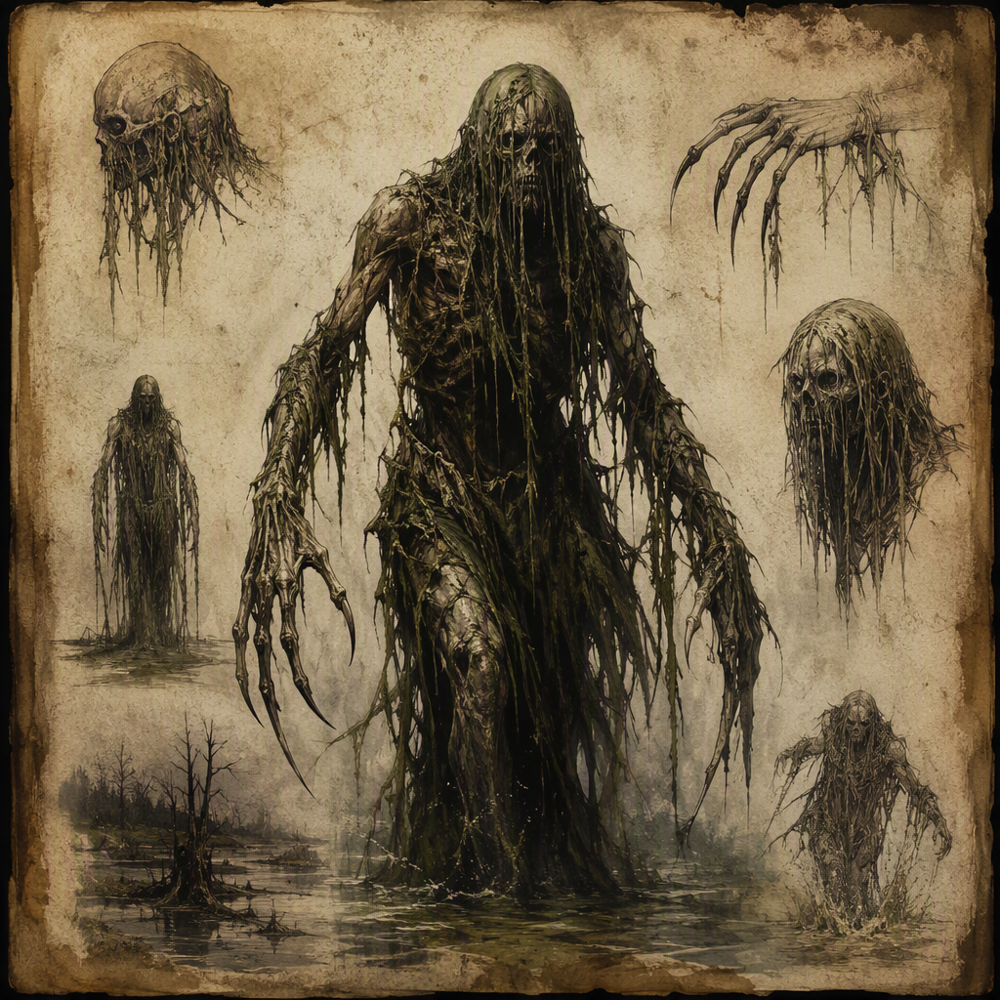

# Marsh Revenant (creature)

The **[[Marsh Revenant]]** is a siege-breaker, defined by its ability to shatter fortified resistance. It is a revenant of stagnant, hostile ground whose presence turns defense into desperation. The creature appears as a corpse-like figure burdened with marsh-wet decay and the grim solidity of a breaker of walls. It projects tireless, impersonal hostility, advancing with the inevitability of the dead. The [[Marsh Revenant]] lairs in [[Greyfell Citadel]], where its nature is most clearly associated with the collapse of defensive strength and the erosion of organized resistance.

## Infobox

| Field | Value |
|---|---|
| Creature | Marsh Revenant |
| Habit | Siege-breaker |
| Lair | Greyfell Citadel |
| Appearance | Corpse-like figure burdened with marsh-wet decay and the grim solidity of a breaker of walls |
| Demeanor | Tireless, impersonal hostility; advances with the inevitability of the dead |

## History

The history of the [[Marsh Revenant]] is inseparable from its character as a revenant of stagnant, hostile ground. It is not defined by a personal past, a remembered allegiance, or a recognizable ambition. Its identity is instead expressed through the condition of the ground from which it arises and through the pressure it brings against anything that attempts to resist it. The creature’s decay is therefore more than a visual feature. It conveys the persistence of a hostile place made manifest in a corpse-like form.

The surviving description of the [[Marsh Revenant]] presents no account of an origin beyond this association with stagnant ground. Consequently, its history is treated through function rather than chronology. It is a siege-breaker: a creature whose defining purpose is the shattering of fortified resistance. This designation describes more than a preferred method of attack. It identifies the role the creature occupies wherever it appears, placing the collapse of defenses at the center of its significance.

The [[Marsh Revenant]] is not characterized as a commander, negotiator, or raider. Its movement is direct and impersonal. It advances without the signs of fatigue or hesitation associated with living attackers, and its hostility does not depend upon insult, fear, or personal grievance. The creature’s progress is instead presented as an unavoidable pressure. In this sense, its history is enacted whenever a defense begins to lose the certainty that it can endure.

Its lair is [[Greyfell Citadel]]. This fact gives the creature a fixed place within the known geography of the setting, while also reinforcing the contrast at the heart of its description. A citadel signifies fortified resistance; the [[Marsh Revenant]] signifies the force that breaks such resistance. The lair is therefore not merely a shelter. It is the setting most closely associated with the creature’s defining habit and with the transformation of defense into desperation.

No further history is assigned to the [[Marsh Revenant]] in the available record. In particular, the creature is not given a named maker, a known former identity, or a stated purpose beyond its nature as a siege-breaker. These omissions are consistent with its impersonal presentation. The absence of an individual story leaves the creature as a concentrated expression of decay, persistence, and the failure of walls to provide lasting safety.

## Relationships & Affiliations

No affiliation is established for the [[Marsh Revenant]] beyond its lair in [[Greyfell Citadel]]. It is not identified as a servant, champion, or ally of any other named power. Its description supplies no personal bond and no evidence of loyalty. The creature’s hostility is impersonal, and this quality prevents it from being understood through ordinary ideas of allegiance.

The lack of a stated affiliation does not make the [[Marsh Revenant]] neutral. It is hostile by nature, and its hostility is directed through the breaking of fortified resistance. Its actions are therefore best understood as functional rather than political. It does not need a cause or a declared master to threaten a defense. Its presence alone applies pressure to the people and structures attempting to hold their ground.

The relationship between the [[Marsh Revenant]] and [[Greyfell Citadel]] is the only lair association established in the record. The citadel provides the creature with its known place of habitation, while the creature’s siege-breaking nature gives the location a particular significance. Their association is consequently spatial and thematic rather than described as a pact or command structure.

The [[Marsh Revenant]] should not be confused with an organized force merely because it is associated with the breaking of defenses. A siege-breaker is a defined habit, not evidence of membership in an army or faction. The creature’s advance is tireless and impersonal, and no hierarchy is attributed to it. Any interpretation that assigns it a commander, a military rank, or a broader allegiance exceeds the established description.

Its relationship with defenders is similarly defined by effect rather than communication. The [[Marsh Revenant]] does not bargain with those who oppose it, nor does it require their recognition. It advances, and the defense responds under mounting pressure. This is why its presence turns defense into desperation: the contest is not framed as an exchange of intentions, but as the gradual imposition of an inhuman force upon a position intended to endure.

## Tactical Assessment

The [[Marsh Revenant]] is most significant when considered as a threat to fortified resistance. Its role as a siege-breaker indicates that walls, barriers, and defensive arrangements are central to the danger it represents. The creature is defined by its ability to shatter such resistance, making it particularly important in any account of a defense that has ceased to be secure.

Its appearance communicates this role immediately. The corpse-like figure suggests death and decay, while the marsh-wet burden suggests a hostile environment carried upon the body. At the same time, the creature possesses the grim solidity of a breaker of walls. These elements establish a tension between decomposition and mass: the [[Marsh Revenant]] is visibly ruined, yet it is also presented as something capable of applying overwhelming physical pressure.

The creature’s demeanor strengthens this assessment. Tireless hostility means that time does not offer an obvious answer to its advance. Impersonal hostility means that there is no stated emotional condition that can be exploited. It does not grow angry, become distracted, or seek recognition. Its movement is instead governed by the inevitability of the dead, making continued resistance appear increasingly desperate.

The [[Marsh Revenant]] therefore functions as a threat of attrition even when its defining action is the breaking of a wall. Its danger lies not solely in the instant of collapse, but in the certainty implied by its approach. A defense confronted by such a creature must contend with the loss of confidence as well as the destruction of fortification. The psychological effect follows directly from the creature’s presentation: what advances cannot be persuaded, exhausted, or shamed into retreat.

The known lair in [[Greyfell Citadel]] further concentrates these tactical meanings. A creature that dwells in a citadel while embodying the destruction of fortified resistance presents a persistent contradiction. The structure suggests endurance; the inhabitant suggests the failure of endurance. Within the article’s established description, this contradiction is central to the [[Marsh Revenant]] rather than incidental to it.

No additional weapons, powers, weaknesses, or methods are specified. Tactical accounts should therefore remain focused on the creature’s established qualities: its siege-breaking habit, its corpse-like and marsh-wet appearance, its grim solidity, and its tireless, impersonal advance. These qualities are sufficient to define its role without attributing unrecorded capabilities.

## Significance

The [[Marsh Revenant]] has significance as an embodiment of defensive collapse. It gives physical form to the fear that a wall, fortress, or prepared position may fail despite its apparent strength. Its decay connects it to stagnant and hostile ground, while its solidity connects it to the deliberate destruction of barriers. The result is a creature that represents both environmental corruption and military desperation.

Its importance does not depend upon a personal name, a recorded life, or a stated allegiance. The [[Marsh Revenant]] is memorable because its identity is concentrated in its function. It is the siege-breaker: the advancing dead presence before which resistance becomes uncertain and then desperate. The known fact that the [[Marsh Revenant]] lairs in [[Greyfell Citadel]] completes this image by placing the embodiment of broken defenses within a fortified setting.

As a subject of record, the creature is consequently defined by three inseparable features: the hostile ground from which its revenant nature is expressed, the fortified resistance it is capable of shattering, and the inevitability of its advance. Any account that omits one of these elements gives an incomplete picture of the [[Marsh Revenant]].