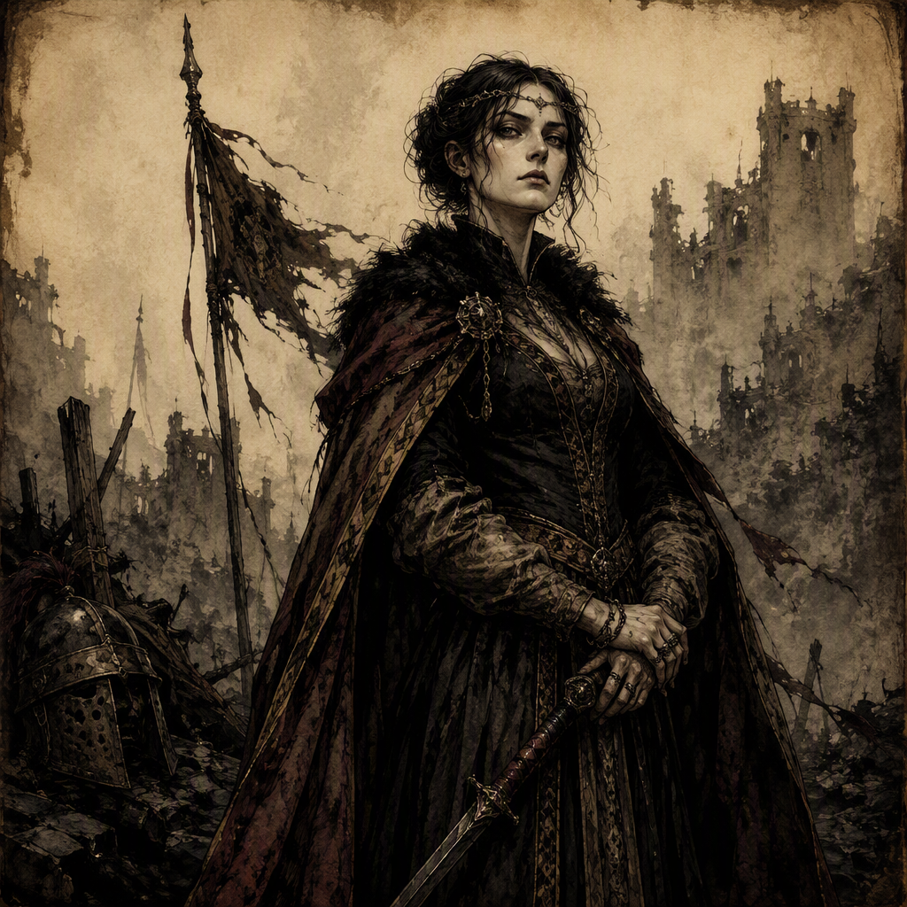

# Morwenna Ashgrove

[[Morwenna Ashgrove]] is a major Fleet Admiral and a member of [[The Ashen Vanguard]]. Born in 288 AS, she commands [[Hollowvale]] since 311 AS and fought in [[The Leaden Accord]] for [[The Ashen Vanguard]]. Her public identity is defined by disciplined authority and the commanding station of Fleet Admiral, while her concealed activities place her in opposition to the interests of her own faction: [[Morwenna Ashgrove]] secretly sells intelligence to the [[Iron-Ring Cartel]]. She is also the mentor of [[Caedmon Fellgard]] and the rival of [[Sabelle Mournvale the Twice-Crowned]].

## Infobox

| Field | Value |
|---|---|
| Name | [[Morwenna Ashgrove]] |
| Role | Fleet Admiral |
| Born | 288 AS |
| Membership | Member of [[The Ashen Vanguard]] |
| Command | Commands [[Hollowvale]] since 311 AS |
| Conflict | Fought in [[The Leaden Accord]], fighting for [[The Ashen Vanguard]] |
| Mentor | Mentor of [[Caedmon Fellgard]] |
| Rival | Rival of [[Sabelle Mournvale the Twice-Crowned]] |
| Secret | Secretly sells intelligence to the [[Iron-Ring Cartel]] |
| Appearance | No canonical physical features are established; her visual identity is defined by the commanding station of Fleet Admiral |

## History

[[Morwenna Ashgrove]] was born in 288 AS. The available record establishes her later prominence as a major Fleet Admiral and a member of [[The Ashen Vanguard]], but does not establish additional details concerning her early life. Her characterization is consequently centered less on a documented origin than on the authority she exercises and the divided loyalties concealed beneath it.

[[Morwenna Ashgrove]] fought in [[The Leaden Accord]], fighting for [[The Ashen Vanguard]]. This association places her military identity within the history of the Vanguard and confirms her participation in one of the conflicts recorded under her name. The available account does not assign her a separate allegiance during the conflict; her stated side was [[The Ashen Vanguard]].

Since 311 AS, [[Morwenna Ashgrove]] has commanded [[Hollowvale]]. The command is a central part of her official position. It gives concrete form to the authority associated with the title Fleet Admiral, while also defining her in the records as an active power within [[The Ashen Vanguard]]. Her command of [[Hollowvale]] is therefore inseparable from the public image she projects: controlled, disciplined, and invested with responsibility.

No canonical physical features are established for [[Morwenna Ashgrove]]. Her visual identity is instead defined by the commanding station of Fleet Admiral. This absence of fixed physical description is significant to her presentation. The character is recognized through rank, bearing, and conduct rather than through a canonical account of facial features, stature, clothing, or other bodily details. Her presence is consequently institutional as much as personal.

The contradiction at the center of [[Morwenna Ashgrove]]'s history is her relationship with the [[Iron-Ring Cartel]]. Although she is a member of [[The Ashen Vanguard]], [[Morwenna Ashgrove]] secretly sells intelligence to the [[Iron-Ring Cartel]]. The act is established as her secret and is not presented as an open affiliation. Her public position and covert dealings must therefore be read as separate aspects of the same character: one visible through command, the other concealed through deliberate secrecy.

## Relationships & Affiliations

### The Ashen Vanguard

[[Morwenna Ashgrove]] is a member of [[The Ashen Vanguard]]. Her service for the faction is affirmed by both her membership and her participation in [[The Leaden Accord]], where she fought for [[The Ashen Vanguard]]. Her command of [[Hollowvale]] since 311 AS further connects her authority to the Vanguard's sphere of power.

The relationship is complicated by her secret dealings. [[Morwenna Ashgrove]]'s membership of [[The Ashen Vanguard]] is a matter of record, while her sale of intelligence to the [[Iron-Ring Cartel]] is covert. The contrast does not erase her stated factional identity, but it makes that identity an unstable foundation for trust.

### The Iron-Ring Cartel

[[Morwenna Ashgrove]] secretly sells intelligence to the [[Iron-Ring Cartel]]. This is her defining secret and the clearest indication that her public allegiance does not encompass the whole of her activity. The nature, extent, and consequences of the intelligence are not established in the available record. What is established is the transaction itself: a Fleet Admiral and member of [[The Ashen Vanguard]] provides intelligence secretly to the [[Iron-Ring Cartel]].

The secrecy of the arrangement is essential to its characterization. [[Morwenna Ashgrove]] does not possess a publicly declared role within the [[Iron-Ring Cartel]] in the established account. Instead, the Cartel is connected to her through concealed intelligence sales, creating a relationship based on information and concealment rather than an openly stated change of allegiance.

### Caedmon Fellgard

[[Morwenna Ashgrove]] is the mentor of [[Caedmon Fellgard]]. The record does not specify the precise lessons, campaigns, or methods associated with this mentorship. It does establish that [[Caedmon Fellgard]] stands in a student relationship to her, adding a personal and instructional dimension to [[Morwenna Ashgrove]]'s otherwise formal identity as Fleet Admiral and commander of [[Hollowvale]].

Her role as mentor also reinforces the distinction between what [[Morwenna Ashgrove]] teaches and what she conceals. The character is capable of serving as a model of disciplined authority while secretly selling intelligence to the [[Iron-Ring Cartel]]. The available facts do not determine whether [[Caedmon Fellgard]] knows of the secret, and no conclusion about that matter is established here.

### Sabelle Mournvale the Twice-Crowned

[[Morwenna Ashgrove]] is the rival of [[Sabelle Mournvale the Twice-Crowned]]. The rivalry is a defined part of her character record, although its origin, scope, and outcome are not specified. It places [[Morwenna Ashgrove]] in a direct adversarial relationship with another named figure while leaving the details of their opposition open to interpretation.

The rivalry also complements the divided structure of [[Morwenna Ashgrove]]'s characterization. Her public authority, military history, mentorship, and covert dealings establish several distinct pressures around her. Her rivalry with [[Sabelle Mournvale the Twice-Crowned]] provides an additional point of tension without replacing the central conflict between her membership in [[The Ashen Vanguard]] and her secret dealings with the [[Iron-Ring Cartel]].

## Command and Concealment

[[Morwenna Ashgrove]]'s characterization is built around the tension between command and concealment. As a major Fleet Admiral, she projects disciplined authority shadowed by covert dealings. The commanding station of Fleet Admiral defines her visual identity, even though no canonical physical features are established. Her authority is therefore communicated through position and demeanor rather than through a fixed physical description.

Her command of [[Hollowvale]] since 311 AS gives this authority a specific expression. She is not merely associated with military rank; she is recorded as holding command there. At the same time, her secret sale of intelligence to the [[Iron-Ring Cartel]] makes her authority morally and politically uncertain. The same character who represents command within [[The Ashen Vanguard]] also maintains a concealed connection to a competing power.

This duality does not require the record to resolve [[Morwenna Ashgrove]] into either loyalty or betrayal. The established facts support both sides of her presentation. She is a member of [[The Ashen Vanguard]], fought for [[The Ashen Vanguard]] in [[The Leaden Accord]], and commands [[Hollowvale]] since 311 AS. She also secretly sells intelligence to the [[Iron-Ring Cartel]]. Her significance lies in the coexistence of these facts.

As mentor of [[Caedmon Fellgard]] and rival of [[Sabelle Mournvale the Twice-Crowned]], [[Morwenna Ashgrove]] is connected to both instruction and opposition. These relationships broaden her role beyond the chain of command without supplying a separate account of her motives. Her disciplined demeanor remains shadowed by covert dealings, and the absence of canonical physical features directs attention back to the choices and affiliations that define her.

Within the character record, [[Morwenna Ashgrove]] therefore represents authority that cannot be separated from secrecy. Her history establishes the dates 288 AS and 311 AS, her military service establishes her place with [[The Ashen Vanguard]], and her secret establishes a concealed exchange with the [[Iron-Ring Cartel]]. Together, these elements define a Fleet Admiral whose public command and private conduct remain in deliberate tension.