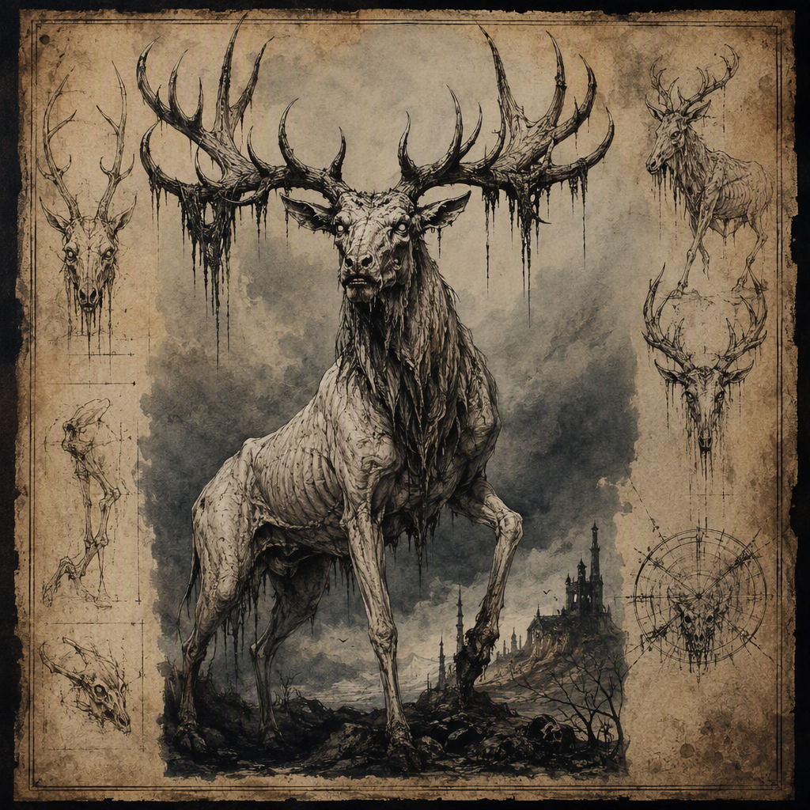

# Pale Stag of Omens

The [[Pale Stag of Omens]] is a burrowing horror of serious threat, recognized by its pallid, antlered form and the quiet foreboding that surrounds its appearance. It lairs in [[Hollowreach]] and was unleashed in [[The Winter Reckoning]]. Its title identifies it both as a subterranean terror and as a portent of what may follow, making the creature significant not only as a physical danger but also as an omen whose presence inspires dread.

## Infobox

| Field | Value |
|---|---|
| Threat rating | 5 |
| Habit | Burrowing horror |
| Lair | [[Hollowreach]] |
| Unleashed in | [[The Winter Reckoning]] |

## History

The recorded history of the [[Pale Stag of Omens]] is defined by two fixed particulars: it lairs in [[Hollowreach]], and it was unleashed in [[The Winter Reckoning]]. These facts establish the creature as both a resident of a subterranean place and an active presence in a significant period of upheaval. No further chronology is assigned to it in the available account.

Its connection to [[Hollowreach]] is central to its classification. The creature is not merely a stag-shaped beast encountered beneath the surface; it is specifically described as a burrowing horror. Its subterranean habit is therefore part of its identity rather than incidental behavior. The darkness and concealment associated with its lair reinforce the creature’s principal effect: it inspires dread through quiet foreboding rather than through overt display.

The phrase “unleashed in” [[The Winter Reckoning]] describes the creature’s emergence or release without establishing an additional cause, agent, or circumstance. The available record does not identify who or what unleashed it. Accordingly, the event is best treated as the confirmed point at which the [[Pale Stag of Omens]] entered the recorded account, not as evidence of any undocumented allegiance or origin.

The creature’s threat rating is 5. This rating places its danger at a serious level within the established record, while the available account does not define a separate scale or provide further numerical comparison. Its danger is consequently understood through the combination of its rating, its burrowing habit, and the foreboding attached to its appearance.

## Relationships & Affiliations

No affiliation is recorded for the [[Pale Stag of Omens]]. The available account does not associate it with a house, order, cartel, crown, or other named power. It is therefore treated as an independent creature rather than as a confirmed servant, weapon, mount, or agent of another faction.

Its relationship with [[Hollowreach]] is geographical and habitual: the [[Pale Stag of Omens]] lairs there. The record does not state whether the creature originated in [[Hollowreach]], whether it was drawn there, or whether the place was altered by its presence. The only confirmed point is that [[Hollowreach]] is its lair.

Its relationship with [[The Winter Reckoning]] is likewise established by the wording “unleashed in.” The event marks the creature’s recorded release, but the account does not specify whether this release was deliberate, accidental, ritual, or the result of another process. No named party is credited with the act. Any stronger claim would go beyond the documented facts.

The creature’s title also creates a conceptual relationship between its physical nature and its perceived significance. “Pale Stag” describes its outward form, while “of Omens” identifies the dread attached to its appearance. This is not recorded as an affiliation with a prophetic order or an omen-bearing institution. Rather, the title marks the creature itself as a portent of what may follow.

## Appearance and Demeanor

The [[Pale Stag of Omens]] appears as a pallid stag. Its antlered form is unmistakable, making the creature immediately distinct in silhouette even before its other qualities are perceived. The pallor of its body contributes to its unnatural impression, while the antlers preserve the recognizable outline of a stag without diminishing the horror of the creature.

Its appearance carries an unmistakable sense of omen. This quality is not described as a visible mark, spoken warning, or separate supernatural manifestation. Instead, the creature’s antlered form conveys the impression that its arrival signifies something yet to come. Its presence is therefore read as meaningful as well as dangerous.

The creature’s demeanor is characterized by quiet foreboding. It does not require noise, frenzy, or conspicuous violence to inspire dread. The stillness associated with it is itself threatening. This restrained manner distinguishes the [[Pale Stag of Omens]] from a horror whose danger depends solely on immediate aggression. Its menace lies in the anticipation surrounding it: the sense that the creature’s appearance is a warning whose full meaning has not yet been revealed.

The combination of pallid coloration, antlers, subterranean habits, and quiet foreboding gives the creature a unified identity. None of these qualities stands apart from the others. Its physical form establishes the image; its burrowing habit places that image beneath the surface; and its ominous demeanor turns an encounter into a sign of possible consequence.

## Significance of the Omen

The title [[Pale Stag of Omens]] is an explicit indication that the creature is understood through both what it is and what its presence may signify. The term “pale” emphasizes its pallid appearance. “Stag” identifies its recognizable body and antlered form. “Omens” extends the meaning beyond natural description, presenting the creature as a portent of what may follow.

This title does not provide a specific prophecy. The available account does not state what the creature foretells, nor does it attach its arrival to a particular outcome beyond its unleashing in [[The Winter Reckoning]]. The omen is therefore deliberately unresolved. The creature inspires the expectation of consequence without supplying a confirmed interpretation.

That uncertainty is essential to its effect. A fully explained warning could be assessed and answered, but the quiet foreboding of the [[Pale Stag of Omens]] leaves the significance of its presence open. Its threat is consequently both immediate and anticipatory. It is a serious physical danger, reflected in its threat rating of 5, while also functioning as a sign whose meaning extends beyond the moment of encounter.

The creature’s subterranean nature strengthens this symbolic role. A burrowing horror remains concealed until it emerges, making discovery inseparable from apprehension. Because it lairs in [[Hollowreach]], the boundary between hidden danger and visible omen is particularly important to its description. The creature belongs beneath the surface, yet its appearance communicates a warning that reaches beyond its lair.

In the surviving account, the [[Pale Stag of Omens]] is therefore defined by restraint rather than spectacle. It is not described through a catalog of attacks or an account of its movements. Instead, its identity rests on the convergence of four confirmed elements: a threat rating of 5, the habit of a burrowing horror, a lair in [[Hollowreach]], and an unleashing in [[The Winter Reckoning]]. Around these facts gathers the creature’s pallid image and its unmistakable sense of omen.