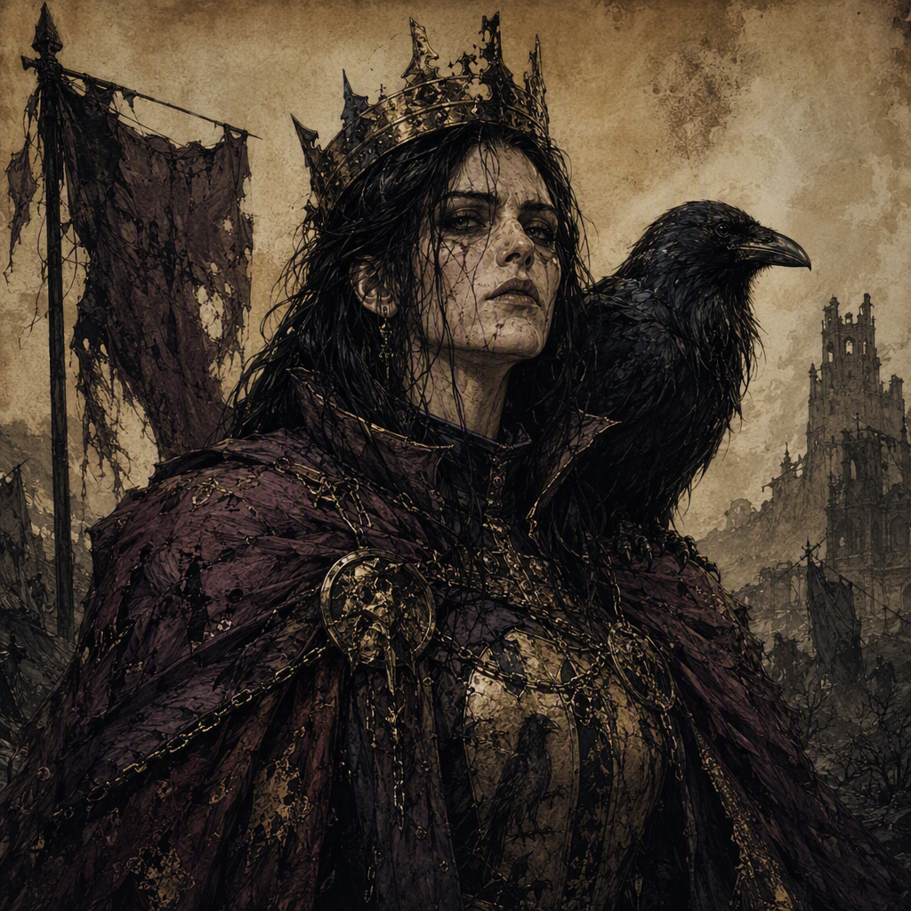

# [[Sabelle Mournvale the Twice-Crowned]]

[[Sabelle Mournvale the Twice-Crowned]] is a major character of the Ashen Era and serves as High Inquisitor. Born in 263 AS, they are a member of [[The Ashen Vanguard]] and command [[Marrowwatch]] since 293 AS. Their authority is visually defined by the regalia of a Twice-Crowned High Inquisitor, including the [[Diadem of Sorrowgate]], which they have wielded since 291 AS, and [[The Crown of Burned Names]], which they have wielded since 283 AS. They fought for [[The Ashen Vanguard]] in [[The Leaden Accord]] and are a rival of [[Morwenna Ashgrove]]. Behind their inquisitorial severity, [[Sabelle Mournvale the Twice-Crowned]] conceals a necromantic custody: they keep a bound revenant in their cellar.

## Infobox

| Field | Value |
|---|---|
| Name | [[Sabelle Mournvale the Twice-Crowned]] |
| Role | High Inquisitor |
| Born | 263 AS |
| Affiliation | Member of [[The Ashen Vanguard]] |
| Command | Commands [[Marrowwatch]] since 293 AS |
| Wielded relic | [[The Crown of Burned Names]], since 283 AS |
| Wielded relic | [[Diadem of Sorrowgate]], since 291 AS |
| Military service | Fought for [[The Ashen Vanguard]] in [[The Leaden Accord]] |
| Rival | [[Morwenna Ashgrove]] |
| Secret | Keeps a bound revenant in their cellar |
| Appearance | Twice-Crowned High Inquisitor |
| Demeanor | Inquisitorial severity shadowed by concealed necromantic custody |

## History

[[Sabelle Mournvale the Twice-Crowned]] was born in 263 AS. The known record identifies their later position as High Inquisitor, but does not establish the circumstances by which they entered that office. Their career is consequently defined less by an account of upbringing than by the symbols, commands, and conflicts associated with their public identity.

The title of Twice-Crowned High Inquisitor is central to their appearance. The designation presents [[Sabelle Mournvale the Twice-Crowned]] as a figure whose authority is expressed through duplicated or layered crown imagery, though the available record does not specify the ceremonial meaning of the title. Their visual identity is that of a Twice-Crowned High Inquisitor, combining the severity of inquisitorial office with the unmistakable presence of two crowns.

[[The Crown of Burned Names]] has been wielded by [[Sabelle Mournvale the Twice-Crowned]] since 283 AS. The record supplies no account of its construction, former wielders, or precise powers, but its association with the High Inquisitor forms part of their established image. The name itself contributes to the character’s atmosphere of judgment, remembrance, and destruction without requiring any further interpretation of its function.

[[Sabelle Mournvale the Twice-Crowned]] has wielded the [[Diadem of Sorrowgate]] since 291 AS. Like [[The Crown of Burned Names]], the diadem is a recognized part of their equipment and identity. The two relics are recorded separately, and both belong to the visual language of the Twice-Crowned High Inquisitor. No additional account of their use is established in the available facts.

Since 293 AS, [[Sabelle Mournvale the Twice-Crowned]] has commanded [[Marrowwatch]]. This command places them in a position of direct authority over that institution or force, although the record does not define its size, organization, or duties. The command is nevertheless one of the clearest markers of their standing within [[The Ashen Vanguard]]. It establishes [[Sabelle Mournvale the Twice-Crowned]] not merely as an officeholder, but as a figure entrusted with command.

They fought for [[The Ashen Vanguard]] in [[The Leaden Accord]]. The available record does not give the circumstances of the conflict, the nature of the opposing side, or the specific actions undertaken by [[Sabelle Mournvale the Twice-Crowned]]. Their participation is therefore best treated as a confirmed element of their history without assigning them victories, wounds, or battlefield methods not recorded elsewhere.

## Relationships & Affiliations

[[Sabelle Mournvale the Twice-Crowned]] is a member of [[The Ashen Vanguard]]. This affiliation is fundamental to their public identity and connects their office as High Inquisitor, their command of [[Marrowwatch]], and their participation in [[The Leaden Accord]]. The record does not specify whether their membership predates their command or whether their inquisitorial office is held exclusively within [[The Ashen Vanguard]], so those matters remain undefined.

Their known rivalry is with [[Morwenna Ashgrove]]. The rivalry is established, but its origin, duration, and character are not recorded in the available facts. It is therefore not possible to state whether the conflict is political, personal, ideological, military, or rooted in another cause. What is certain is that [[Morwenna Ashgrove]] occupies the position of rival in accounts of [[Sabelle Mournvale the Twice-Crowned]].

The relationship between [[Sabelle Mournvale the Twice-Crowned]] and [[The Ashen Vanguard]] is further marked by service in [[The Leaden Accord]]. The phrase “fought for” establishes their side in that conflict: they fought for [[The Ashen Vanguard]]. It does not establish the complete composition of the conflict or describe the conduct of any other participant. The surviving description consequently emphasizes allegiance rather than narrative detail.

Their connection to [[Marrowwatch]] is likewise defined by command. Since 293 AS, [[Sabelle Mournvale the Twice-Crowned]] commands [[Marrowwatch]]. No separate affiliation is supplied for [[Marrowwatch]], and no additional relationship should be inferred beyond the stated command. In character discussions, the command is often considered alongside the High Inquisitor title because both indicate formal authority, while the concealed revenant presents a direct contradiction to the severity of that public role.

## Inquisitorial Image and Concealed Custody

The defining tension of [[Sabelle Mournvale the Twice-Crowned]] lies between their public appearance and their secret. Their visual identity is that of a Twice-Crowned High Inquisitor: formal, severe, and centered on the authority of the crowns. Their demeanor projects an atmosphere of inquisitorial severity shadowed by concealed necromantic custody. This contrast is not incidental to the character’s presentation. It describes a figure whose visible discipline coexists with a hidden practice associated with the dead.

The secret is explicit: [[Sabelle Mournvale the Twice-Crowned]] keeps a bound revenant in their cellar. The record does not identify the revenant, explain how it became bound, or state why it is kept there. It also does not establish whether the custody is temporary or permanent. The cellar is the confirmed location, and the revenant is confirmed to be bound. Beyond those facts, the circumstances remain undisclosed.

This concealed custody gives particular weight to the character’s demeanor. The severity they project is not replaced by the secret, nor is the secret presented as their sole defining trait. Instead, [[Sabelle Mournvale the Twice-Crowned]] is characterized by the coexistence of High Inquisitor authority, membership in [[The Ashen Vanguard]], command of [[Marrowwatch]], and hidden necromantic custody. The contrast allows the character to be read simultaneously as an agent of formal judgment and as someone maintaining a prohibited or concealed relationship with the dead, without the available record specifying the exact rules governing that contradiction.

The relics reinforce this image. [[The Crown of Burned Names]], wielded since 283 AS, and the [[Diadem of Sorrowgate]], wielded since 291 AS, present [[Sabelle Mournvale the Twice-Crowned]] through objects whose names evoke grief, memory, and ruin. The record does not require either relic to be assigned an unrecorded power. Their established significance is their association with the Twice-Crowned High Inquisitor and their contribution to the character’s severe visual identity.

As a result, [[Sabelle Mournvale the Twice-Crowned]] occupies a distinctive position in the known record: a High Inquisitor born in 263 AS, a member of [[The Ashen Vanguard]], a commander of [[Marrowwatch]] since 293 AS, a veteran of [[The Leaden Accord]], and a rival of [[Morwenna Ashgrove]]. Beneath that public structure, they keep a bound revenant in their cellar.