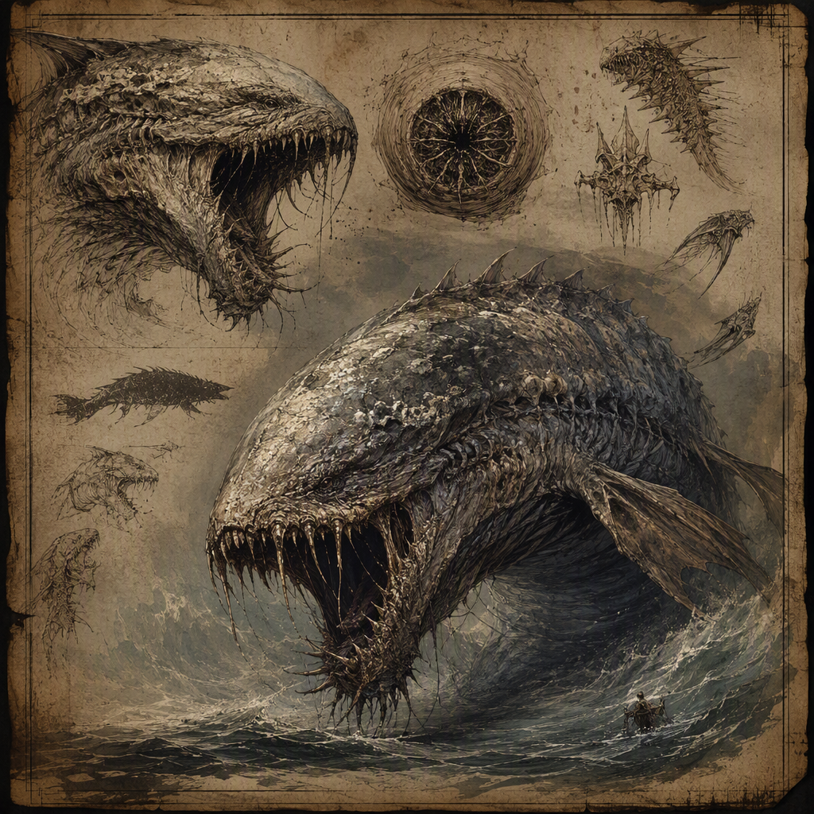

# [[Salt-Blind Leviathan]] (creature)

The [[Salt-Blind Leviathan]] is a vast siege-breaking creature defined by immense destructive force and an inability to rely on sight. Its pale, salt-crusted features and sightless eyes give it a distinctive appearance, while its ponderous, relentless pressure shapes every account of its behavior. The [[Salt-Blind Leviathan]] has a threat rating of 4, is classified by the habit “siege-breaker,” and lairs in [[Greythrone]].

## Infobox

| Field | Value |
|---|---|
| Name | [[Salt-Blind Leviathan]] |
| Classification | Creature |
| Threat rating | 4 |
| Habit | Siege-breaker |
| Lair | [[Greythrone]] |

## History

The recorded history of the [[Salt-Blind Leviathan]] is defined less by chronology than by function. It is identified as a siege-breaker, a designation that places its destructive force at the center of its known nature. The term describes the role associated with the creature without establishing any particular campaign, allegiance, or historical episode. No additional dated history is established for the [[Salt-Blind Leviathan]].

Its presence in the record is therefore treated as a description of a persistent creature rather than as an account of a single event. The available characterization emphasizes what the [[Salt-Blind Leviathan]] is capable of imposing upon a fortified position: immense, sustained pressure that does not depend upon speed, precision, or conventional battlefield awareness. Its designation as a siege-breaker is consequently inseparable from its physical scale and its relentless demeanor.

The [[Salt-Blind Leviathan]] lairs in [[Greythrone]]. This establishes [[Greythrone]] as the creature’s lair, but the available record does not define the form of that lair, the circumstances under which it was chosen, or the extent of the creature’s movements beyond it. No further location is established. References to the [[Salt-Blind Leviathan]] should therefore distinguish its confirmed lair from any unrecorded range or route.

The creature’s inability to rely on sight is a central part of its historical identification. Its eyes are sightless, and the condition is not presented as a minor defect or incidental feature. Instead, it is part of the defining contrast of the [[Salt-Blind Leviathan]]: a creature of immense destructive force whose actions cannot be understood through ordinary assumptions about visual perception. The record does not provide a replacement sense or explain how the creature navigates. Such explanations remain unconfirmed.

## Relationships & Affiliations

No relationship or affiliation is established for the [[Salt-Blind Leviathan]]. It is not assigned to a faction, court, order, or other named power in the available record. Its classification as a siege-breaker describes its habit and function, not an allegiance.

The designation should not be read as evidence that the [[Salt-Blind Leviathan]] serves a commander or operates under an organized authority. Likewise, its lair in [[Greythrone]] establishes where it lairs, but does not establish ownership, protection, cooperation, or political association. No affiliation can be inferred solely from the creature’s location.

The [[Salt-Blind Leviathan]] is also not described through bonds with other creatures. Its known profile is self-contained: vast in scale, pale and salt-crusted in appearance, sightless in its eyes, and ponderous in demeanor. The absence of recorded relationships is significant to the creature’s classification, since the existing material presents it as an individual threat rather than as a member of a documented group.

For the same reason, accounts should avoid assigning motives that are not supported by the record. The [[Salt-Blind Leviathan]] conveys relentless pressure, but that quality does not by itself establish loyalty, hostility toward a particular power, or a wider purpose. Its affiliation remains unrecorded.

## Tactical Assessment

The [[Salt-Blind Leviathan]] has a threat rating of 4. This rating places its danger within the established moderate-threat category. The rating does not diminish the description of its destructive force; rather, it records the creature’s overall threat classification without replacing the more specific account of its capabilities.

Its principal tactical identity is that of a siege-breaker. The creature is therefore understood through the effect of its immense force against fortified resistance. The term does not provide a complete account of its methods, and the available record does not specify whether it relies upon bodily impact, pressure, or another form of destruction. What is established is the combination of siege-breaking habit and immense destructive force.

The [[Salt-Blind Leviathan]]’s sightless eyes are a decisive consideration in any assessment. It is unable to rely on sight, and its behavior should not be interpreted as though it possessed ordinary visual awareness. The record does not state how it detects obstacles, chooses paths, or distinguishes targets. Tactical descriptions must therefore preserve the distinction between its confirmed inability and any unconfirmed theory about its perception.

Its demeanor is ponderous and relentless. These qualities suggest pressure that is sustained rather than fleeting, but they do not establish a specific speed, endurance, or pattern of movement. “Ponderous” describes the character of the creature’s advance or presence; “relentless” describes its refusal, as conveyed in the record, to lessen that pressure. Neither term supplies a numerical measure or a further capability.

The pale, salt-crusted features of the [[Salt-Blind Leviathan]] are likewise part of its identification rather than a complete anatomical account. The sightless eyes are visible within this appearance, but no additional structure, weakness, or means of attack is established. Any tactical assessment beyond the creature’s immense destructive force, sightlessness, siege-breaker habit, and ponderous relentlessness remains speculative.

## Appearance and Demeanor

The [[Salt-Blind Leviathan]] appears as a vast leviathan. Its features are pale and crusted with salt, giving its visible form a stark and weathered character. The salt crust is an explicit feature of its appearance, not merely an association drawn from its name. Its eyes are sightless, reinforcing the creature’s inability to rely on sight.

The creature’s scale is conveyed by the word “vast,” while its force is described as immense. These terms establish magnitude without assigning an unsupported measurement. No further dimensions are recorded. The [[Salt-Blind Leviathan]] should therefore be depicted as overwhelmingly large without attaching a specific size to it.

Its demeanor is ponderous, relentless pressure. This phrase is central to the creature’s presentation. The [[Salt-Blind Leviathan]] is not characterized by suddenness, wit, or display, but by the weight and persistence of its presence. The description does not establish emotion, intelligence, or intention. It records how the creature conveys itself: as pressure that is heavy, continuous, and difficult to disregard.

The contrast between sightlessness and destructive force is fundamental to the creature’s identity. The [[Salt-Blind Leviathan]] is not defined by perception in the ordinary sense, yet it remains a major physical presence within its classification. Its pale, salt-crusted body, sightless eyes, vast form, and ponderous demeanor together provide the complete established visual and behavioral profile.

## Legacy

The legacy of the [[Salt-Blind Leviathan]] rests on the force of its designation. As a siege-breaker with a threat rating of 4, it is remembered through the tension between moderate threat classification and immense destructive force. The rating supplies its formal category; the creature’s appearance and demeanor supply its enduring image.

Its lair in [[Greythrone]] is an essential part of that record. Beyond confirming the location in which the [[Salt-Blind Leviathan]] lairs, the available material does not establish a broader tradition, named encounter, or associated faction. The creature’s legacy therefore remains focused on its confirmed traits rather than on unrecorded stories.

In reference works, the [[Salt-Blind Leviathan]] is best summarized through four linked facts: it is a creature of vast scale, it bears pale salt-crusted features and sightless eyes, it is a siege-breaker with a threat rating of 4, and it lairs in [[Greythrone]]. Its relentless, ponderous pressure completes the profile without requiring any additional history or affiliation.