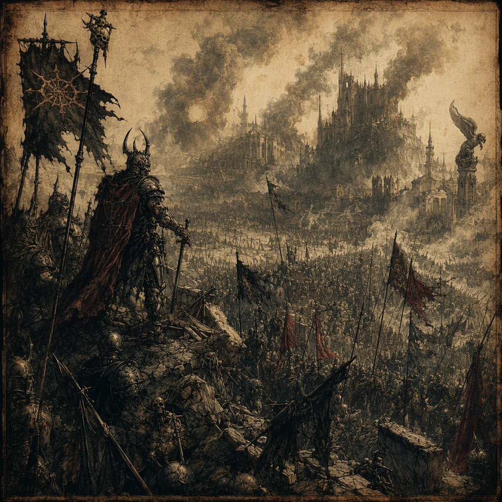

# [[The Accord of Mournthrone]] (conflict)

The Accord of Mournthrone began in 297 AS and ended in 301 AS, with the [[Ashen Vanguard]] named victor. Its recorded course included fighting at [[Crookvale]] in 297 AS, the devastation of [[Fenspire]] in 298 AS, the devastation of [[Hollowvale]] in 301 AS, and fighting at [[Vharencrag Fortress]] in 301 AS. The accord collapsed into a decade of guerrilla reprisals, and its hidden truth is that the losing commander was bribed to withdraw. In visual identity, the conflict is defined by a broken accord overshadowed by [[Mournthrone]] and the [[Ashen Vanguard]]; in tone, it is less a settled victory than a sullen prelude to reprisal.

## Infobox

| Field | Value |
|---|---|
| Conflict | [[The Accord of Mournthrone]] |
| Began | 297 AS |
| Ended | 301 AS |
| Victor | [[The Ashen Vanguard]] |
| Outcome | Collapsed into a decade of guerrilla reprisals |
| Secret truth | The losing commander was bribed to withdraw |
| Waged at | [[Crookvale]] in 297 AS |
| Devastated | [[Fenspire]] in 298 AS |
| Devastated | [[Hollowvale]] in 301 AS |
| Waged at | [[Vharencrag Fortress]] in 301 AS |

## History

The Accord of Mournthrone began in 297 AS. Despite its name, the conflict is remembered less as a durable settlement than as an accord whose promises failed under pressure. The title remains significant because it frames the struggle through a broken agreement, while its outcome gave the appearance of a clear military conclusion. The [[Ashen Vanguard]] was named victor when the Accord of Mournthrone ended in 301 AS.

The first recorded fighting associated with the conflict was at [[Crookvale]] in 297 AS. This engagement establishes the opening year and places the conflict within a landscape already marked by fracture. The available account does not turn [[Crookvale]] into a separate war or assign it an independent result; it is instead identified as a place where the Accord of Mournthrone was waged in 297 AS.

In 298 AS, the Accord of Mournthrone devastated [[Fenspire]]. The wording of the record emphasizes devastation rather than possession, making [[Fenspire]] one of the conflict’s principal marks of destruction. Its inclusion in the history of the accord also demonstrates that the struggle was not confined to a single battlefield or a narrow dispute over terms. The accord’s failure was experienced through the ruin left in its passage.

The conflict continued until 301 AS. In that year, the Accord of Mournthrone was waged at [[Vharencrag Fortress]] and devastated [[Hollowvale]]. These two entries define the final phase of the conflict without reducing it to a single action. [[Vharencrag Fortress]] is associated with active fighting, while [[Hollowvale]] is associated with devastation. Together, they mark the destructive reach of the accord in the year it ended.

The Accord of Mournthrone ended in 301 AS with the [[Ashen Vanguard]] named victor. This designation is the formal outcome, but it does not resolve the conflict’s deeper ambiguity. The accord collapsed into a decade of guerrilla reprisals, meaning that the ending did not produce a settled peace. The named victory therefore stands beside a continuation of violence rather than replacing it.

The hidden truth further complicates the recorded conclusion: the losing commander was bribed to withdraw. This fact changes the meaning of the final phase without changing the formal designation of the [[Ashen Vanguard]] as victor. The withdrawal was not simply the unforced consequence of defeat. It was shaped by a bribe, leaving the apparent settlement vulnerable to suspicion and helping explain why the collapse of the accord led into reprisal rather than closure.

## Relationships & Affiliations

The central relationship in the record is between the Accord of Mournthrone and the [[Ashen Vanguard]], which was named victor when the conflict ended in 301 AS. The [[Ashen Vanguard]] consequently dominates the accord’s public identity. Its victory is the most direct answer to the question of who prevailed, yet the bribed withdrawal of the losing commander prevents that answer from functioning as a complete explanation of the conflict.

[[Mournthrone]] occupies a different place in the accord’s identity. The conflict’s visual identity is described as a broken accord overshadowed by [[Mournthrone]] and the [[Ashen Vanguard]]. This formulation gives [[Mournthrone]] a powerful symbolic presence without changing the documented military outcome. The accord is therefore remembered through the tension between its failed promise, the shadow of [[Mournthrone]], and the victory attributed to the [[Ashen Vanguard]].

The named locations are likewise bound to the accord through distinct forms of association. The Accord of Mournthrone was waged at [[Crookvale]] in 297 AS and at [[Vharencrag Fortress]] in 301 AS. It devastated [[Fenspire]] in 298 AS and [[Hollowvale]] in 301 AS. These connections should not be treated as interchangeable: the record specifically distinguishes places of fighting from places marked by devastation.

No separate affiliation is required to understand the conflict’s aftermath. The decade of guerrilla reprisals is itself the defining continuation of the accord’s collapse. It links the formal ending in 301 AS to the conflict’s enduring consequence, while the secret of the bribed withdrawal links the public victory to the concealed mechanism behind the final retreat.

## Legacy and Interpretation

The Accord of Mournthrone is conventionally represented through the image of a broken accord overshadowed by [[Mournthrone]] and the [[Ashen Vanguard]]. This visual identity rejects the appearance of clean triumph. Although the [[Ashen Vanguard]] was named victor, the broken form of the accord suggests that the agreement at the conflict’s heart did not survive its own conclusion.

Its demeanor is similarly distinctive. The Accord of Mournthrone feels less like a settled victory than a sullen prelude to reprisal. This characterization reflects the conflict’s documented outcome: the accord collapsed into a decade of guerrilla reprisals. The reprisal period is not an incidental footnote but the principal measure of how incomplete the settlement proved to be.

The secret of the losing commander’s bribe reinforces this interpretation. A withdrawal secured by bribery creates a divide between the visible account and the concealed account. On the visible account, the [[Ashen Vanguard]] won in 301 AS. On the hidden account, the losing commander was bribed to withdraw. Both statements are part of the conflict’s accepted record, and neither erases the other.

The locations associated with the accord contribute to its legacy in sequence. [[Crookvale]] represents the conflict in 297 AS, the year it began. [[Fenspire]] represents devastation in 298 AS. [[Vharencrag Fortress]] and [[Hollowvale]] represent the final year, 301 AS, through fighting and devastation respectively. This progression gives the accord a remembered shape without requiring the ending to be understood as peace.

For this reason, the accord is treated as a warning about the difference between a named victor and a resolved conflict. The [[Ashen Vanguard]] received the formal victory, but the decade of guerrilla reprisals preserved the dispute in another form. The broken accord, the shadow of [[Mournthrone]], the devastation of [[Fenspire]] and [[Hollowvale]], and the bribed withdrawal of the losing commander all sustain the same conclusion: the Accord of Mournthrone ended in 301 AS, but it did not truly settle what it had begun.