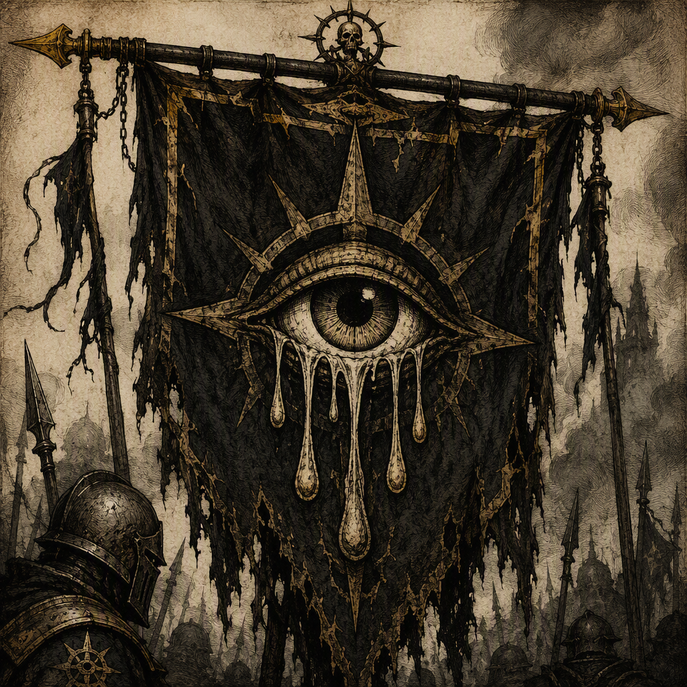

# The Ashen Vanguard (faction)

The **[[The Ashen Vanguard]]** is a **knightly order** sworn to contain the **[[Ley-ruins]]** left by the **[[Sundering]]**. Seated at **[[Vharenford]]**, it is defined by militant discipline, severe conduct, and constant watchfulness. The order has been identified as a belligerent in **[[The War of Drowned Light]]**, **[[The Accord of Mournthrone]]**, and **[[The Leaden Accord]]**; it is specifically recorded as the victor of **[[The Accord of Mournthrone]]**. Its known members include **[[Halvard Cindervale]]**, **[[Voltaire Hollowmere]]**, and **[[Orin Veyra]]**.

## Infobox

| Field | Value |
|---|---|
| Name | The Ashen Vanguard |
| Organizational kind | Knightly order |
| Doctrine | Militant order sworn to contain the Ley-ruins left by the Sundering |
| Seat | Vharenford |
| Appearance | Militant, knightly order marked by the grim legacy of the Ley-ruins |
| Demeanor | Severe, disciplined, and constantly watchful |
| Belligerent | The War of Drowned Light |
| Belligerent | The Accord of Mournthrone |
| Outcome | Victor of The Accord of Mournthrone |
| Belligerent | The Leaden Accord |
| Members | Halvard Cindervale; Voltaire Hollowmere; Orin Veyra |

## History

The central purpose of **[[The Ashen Vanguard]]** is containment. Its doctrine is explicitly defined as a militant order sworn to contain the **[[Ley-ruins]]** left by the **[[Sundering]]**. The order’s identity therefore rests not on the preservation of a court, dynasty, or ordinary territorial claim, but on the control of dangerous remnants. The wording of its doctrine presents containment as an oath-bound duty and as the foundation of its military character.

The order is seated at **[[Vharenford]]**. This seat is the clearest fixed point associated with the Vanguard in the surviving record. **[[Vharenford]]** is consequently treated as the order’s established center without implying any additional administrative structure or territorial extent beyond the stated seat.

The military record of **[[The Ashen Vanguard]]** includes participation as a belligerent in **[[The War of Drowned Light]]**. The record identifies the Vanguard as a belligerent, but does not, by that designation alone, establish the order’s specific operations, commanders, or objectives within that conflict. Its participation nevertheless places the order among the forces directly involved in the war.

The Vanguard was also a belligerent in **[[The Accord of Mournthrone]]**. In that conflict, **[[The Ashen Vanguard]]** is recorded as the victor. This is the order’s explicitly recorded victory and remains a defining element of its military reputation. The victory does not alter the narrower statement of its doctrine: the order’s stated purpose remains the containment of the **[[Ley-ruins]]**, while its victory in **[[The Accord of Mournthrone]]** establishes its recorded outcome in that conflict.

The order is further identified as a belligerent in **[[The Leaden Accord]]**. As with its other recorded engagements, this designation confirms participation without supplying additional details about the nature, duration, or immediate consequences of the Vanguard’s involvement. The three named conflicts—**[[The War of Drowned Light]]**, **[[The Accord of Mournthrone]]**, and **[[The Leaden Accord]]**—form the known outline of its belligerent record.

## Relationships & Affiliations

The known membership of **[[The Ashen Vanguard]]** includes **[[Halvard Cindervale]]**, **[[Voltaire Hollowmere]]**, and **[[Orin Veyra]]**. Each is identified as a member of the order. The available record does not assign them additional offices, ranks, commands, or separate duties within the Vanguard, and such distinctions are therefore not established here.

The order’s most definite affiliation is with its own stated doctrine: it is a militant order sworn to contain the **[[Ley-ruins]]** left by the **[[Sundering]]**. This purpose distinguishes the Vanguard’s institutional identity from the more general description of it as a knightly order. Knighthood describes its organizational kind; containment describes the obligation around which that organization is defined.

Its seat at **[[Vharenford]]** is likewise a confirmed institutional association. The connection is geographic and organizational: **[[The Ashen Vanguard]]** is seated at **[[Vharenford]]**. No further affiliation is established by the available facts. In particular, the record does not provide additional houses, councils, subordinate orders, allied institutions, or rival bodies connected to the Vanguard.

The order’s participation in **[[The War of Drowned Light]]**, **[[The Accord of Mournthrone]]**, and **[[The Leaden Accord]]** constitutes a recorded relationship to those conflicts as a belligerent. The status of victor is specifically attached to **[[The Accord of Mournthrone]]**. No equivalent outcome is assigned here to **[[The War of Drowned Light]]** or **[[The Leaden Accord]]**.

## Operational Character

The visual identity of **[[The Ashen Vanguard]]** is that of a militant, knightly order marked by the grim legacy of the **[[Ley-ruins]]**. Its appearance communicates the weight of the remnants it is sworn to contain. The order is not merely described as martial; its martial character is visibly tied to the aftermath of the **[[Sundering]]** and to the dangers represented by the ruins.

Its demeanor is severe, disciplined, and constantly watchful. These qualities are complementary rather than incidental. Severity reflects the grim character associated with the order, discipline reflects its militant structure, and watchfulness corresponds to a duty centered on containment. Together, they define the expected bearing of the Vanguard without requiring any additional rank system or ceremonial code.

The term “containment” is especially important to the order’s characterization. The Vanguard’s doctrine does not describe the **[[Ley-ruins]]** as objects of study, inheritance, or ordinary occupation. It states that the order is sworn to contain them. The emphasis places restraint and vigilance at the center of the faction’s identity. Its knightly character is therefore presented through duty and control rather than through pageantry alone.

This operational character also explains the consistency between the order’s appearance and demeanor. A force marked by the grim legacy of the **[[Ley-ruins]]** is visually associated with danger and aftermath, while a severe, disciplined, and constantly watchful bearing expresses the demands of its oath. The available facts establish this pattern as the defining presentation of **[[The Ashen Vanguard]]**.

## Legacy

The legacy of **[[The Ashen Vanguard]]** rests on the combination of doctrine, seat, membership, and military record. Its doctrine identifies the purpose of the order; **[[Vharenford]]** identifies its seat; **[[Halvard Cindervale]]**, **[[Voltaire Hollowmere]]**, and **[[Orin Veyra]]** establish known membership; and its recorded belligerence in three conflicts demonstrates its presence in the martial history of the age.

Among those conflicts, **[[The Accord of Mournthrone]]** holds particular importance because **[[The Ashen Vanguard]]** is recorded as its victor. That victory is the clearest stated outcome attached to the order. It stands alongside the order’s participation in **[[The War of Drowned Light]]** and **[[The Leaden Accord]]**, completing the known outline of the Vanguard’s documented wartime identity.

The faction’s enduring image is consequently that of a watchful knightly order confronting the grim inheritance of the **[[Sundering]]**. Its severe discipline and containment doctrine remain inseparable from its name, while its seat at **[[Vharenford]]** and its recorded victory in **[[The Accord of Mournthrone]]** provide the principal fixed markers by which the order is recognized.