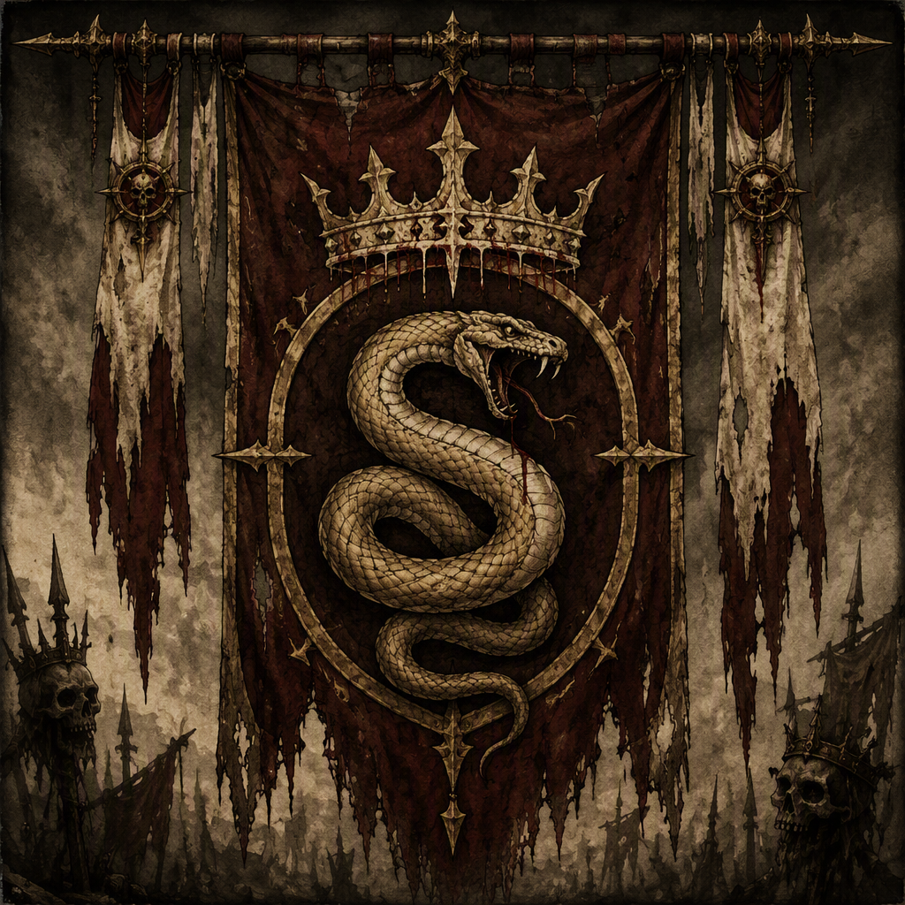

# The Bleeding Crown

The **[[The Bleeding Crown]]** is a **royalist remnant** fighting to restore the shattered monarchy. Seated at [[Blackford]], the faction defines itself through loyalty to the monarchy and opposition to the realm’s fractured condition. It was a belligerent in [[The War of Endless Vigil]] and is recorded as that conflict’s victor. The Bleeding Crown was also a belligerent in [[The Accord of Mournthrone]]. Its visual identity is royalist and wounded, evoking a crown that has endured the shattering of the monarchy, while its prevailing demeanor is fervent, embittered, and determined.

## Infobox

| Field | Value |
|---|---|
| Name | [[The Bleeding Crown]] |
| Organization kind | royalist remnant |
| Doctrine | Royalist remnant fighting to restore the shattered monarchy |
| Seat | [[Blackford]] |
| Belligerent in | [[The War of Endless Vigil]]; [[The Accord of Mournthrone]] |
| Victor of | [[The War of Endless Vigil]] |
| Members | [[Corvus Duskbane]]; [[Halvard Sablewood]] |

## History

The Bleeding Crown is defined first and foremost by its doctrine: it is a **royalist remnant fighting to restore the shattered monarchy**. This doctrine gives the faction both its political purpose and its internal character. The Bleeding Crown does not present the fractured condition of the realm as an arrangement to be accepted. Instead, that fracture is the central condition its struggle seeks to overcome.

As a royalist remnant, the faction’s identity is rooted in continuity with the monarchy rather than in the creation of a wholly new order. Its cause is defined by loyalty to the monarchy and opposition to the realm’s fractured condition. These principles are inseparable from its understanding of itself: the faction is not merely a force that favors royal rule, but a remnant that regards restoration as its defining task.

The Bleeding Crown is seated at [[Blackford]]. That seat is the faction’s stated center and provides the clearest fixed point for its political identity. In an era marked by division, the association with [[Blackford]] gives the Bleeding Crown a place from which its royalist claim can be articulated and maintained. The seat is therefore significant not only as a location, but also as a visible expression of the faction’s refusal to abandon the idea of monarchy.

The Bleeding Crown was a belligerent in [[The War of Endless Vigil]] and was the victor of [[The War of Endless Vigil]]. The victory stands as a central part of the faction’s recorded history. It confirms that the Bleeding Crown’s royalist cause has not remained solely aspirational; its struggle has produced a recognized triumph in war. At the same time, the victory does not alter the faction’s basic description as a remnant. The Bleeding Crown remains defined by the restoration it seeks, regardless of the success already attached to its name.

The faction was also a belligerent in [[The Accord of Mournthrone]]. Its participation places the Bleeding Crown within another major record of conflict and settlement. The title of the accord does not, by itself, replace the faction’s doctrine or its royalist purpose. Rather, the Bleeding Crown’s presence in the accord is part of the broader record through which its determination and political position are understood.

The available record identifies [[Corvus Duskbane]] as a member of [[The Bleeding Crown]], and identifies [[Halvard Sablewood]] as a member of [[The Bleeding Crown]]. Neither membership record changes the faction’s collective identity. Both names are instead preserved as individual instances of the allegiance that binds the remnant together.

## Relationships & Affiliations

The principal affiliation of [[The Bleeding Crown]] is with the monarchy it seeks to restore. Its loyalty is not incidental to its political program; it is the foundation of the faction’s doctrine. The Bleeding Crown’s opposition to the realm’s fractured condition follows directly from that loyalty. A divided realm represents the condition the faction rejects, while the restored monarchy represents the condition it seeks.

The faction’s recorded military relationships are expressed through its status as a belligerent. [[The Bleeding Crown]] was a belligerent in [[The War of Endless Vigil]], a conflict in which it was also the victor. It was additionally a belligerent in [[The Accord of Mournthrone]]. These records establish the faction’s participation in both named conflicts without reducing its identity to either one. The Bleeding Crown remains a royalist remnant before, during, and beyond the conflicts in which it appears.

Its seat at [[Blackford]] is likewise an important affiliation of place. The connection does not merely identify where the faction is seated; it gives the royalist remnant a recognized center. The name of [[Blackford]] is consequently linked with the Bleeding Crown’s persistence, its wounded royal symbolism, and its continued opposition to the realm’s fractured condition.

The known membership of [[Corvus Duskbane]] and [[Halvard Sablewood]] provides two explicitly recorded links between individuals and the faction. [[Corvus Duskbane]] is a member of [[The Bleeding Crown]]. [[Halvard Sablewood]] is a member of [[The Bleeding Crown]]. Their inclusion in the faction’s records illustrates the personal dimension of its cause while leaving the organization’s broader structure defined by its doctrine rather than by any unrecorded offices or ranks.

No broader affiliation is required to understand the faction’s place in the record. Its essential connections are clear: loyalty to the monarchy, opposition to the fractured realm, a seat at [[Blackford]], participation in [[The War of Endless Vigil]] and [[The Accord of Mournthrone]], and membership represented by [[Corvus Duskbane]] and [[Halvard Sablewood]].

## Symbolism and Demeanor

The visual identity of [[The Bleeding Crown]] is royalist and wounded. It evokes a crown that has endured the shattering of the monarchy rather than one that has remained untouched by catastrophe. This imagery communicates two ideas at once. The crown remains a crown, preserving the faction’s connection to royal authority, but it is also marked by damage, reflecting the condition from which the faction emerged.

The wounded quality of the symbol is central to the faction’s presentation. It distinguishes the Bleeding Crown from an abstract or purely ceremonial claim to kingship. The faction’s royalism is portrayed as something tested by ruin and sustained through injury. The image does not suggest that the monarchy’s shattering has been forgotten. Instead, the damage is made visible and incorporated into the faction’s identity.

This visual language corresponds to the Bleeding Crown’s demeanor. The faction is **fervent, embittered, and determined**. Its fervor reflects the intensity of its loyalty to the monarchy. Its bitterness reflects opposition to the realm’s fractured condition and the wounds represented by its royalist imagery. Its determination expresses the persistence of the restorationist cause despite the shattering that defines the faction’s historical position.

Taken together, these qualities make the Bleeding Crown a faction of damaged continuity. It does not abandon the crown because the monarchy has been shattered; the shattering is precisely what gives its crown its meaning. The faction’s appearance and demeanor therefore reinforce its doctrine: restoration is not presented as a distant preference, but as a fervent and determined response to a broken royal order.

## Legacy

The legacy of [[The Bleeding Crown]] rests on the tension between remnant and victor. It is a royalist remnant, defined by a monarchy that has been shattered, yet it is also recorded as the victor of [[The War of Endless Vigil]]. That combination gives the faction a distinctive place in the history of the realm. The Bleeding Crown represents persistence born from loss, but its record also includes success.

Its participation as a belligerent in [[The Accord of Mournthrone]] further preserves the faction within the history of major conflict. Through these records, the Bleeding Crown is remembered not only for what it believes, but also for the conflicts in which it acted. Its seat at [[Blackford]] provides the enduring location associated with that cause, while the membership of [[Corvus Duskbane]] and [[Halvard Sablewood]] gives the faction a human presence within the archive.

The faction’s central image remains the wounded crown: royal authority damaged but not discarded. That image summarizes the Bleeding Crown’s doctrine, its demeanor, and its historical significance. It is a remnant because the monarchy was shattered, a royalist force because it remains loyal to that monarchy, and a determined belligerent because it continues to oppose the realm’s fractured condition.