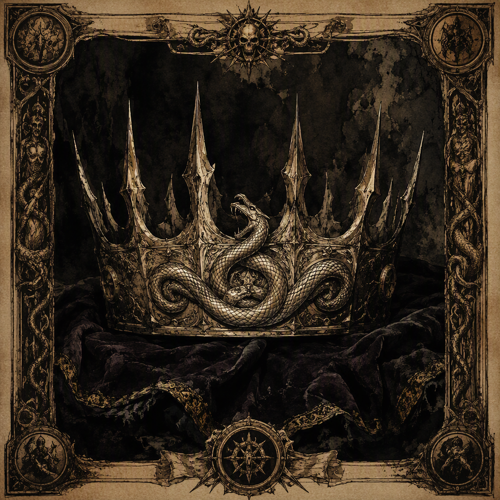

# The Crown of Burned Names (artifact)

The **[[The Crown of Burned Names]]** is a ward forged in 266 AS at [[Hollowvale]] and housed in [[Blackford]]. Its identity rests on the tension between protection and the erasure carried by burned names. The artifact has a blackened, name-scarred appearance and a stark, funerary silhouette, while its presence imposes a hushed atmosphere of remembrance, loss, and guarded identity. Attuning to the ward carries a cost of 60.

## Infobox

| Field | Value |
|---|---|
| Artifact class | ward |
| Forged | 266 AS |
| Forged at | [[Hollowvale]] |
| Housed in | [[Blackford]] |
| Attunement cost | 60 |
| Appearance | A crown of blackened, name-scarred material with a stark and funerary silhouette |
| Demeanor | Imposes a hushed atmosphere of remembrance, loss, and guarded identity |

## History

The [[The Crown of Burned Names]] was forged in 266 AS at [[Hollowvale]]. This date and place constitute the artifact’s recorded point of origin. The ward’s name indicates that burned names are central to its meaning, but the surviving account does not define those names as belonging to any particular individual, lineage, faction, or event. The crown is therefore understood through the paired ideas of protection and erasure rather than through a single attributed history.

Its classification as a ward places protection at the center of its identity. The nature of that protection is not further specified in the available record. The artifact should consequently not be assigned a particular defensive effect, target, range, or limitation beyond its established status as a ward. What is clear is that the crown’s protective character exists in tension with the destructive symbolism of its burned names.

The use of the word “burned” is inseparable from the crown’s presentation. Its material is blackened and marked by scars that resemble names subjected to fire or otherwise rendered difficult to preserve. These marks do not merely decorate the artifact. They provide the principal visual expression of its identity: a thing made to guard while bearing the signs of what has been damaged, obscured, or erased.

The [[The Crown of Burned Names]] is housed in [[Blackford]]. Its current housing does not alter its origin at [[Hollowvale]] in 266 AS, nor does the record identify the circumstances under which it came to be kept there. The distinction between the place where the ward was forged and the place where it is housed is therefore significant, but the available facts do not establish a chain of custody or a reason for the transfer.

The attunement cost of the crown is 60. This cost is part of the artifact’s formal record and distinguishes the act of attunement from ordinary handling or observation. No further rule governing attunement is established. The cost should not be interpreted as evidence of a specific ritual, duration, sacrifice, or consequence beyond the stated requirement.

## Relationships & Affiliations

No relationship or affiliation involving the [[The Crown of Burned Names]] is established in the available record. In particular, the ward is not assigned to any named power, house, order, cartel, crown, or other organization. Its forging at [[Hollowvale]] and its housing in [[Blackford]] are locations of origin and custody, respectively; neither is identified as an affiliation.

This absence of an established affiliation is consistent with the crown’s thematic emphasis on guarded identity. The artifact is described through the conflict between protection and erasure, not through allegiance. Its blackened surface and name scars suggest a concern with what is remembered and what is withheld, but they do not identify a political owner or institutional purpose.

The crown’s demeanor likewise does not establish a relationship with any particular group. The hushed atmosphere surrounding it is one of remembrance, loss, and guarded identity. Those qualities describe the effect and impression associated with the ward, rather than a documented bond with a person or organization. Any attempt to connect the artifact to a specific faction or lineage would go beyond the established record.

The distinction between custody and allegiance is especially important in cataloguing the artifact. [[Blackford]] is the place where the ward is housed, while [[Hollowvale]] is the place where it was forged in 266 AS. These facts may be recorded without treating either location as the crown’s patron, owner, or creator beyond the stated act of forging. No additional affiliation is confirmed.

## Symbolism and Presentation

The [[The Crown of Burned Names]] presents a stark and funerary silhouette. Its form is recognizably regal, but the material from which it is made is blackened and scarred with names. The result is an object whose authority is expressed through severity rather than splendor. The crown does not evoke an untouched emblem of rule; it evokes the remains of identity after identity has been exposed to loss.

Its appearance is closely aligned with its demeanor. The ward imposes a hushed atmosphere of remembrance, loss, and guarded identity. This atmosphere is not described as loud, violent, or openly commanding. Instead, the crown’s presence is characterized by restraint. It encourages attention toward absence and memory while maintaining a boundary around whatever identity remains protected.

The tension between protection and erasure is the principal interpretive key for the artifact. A ward ordinarily implies safeguarding, preservation, or defense. Burned names imply the opposite movement: the destruction or removal of identifying marks. The crown holds these meanings together without resolving them. It protects in the presence of erasure and bears erased or damaged names as part of that protection.

The name scars are therefore central to the artifact’s visual language. They make the crown a record of loss without providing a complete record of what has been lost. The marks signify names, but the available description does not identify those names or state whether they can be read. This uncertainty reinforces the crown’s guarded quality. Its identity is visible, yet the identities represented by its scars remain withheld.

The funerary silhouette further shapes the ward’s presentation. The crown is not characterized by ornament, brightness, or celebration. Its starkness makes remembrance feel solemn and deliberate. The artifact’s demeanor does not erase memory; rather, it surrounds memory with silence and caution. In this sense, the crown’s atmosphere reflects both halves of its identity: it preserves the significance of names while acknowledging that names may be burned beyond recovery.

## Legacy

The legacy of the [[The Crown of Burned Names]] rests on the clarity of its contradictions. It is a ward, yet its defining imagery is marked by destruction. It is a crown, yet its silhouette is funerary rather than celebratory. It is connected to names, yet those names are carried through scars and burning rather than open inscription. These contrasts give the artifact a distinct conceptual identity without requiring an additional history or affiliation.

Its forging at [[Hollowvale]] in 266 AS remains the fixed beginning of its recorded history, while its housing in [[Blackford]] defines its established place of custody. Between those two facts lies an absence of recorded detail. That absence is compatible with the artifact’s themes, but it should not be filled with unsupported claims. The crown’s known history is strongest where the record is precise: its class is ward, its forging year is 266 AS, its forging place is [[Hollowvale]], its housing is [[Blackford]], and its attunement cost is 60.

As an artifact, the crown is most fully understood not by assigning it an unrecorded purpose, but by preserving the tension already present in its description. Its blackened material, name scars, funerary silhouette, and hushed demeanor all point toward remembrance under threat. The crown protects without appearing untouched, and it bears the signs of erasure without surrendering its identity. That balance defines its enduring significance.