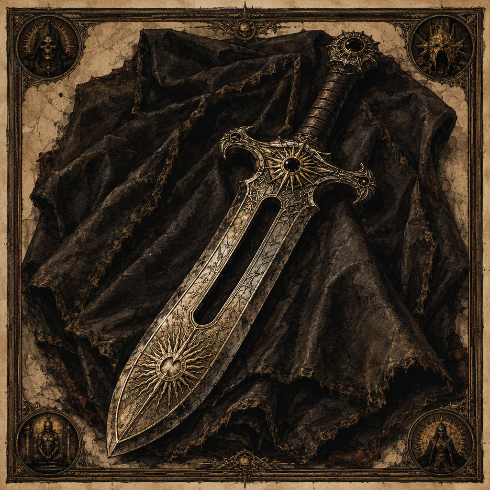

# The Hollow Edge (artifact)

The Hollow Edge is a ward forged at [[Hollowvale]] in 216 AS and subsequently housed in [[Crookgate Keep]]. Its attunement cost is 21. The artifact’s visual identity is that of a ward bearing the name The Hollow Edge, while its demeanor suggests an atmosphere of emptiness and severity. Beyond these recorded attributes, its known description is deliberately limited: the surviving account establishes its class, date of forging, place of forging, attunement cost, and current housing, but does not assign it additional powers, owners, makers, or affiliations.

## Infobox

| Field | Value |
|---|---|
| Artifact class | Ward |
| Forged | 216 AS |
| Forged at | [[Hollowvale]] |
| Attunement cost | 21 |
| Housed in | [[Crookgate Keep]] |
| Appearance | A ward bearing the name The Hollow Edge |
| Demeanor | Suggests an atmosphere of emptiness and severity |

## History

The Hollow Edge was forged in 216 AS. Its place of forging was [[Hollowvale]], making the location an essential part of the artifact’s recorded provenance. The available account does not identify a smith, order, household, or other maker associated with its creation. Accordingly, the history of the forging is defined by its date and place rather than by a documented chain of personal or institutional attribution.

The date 216 AS is the sole established date attached to the artifact. It marks the forging of The Hollow Edge and should not be treated as the date of its later housing, its first attunement, or any subsequent use. Those events are not dated in the surviving record.

The Hollow Edge is housed in [[Crookgate Keep]]. This is the artifact’s recorded place of housing, but the available description does not explain how or when it came to be housed there. No transfer, recovery, inheritance, or installation account is provided. The keep therefore forms part of the artifact’s known present context without supplying an additional narrative about its passage from [[Hollowvale]].

The artifact’s class is ward. This classification is central to its identification. The Hollow Edge is not described by a secondary class or by a more specialized category, and no additional function is assigned in the available record. The term “ward” establishes the artifact’s formal category, while the name and presentation provide its distinguishing identity.

Attunement to The Hollow Edge costs 21. This figure is the complete recorded attunement cost and is not accompanied by a stated ritual, duration, prerequisite, consequence, or limitation. The number is therefore best presented as a fixed property of the artifact rather than expanded into an account of how attunement is performed.

## Relationships & Affiliations

The Hollow Edge is associated with [[Hollowvale]] through its forging and with [[Crookgate Keep]] through its housing. These are the two named locations directly connected to the artifact in the established record. The connection to [[Hollowvale]] is historical and concerns creation; the connection to [[Crookgate Keep]] concerns the place in which the ward is housed.

No allegiance is recorded for The Hollow Edge. The artifact is not assigned to a faction, dynasty, fellowship, military formation, or cult in the available account. Likewise, no bearer, keeper, owner, or attuned individual is named. The fact that the ward is housed in [[Crookgate Keep]] does not, by itself, establish ownership or institutional affiliation.

The Hollow Edge also has no documented relationship to another artifact. Its name supplies its identity, but no counterpart, paired object, maker’s series, or associated relic is identified. Claims that it belongs to a larger collection or tradition remain unsupported by the established facts.

The same caution applies to the distinction between location and affiliation. [[Hollowvale]] is the place where The Hollow Edge was forged, while [[Crookgate Keep]] is the place where it is housed. Neither location should be treated as an allegiance unless further records establish one. The known relationships are therefore geographical and custodial in character, not political or personal.

## Appearance and Demeanor

The visual identity of The Hollow Edge is that of a ward bearing the name The Hollow Edge. This description identifies how the artifact presents itself without adding a material specification, shape, ornament, color, inscription, or construction detail. The name is consequently part of the ward’s visual identity rather than merely a catalog label.

Its demeanor suggests an atmosphere of emptiness and severity. These qualities describe the impression conveyed by the artifact, not a confirmed supernatural effect or a stated emotional influence. The record does not explain whether the atmosphere arises from its appearance, its presence, its behavior, or the experience of those who encounter it.

“Emptiness” and “severity” are therefore interpretive descriptors of the artifact’s demeanor. They establish a restrained and austere character while leaving the exact source of that character undefined. The Hollow Edge is not documented as benevolent, hostile, protective, destructive, or communicative. Such interpretations exceed the known description.

The combination of the ward classification and its severe, empty presentation gives The Hollow Edge a distinct conceptual identity. Even so, the available facts do not authorize a detailed account of its powers. No effect, target, range, activation condition, or cost beyond the attunement cost of 21 is recorded. The artifact’s atmosphere should not be confused with a confirmed ability.

## Attunement and Classification

The Hollow Edge is classified as a ward, and attunement to it costs 21. These two facts define the artifact’s most concrete operational profile. The classification identifies what kind of artifact it is; the cost identifies the numerical burden associated with establishing attunement.

No further rules governing attunement are supplied. In particular, the record does not state who may attune to The Hollow Edge, what attunement permits, whether attunement can be broken, or what follows when the process is completed. The cost of 21 should therefore remain an isolated, exact value rather than being connected to an unrecorded procedure.

The limited description is significant to cataloging. The Hollow Edge can be securely identified by its name, ward classification, forging in 216 AS at [[Hollowvale]], attunement cost of 21, and housing in [[Crookgate Keep]]. Its appearance and demeanor supplement that identification, but they do not provide grounds for assigning unrecorded abilities or affiliations.

## Legacy

The Hollow Edge’s recorded legacy rests on a small number of precise facts. It is a ward forged in 216 AS, made at [[Hollowvale]], attuned at a cost of 21, and housed in [[Crookgate Keep]]. Its name, visual identity, and atmosphere of emptiness and severity distinguish it in description, while the absence of a named maker or bearer leaves its broader history open.

Because no additional dates, achievements, wielders, or effects are established, the artifact’s significance cannot be measured through undocumented campaigns or legends. Its cataloged importance instead lies in the clarity of its surviving identifiers. The Hollow Edge remains an artifact whose known record is concise, severe, and notably empty of claims beyond what can be stated with certainty.