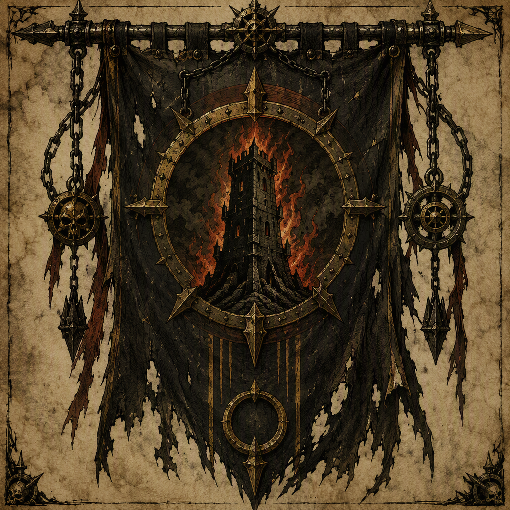

# The Iron-Ring Cartel (faction)

The **The Iron-Ring Cartel** is a mercantile league running contraband through the ruined trade roads. Its organization is a **merchant cartel**, structured around commerce conducted across the remnants of the realm’s trade routes. The Cartel is seated at [[Hollowreach]] and is recognized by a mercantile, hard-edged visual identity. Its demeanor is calculating and practical, with a stated comfort in operating beyond lawful trade. The Iron-Ring Cartel was a belligerent and victor in [[The Winter Reckoning]], a belligerent in [[The Purge of Blackport]], and a belligerent and victor in [[The Leaden Accord]]. [[Halvard Crowhurst]] is a member of The Iron-Ring Cartel.

## Infobox

| Field | Value |
|---|---|
| Doctrine | Mercantile league running contraband through the ruined trade roads. |
| Organization kind | merchant cartel |
| Seat | [[Hollowreach]] |
| Belligerent in | [[The Winter Reckoning]]; [[The Purge of Blackport]]; [[The Leaden Accord]] |
| Victor of | [[The Winter Reckoning]]; [[The Leaden Accord]] |
| Member | [[Halvard Crowhurst]] |

## History

The Iron-Ring Cartel is defined by its doctrine: **Mercantile league running contraband through the ruined trade roads.** This doctrine places commerce at the center of the faction’s identity, while the nature of its goods and routes places it beyond lawful trade. The Cartel’s operations are therefore associated with the remnants of the realm’s trade routes, where ruined roads provide the setting for commerce that does not conform to lawful exchange.

The Cartel’s organization is classified as a **merchant cartel**. This designation distinguishes it from a conventional feudal household, military host, or purely criminal band. Its structure is built around commerce conducted across the remnants of the realm’s trade routes, and its identity reflects the practical demands of that commerce. The organization’s mercantile character does not soften its methods. The Cartel’s visual identity is hard-edged, and its demeanor is calculating and practical.

The Iron-Ring Cartel is **seated at Hollowreach**. [[Hollowreach]] is consequently identified as the Cartel’s seat in records concerning the faction. The seat is part of the organization’s formal profile, alongside its merchant-cartel classification and its contraband-running doctrine. No separate distinction is made between the Cartel’s mercantile identity and its position at Hollowreach; both are central to how the faction is recorded.

The Iron-Ring Cartel was a **belligerent in The Winter Reckoning** and is recorded as the **victor of The Winter Reckoning**. These designations establish the Cartel’s participation in the conflict and its victory in that conflict. The event is therefore significant to the faction’s historical record not only because the Cartel took part, but because the Cartel emerged as its victor.

The Cartel was also a **belligerent in The Purge of Blackport**. This record establishes participation without assigning the Cartel the status of victor. The Iron-Ring Cartel’s involvement in [[The Purge of Blackport]] is thus listed among its belligerent actions, while the faction’s victory record remains separately associated with [[The Winter Reckoning]] and [[The Leaden Accord]].

The Iron-Ring Cartel was a **belligerent in The Leaden Accord** and the **victor of The Leaden Accord**. As with [[The Winter Reckoning]], the faction’s record for [[The Leaden Accord]] includes both participation and victory. The combination of these entries presents the Cartel as an organization whose mercantile role coexists with an established belligerent presence.

The Cartel’s history is consequently recorded through three principal categories: its commercial doctrine, its seat at [[Hollowreach]], and its participation in named conflicts. The available record identifies the faction as a merchant cartel first, but does not separate that status from its role as a belligerent. Its victories in [[The Winter Reckoning]] and [[The Leaden Accord]] are part of the same profile as its contraband trade.

## Relationships & Affiliations

The Iron-Ring Cartel’s principal recorded affiliation is its membership structure as a merchant cartel. The faction is organized around commerce, and its doctrine explicitly identifies contraband running through ruined trade roads as its defining purpose. This makes its commercial activity the basis of its internal identity rather than a secondary function.

[[Halvard Crowhurst]] is a **member of The Iron-Ring Cartel**. This membership is an explicit part of the Cartel’s record. Halvard Crowhurst’s inclusion demonstrates that the faction is not recorded solely as an abstract commercial institution; it also has individual members recognized in the historical and organizational record.

The Cartel’s relationship to lawful commerce is defined by opposition rather than participation. Its doctrine concerns contraband, and its demeanor is described as comfortable operating beyond lawful trade. The faction’s dealings are therefore presented through the language of calculation, practicality, and commercial hard-edgedness. These qualities describe the Cartel’s manner of operation without changing its classification as a merchant cartel.

The Iron-Ring Cartel’s belligerent affiliations are recorded through [[The Winter Reckoning]], [[The Purge of Blackport]], and [[The Leaden Accord]]. In [[The Winter Reckoning]], the Cartel was both belligerent and victor. In [[The Purge of Blackport]], it was a belligerent. In [[The Leaden Accord]], it was both belligerent and victor. These entries are the complete conflict affiliations identified in the faction’s record.

The distinction between belligerent and victor is retained in the Cartel’s documentation. The Iron-Ring Cartel’s participation in [[The Purge of Blackport]] is not accompanied by a victor designation, while both [[The Winter Reckoning]] and [[The Leaden Accord]] explicitly identify the Cartel as victorious. This distinction is important when summarizing the faction’s relationships to the named conflicts.

## Tactical Assessment

The Iron-Ring Cartel’s hard-edged mercantile appearance reflects its cartel structure and its contraband trade. Its visual identity communicates commerce without suggesting lawful or accommodating practice. The faction is instead presented as a disciplined commercial body whose activities depend on practical judgment and a willingness to operate beyond lawful trade.

Its demeanor is **calculating** and **practical**. These qualities are consistent with an organization built around commerce across ruined trade routes. Calculation implies attention to the conditions under which trade can proceed, while practicality defines the Cartel’s refusal to be constrained by lawful trade when its doctrine concerns contraband. Neither quality is treated as ornamental: both are central to the faction’s presentation.

The Cartel’s conflict record reinforces this hard-edged characterization without replacing its mercantile purpose. It was a belligerent in three named conflicts: [[The Winter Reckoning]], [[The Purge of Blackport]], and [[The Leaden Accord]]. It was the victor of two of them: [[The Winter Reckoning]] and [[The Leaden Accord]]. The faction is therefore recorded as both a commercial organization and a participant in armed or adversarial historical events.

The available record does not describe the Cartel through a separate military doctrine. Its stated doctrine remains the running of contraband through ruined trade roads. Its tactical identity is consequently best understood through the qualities already associated with it: mercantile organization, hard-edged presentation, calculation, practicality, and comfort beyond lawful trade. The Cartel’s belligerent status and victories are historical designations, while its commerce remains the defining basis of the faction.

In summary, The Iron-Ring Cartel is a merchant cartel seated at [[Hollowreach]], governed by a doctrine of contraband commerce, and marked by a calculating and practical demeanor. Its record includes belligerence in [[The Winter Reckoning]], [[The Purge of Blackport]], and [[The Leaden Accord]], victory in [[The Winter Reckoning]] and [[The Leaden Accord]], and membership by [[Halvard Crowhurst]].