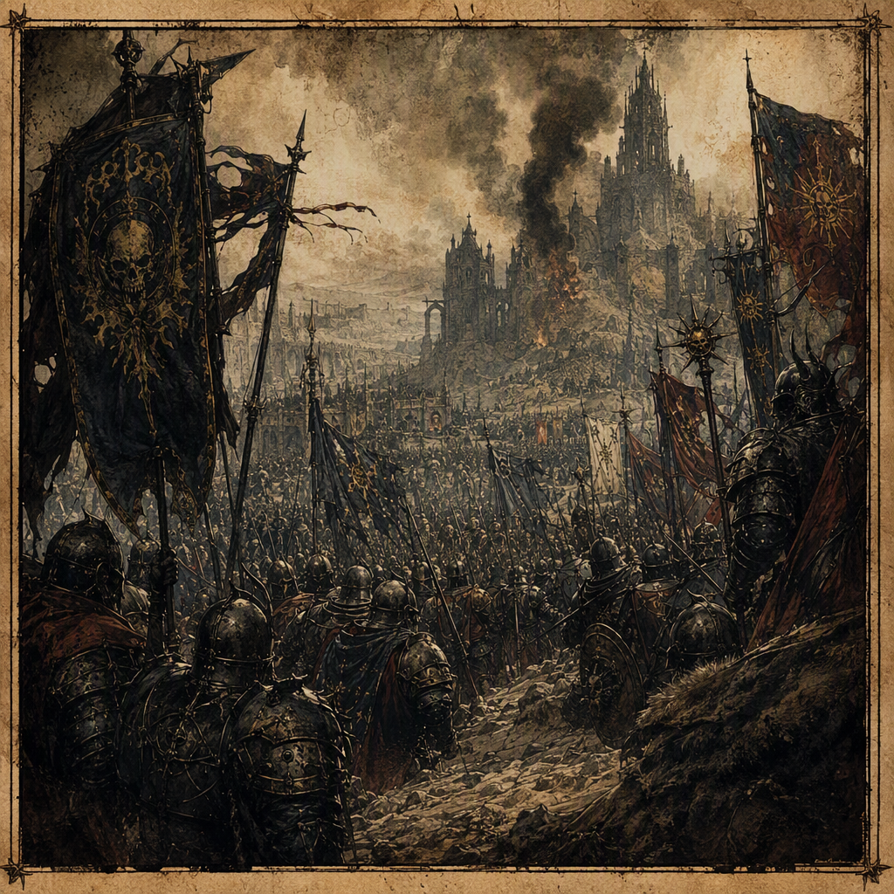

# The Leaden Accord

The [[The Leaden Accord]] was a conflict fought from 330 AS to 342 AS. It ended when both hosts were destroyed by a Ley-storm, leaving 14,011 casualties and a declared victory for the [[Iron-Ring Cartel]]. The conflict devastated [[Greyfell Citadel]] in 337 AS, [[Palewell Abbey]] in 338 AS, and [[Cindermere Hold]] in 338 AS, while fighting was waged at [[Vharencrag Fortress]] in 341 AS. Its hidden truth is that a supposedly destroyed artifact was in fact spirited away.

## Infobox

| Field | Value |
|---|---|
| Conflict | [[The Leaden Accord]] |
| Began | 330 AS |
| Ended | 342 AS |
| Casualty figure | 14011 |
| Outcome | Ended when both hosts were destroyed by a Ley-storm |
| Victor | [[The Iron-Ring Cartel]] |
| Major devastation | [[Greyfell Citadel]] in 337 AS; [[Palewell Abbey]] in 338 AS; [[Cindermere Hold]] in 338 AS |
| Major fighting | [[Vharencrag Fortress]] in 341 AS |
| Secret truth | A supposedly destroyed artifact was in fact spirited away |
| Known participant | [[Voltaire Hollowmere]], fighting for [[The Ashen Vanguard]] |

## History

The [[The Leaden Accord]] began in 330 AS. Its surviving record is defined less by a continuous account of campaigns than by a chain of devastated sites, contested assertions, and the final destruction of both hosts. The term “Accord” therefore remains grimly dissonant in historical usage: the conflict bears a name associated with settlement, while its documented course culminated in mutual ruin.

The first major recorded devastation occurred at [[Greyfell Citadel]] in 337 AS. The event established the pattern by which the conflict is most often understood: fortified places became the visible measure of the struggle, while the motives and movements of the hosts remained obscured beneath the destruction. The record identifies [[Greyfell Citadel]] as devastated in 337 AS, but does not alter the broader conclusion that the conflict continued afterward.

In 338 AS, the [[The Leaden Accord]] devastated both [[Palewell Abbey]] and [[Cindermere Hold]]. Their shared year in the record has made 338 AS one of the conflict’s most concentrated entries. The two sites are traditionally presented together in summaries of the war, not because their circumstances are identical, but because their devastation demonstrates the breadth of the destruction during the middle phase of the conflict.

The conflict was waged at [[Vharencrag Fortress]] in 341 AS. This late engagement is significant in the chronology because it preceded the final outcome by only one recorded year. The fortress is consequently associated with the closing phase of the [[The Leaden Accord]], although the surviving facts do not establish a separate outcome for the fighting there.

The final outcome came in 342 AS. Both hosts were destroyed by a Ley-storm, and the [[The Leaden Accord]] ended at that point. The destruction of both hosts is the defining fact of the conflict’s conclusion: it explains the bleakness of the surviving account while also complicating the declaration that the [[Iron-Ring Cartel]] was the victor.

The recorded casualty figure is 14011. In conventional notation, this is rendered as 14,011 casualties. The figure covers the known loss attributed to the conflict, but the surviving account does not resolve how the casualties were distributed between the destroyed hosts or among the devastated sites.

The most persistent contradiction in the historical record concerns an artifact that was supposedly destroyed. The hidden truth is that the artifact was in fact spirited away. This revelation does not overturn the declared outcome, but it changes the meaning of the final destruction. What appeared to be a conclusion involving the annihilation of all relevant forces and the loss of the artifact instead concealed its removal.

## Relationships & Affiliations

The declared victor of the [[The Leaden Accord]] was the [[Iron-Ring Cartel]]. This designation is an official outcome rather than a simple description of battlefield survival. Because both hosts were destroyed by a Ley-storm, the victory cannot be understood as the result of an intact host imposing a final defeat upon its enemy. The title of victor therefore exists alongside the conflict’s record of mutual ruin.

The [[Ashen Vanguard]] is represented in the conflict through [[Voltaire Hollowmere]], who fought in the [[The Leaden Accord]] for the [[Ashen Vanguard]]. His participation places him among the named figures directly connected to the fighting, while the record does not provide a separate account of his fate or of his role in the final destruction of both hosts.

The relationship between the [[Iron-Ring Cartel]] and the [[The Leaden Accord]] is consequently twofold. The [[Iron-Ring Cartel]] is named victor, yet the conflict itself ended through the destruction of both hosts rather than through an ordinary concluding defeat. This distinction is central to later descriptions of the accord, particularly those that treat the declared victory as incomplete, compromised, or concealed beneath the Ley-storm’s devastation.

The artifact’s disappearance further complicates every affiliation attached to the conflict. Its supposed destruction belongs to the public account, while its being spirited away belongs to the hidden truth. The record does not identify the agent responsible for the removal, nor does it establish an affiliation for the artifact after its disappearance. Accordingly, the artifact is discussed as the unresolved center of the conflict rather than as a possession securely assigned to any named power.

## Legacy

The visual identity of the [[The Leaden Accord]] is leaden, storm-riven, and haunted by the absence of a supposedly destroyed artifact. Artistic and archival treatments emphasize weight, darkness, fractured skies, and empty spaces where the artifact should have been. The imagery does not present the conflict as a clean contest between banners. Instead, it foregrounds the contradiction between what was declared destroyed and what was secretly carried away.

Its demeanor is the bleak stillness of mutual ruin concealed beneath a declared victory. This quality distinguishes the [[The Leaden Accord]] from conflicts remembered primarily through conquest or the endurance of a surviving host. Here, the official result remains legible—[[The Iron-Ring Cartel]] was named victor—yet the final scene is one in which both hosts were destroyed by a Ley-storm.

The devastated sites form the principal landmarks of this legacy. [[Greyfell Citadel]] is associated with 337 AS, while [[Palewell Abbey]] and [[Cindermere Hold]] are both associated with 338 AS. [[Vharencrag Fortress]] marks the fighting of 341 AS. Together, these entries give the conflict a physical outline without resolving its hidden center.

The disappearance of the artifact also ensures that the [[The Leaden Accord]] is remembered as an absence as much as an event. The artifact’s supposed destruction remains part of the declared narrative, but its being spirited away remains the hidden truth. That duality governs the conflict’s place in the historical record: a war that ended in 342 AS, a victory assigned to the [[Iron-Ring Cartel]], and a final certainty that conceals an unresolved removal.

The known participation of [[Voltaire Hollowmere]], fighting for the [[Ashen Vanguard]], adds a personal name to an otherwise impersonal account of ruined hosts and devastated strongholds. Even so, the conflict’s dominant image remains collective rather than individual. The defining figures are the two destroyed hosts, the declared victor, and the absent artifact whose survival was concealed beneath the storm.