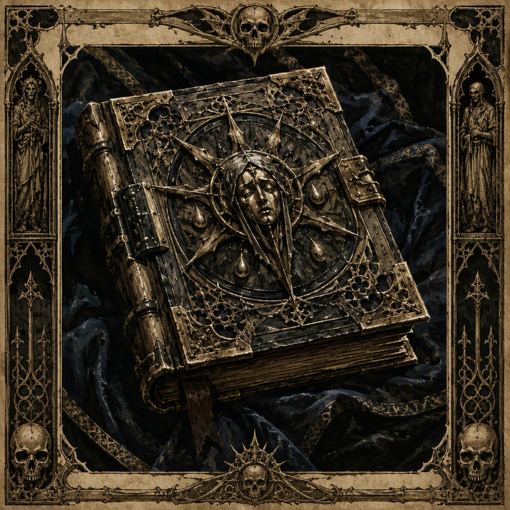

# The Psalter of Seven Sorrows (artifact)

The **[[The Psalter of Seven Sorrows]]** is a ward forged at [[Ironfell Citadel]] in **119 AS** and housed in [[Fenthrone]]. Its artifact class is **ward**, and attunement to it costs **49**. Its visual identity is that of a ward bearing the name *The Psalter of Seven Sorrows*, while its demeanor carries an atmosphere of sorrow shaped by that name. The artifact is therefore defined by the conjunction of its warding nature, its known place of forging, its present housing, and the emotional character associated with its title.

## Infobox

| Field | Value |
|---|---|
| Name | The Psalter of Seven Sorrows |
| Artifact class | Ward |
| Forged | 119 AS |
| Forged at | Ironfell Citadel |
| Housed in | Fenthrone |
| Attunement cost | 49 |
| Appearance | A ward bearing the name The Psalter of Seven Sorrows |
| Demeanor | An atmosphere of sorrow shaped by its name |

## History

The [[The Psalter of Seven Sorrows]] was forged in **119 AS**. Its place of forging is identified as [[Ironfell Citadel]], making that citadel an essential part of the artifact’s recorded history. The known account establishes both the year and location together: [[The Psalter of Seven Sorrows]] was **forged at Ironfell Citadel in 119 AS**.

The artifact’s classification as a **ward** describes its formal place among artifacts. This classification is distinct from the emotional impression associated with it. The ward’s recorded demeanor is sorrowful, and that demeanor is shaped by the name *The Psalter of Seven Sorrows*. The title consequently forms part of the artifact’s identity rather than serving as a detached label.

The passage of the artifact from [[Ironfell Citadel]] to its present housing is not detailed in the established record. What is established is that [[The Psalter of Seven Sorrows]] is **housed in Fenthrone**. [[Fenthrone]] is therefore its recorded place of housing, while [[Ironfell Citadel]] is its recorded place of forging. These two locations occupy separate places in the artifact’s known history, and no further account of the transition between them is specified here.

Attunement to [[The Psalter of Seven Sorrows]] costs **49**. This number is part of the artifact’s defining record and is not presented as a measure of its age, size, strength, or sorrow. It is specifically the attunement cost associated with the ward.

## Relationships & Affiliations

The principal recorded connections of [[The Psalter of Seven Sorrows]] are geographical and custodial. It was forged at [[Ironfell Citadel]] and is housed in [[Fenthrone]]. These facts establish a relationship between the artifact and each location, but they do not establish that the ward belongs to either location as a faction, institution, or bloodline.

No additional affiliation is specified for [[The Psalter of Seven Sorrows]]. In particular, the artifact’s classification as a ward does not by itself identify an owner, maker beyond its place of forging, or political allegiance. Likewise, its residence in [[Fenthrone]] does not, on the available facts, establish a relationship with any power associated with that place.

The relationship between the artifact and an attuned bearer is likewise defined only by the stated cost. Attunement to [[The Psalter of Seven Sorrows]] costs **49**. The record does not supply a named bearer or describe the consequences of attunement beyond that cost. Accordingly, the attunement requirement should be treated as a property of the ward rather than as evidence of an otherwise documented alliance.

The most pronounced internal relationship is between the artifact’s name and demeanor. [[The Psalter of Seven Sorrows]] bears an identity explicitly shaped around sorrow, and its atmosphere is described in those terms. This connection is thematic rather than institutional: the name informs the ward’s character, while the known locations identify its forging and housing.

## Name and Demeanor

The name *The Psalter of Seven Sorrows* gives the ward its visual and emotional identity. Its appearance is defined as that of a ward bearing the name **The Psalter of Seven Sorrows**. No separate physical form is specified in the established description. The artifact is therefore recognizable through the identity carried by its name and through its status as a ward.

Its demeanor carries **an atmosphere of sorrow shaped by its name**. This description does not assign a separate history to the sorrow, nor does it identify a source outside the artifact’s title. Instead, the sorrow is presented as the prevailing character of the ward. The wording also distinguishes demeanor from appearance: the appearance identifies what the artifact is presented as, while the demeanor conveys the emotional atmosphere associated with it.

The term “psalter” contributes to the artifact’s title, while “seven sorrows” supplies its defining emotional emphasis. No additional significance for the number seven is established in the available record. The number must therefore remain part of the proper name rather than being treated as a confirmed count of functions, inscriptions, afflictions, or effects.

This distinction is important in describing the ward accurately. The artifact is not documented as possessing seven separately recorded manifestations. It is documented as **The Psalter of Seven Sorrows**, a ward whose atmosphere of sorrow is shaped by that name.

## Legacy

The established legacy of [[The Psalter of Seven Sorrows]] rests on four fixed details: its class, its forging, its attunement cost, and its housing. It is a **ward**; it was **forged at Ironfell Citadel in 119 AS**; attunement to it costs **49**; and it is **housed in Fenthrone**.

These details give the artifact a clear archival profile without requiring additional interpretation. [[Ironfell Citadel]] marks its origin in the record, [[Fenthrone]] marks its present housing, and **119 AS** fixes the year in which it was forged. The cost of **49** distinguishes the conditions of attunement, while the name and demeanor distinguish the ward’s atmosphere.

In descriptions and catalogues, the full name should be retained. Shortening it may obscure the connection between the title and the sorrowful demeanor that defines the artifact’s presentation. The full designation also separates the ward from any unnamed references to psalters, sorrows, or other wards.

Because the known record does not provide further owners, wielders, effects, or affiliations, the artifact’s legacy is best stated through what is confirmed. [[The Psalter of Seven Sorrows]] remains a ward forged in **119 AS** at [[Ironfell Citadel]], housed in [[Fenthrone]], and requiring an attunement cost of **49**. Its identity is inseparable from the sorrow shaped by its name.