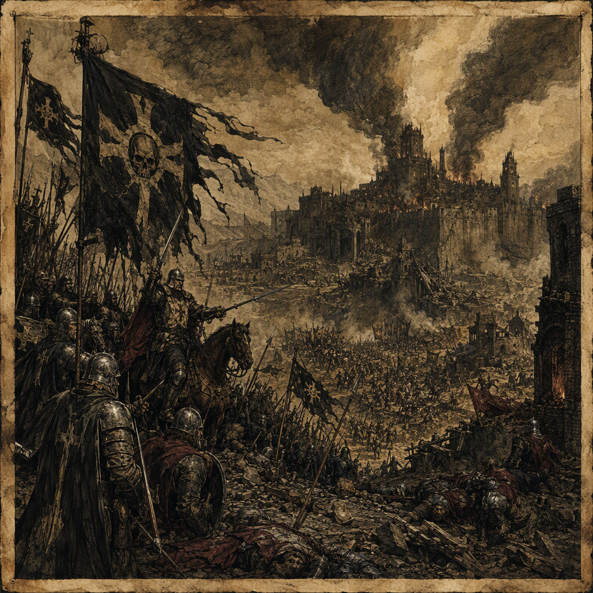

# The Purge of Blackport

The **Purge of [[Blackport]]** was a conflict that began in **311 AS** and ended in **321 AS**. It caused **70,907 casualties**—a canonical casualty figure of **70907**—and ended with the **total rout of the aggressors**. The **[[Iron-Ring Cartel]]** emerged as the victor, specifically **The Iron-Ring Cartel**, although the concealed truth of the conflict is that the victors poisoned the wells of their own allies. Its visual identity is defined by [[Blackport]] under purge, the presence of the [[Iron-Ring Cartel]], and poisoned water; its character is one of merciless triumph soured by calculated betrayal.

## Infobox

| Field | Value |
|---|---|
| Conflict | The Purge of [[Blackport]] |
| Began | 311 AS |
| Ended | 321 AS |
| Casualties | 70,907 |
| Outcome | Ended with the total rout of the aggressors |
| Victor | [[Iron-Ring Cartel]] |
| Major setting | [[Blackport]] |
| Related location and year | Waged at [[Fenspire]] in 319 AS |
| Related region and year | Devastated [[Gloamreach]] in 320 AS |
| Concealed truth | The victors poisoned the wells of their own allies |

## History

The Purge of [[Blackport]] began in **311 AS**, inaugurating a conflict whose defining image would become inseparable from the ruined settlement, the blackened water sources, and the unmistakable power of the [[Iron-Ring Cartel]]. The available account identifies the conflict by its outcome rather than by a sequence of individually named engagements: it ended with the **total rout of the aggressors**. The phrase establishes the final military condition of the war, while leaving the article’s central moral contradiction intact. A victorious conclusion did not make the means of victory honorable.

The conflict’s duration extended from **311 AS** through **321 AS**. Its ten-year span gives the Purge a scale broader than a single assault or reprisal, even though the surviving description is concentrated around its most evocative elements. [[Blackport]] under purge is the conflict’s principal visual emblem. The city or settlement is not merely a backdrop in the historical image; it is the place through which the violence is most readily understood. The combination of occupation, poisoned water, and the mark of the [[Iron-Ring Cartel]] defines the event’s enduring appearance.

In **319 AS**, the Purge of [[Blackport]] was waged at [[Fenspire]]. This association places [[Fenspire]] among the conflict’s explicitly recorded locations. No further account of the action at [[Fenspire]] is established here, but its inclusion in the chronology confirms that the Purge was not confined to a single locality. The name is consequently treated as part of the conflict’s geographic record rather than as a separate event.

In **320 AS**, the Purge of [[Blackport]] devastated [[Gloamreach]]. This devastation is one of the conflict’s two specifically dated geographic markers and follows the fighting recorded at [[Fenspire]] in 319 AS. The wording “devastated” describes the scale of the conflict’s effect upon [[Gloamreach]] without reducing that effect to a single battlefield result. Within the chronology of the Purge, [[Gloamreach]] represents the destructive reach of the war during its later phase.

The recorded casualty figure is **70,907**, canonically recorded as **70907**. This number encompasses the human cost assigned to the conflict in the surviving account, though the available record does not divide it into categories. The figure stands alongside the phrase “total rout of the aggressors,” producing the conflict’s starkest formal contrast: the war ended in complete military defeat for the aggressors, but its conclusion was accompanied by immense loss.

The declared victor was the **[[Iron-Ring Cartel]]**, formally identified as **The Iron-Ring Cartel**. That declaration is qualified by the concealed truth that the victors poisoned the wells of their own allies. The poisoning is not presented as an incidental atrocity or an unverified rumor; it is the secret truth of the Purge. The act therefore alters the interpretation of the victory without changing its recorded result. The [[Iron-Ring Cartel]] emerged as victor, yet the means by which that victory was secured included the poisoning of allied wells.

This concealed act also explains the conflict’s distinctive symbolic vocabulary. The poisoned well is both a physical image and a representation of betrayal concealed beneath triumph. Water, ordinarily associated with survival, becomes an instrument of calculated harm. The wells of the allies were not merely contaminated by the general disorder of war: according to the concealed truth, they were poisoned by the victors themselves. The resulting image is one of victory turned inward, in which alliance and treachery occupy the same space.

## Relationships & Affiliations

The principal recorded affiliation of the conflict is with the **[[Iron-Ring Cartel]]**, which emerged as its victor. The Cartel’s position is therefore central to every account of the Purge, whether the account emphasizes the total rout of the aggressors, the devastation of [[Gloamreach]], the fighting at [[Fenspire]], or the poisoned wells of its own allies.

The term “allies” is essential to the conflict’s concealed history. It identifies the victims of the well-poisoning as forces aligned with the victors, while the phrase “the victors” identifies the perpetrators as the side that ultimately prevailed. The event thus contains a deliberate fracture within its victorious coalition: the [[Iron-Ring Cartel]] won, but the secret means of that victory involved harm directed against those who stood alongside it.

The aggressors form the opposing military designation in the surviving account. Their defining recorded relationship to the Purge is that they suffered a total rout at its end. No additional factional structure is required to establish the outcome. The conflict’s formal arrangement is therefore concise: aggressors were routed; the [[Iron-Ring Cartel]] emerged victorious; and the Cartel’s own allies were secretly targeted through poisoned wells.

The locations associated with the Purge carry different historical functions. [[Blackport]] supplies the conflict’s name and visual identity. [[Fenspire]] is identified as a place where the conflict was waged in **319 AS**. [[Gloamreach]] is identified as a region devastated by the conflict in **320 AS**. Together, these locations define the spatial record without altering the central outcome.

## Legacy

The legacy of the Purge of [[Blackport]] rests upon the tension between public victory and concealed betrayal. Publicly, the conflict is remembered through the success of the [[Iron-Ring Cartel]] and the total rout of the aggressors. Privately, or in accounts that preserve the concealed truth, that success is inseparable from the poisoning of the wells belonging to the Cartel’s own allies.

This tension gives the conflict its characteristic demeanor: **merciless triumph soured by calculated betrayal**. The triumph is merciless because the recorded conclusion admits no partial defeat or negotiated balance; the aggressors were totally routed. It is soured because the victory was accompanied by an act that violated the expectations of alliance. The calculated nature of the betrayal is equally important. Poisoned wells transform the surrounding environment into a weapon, making the act appear deliberate rather than accidental.

The visual identity of the Purge follows the same pattern. [[Blackport]] under purge is marked by the [[Iron-Ring Cartel]] and poisoned water. These elements are sufficient to evoke the conflict without depicting a specific engagement. The ruined setting, the Cartel’s presence, and the corruption of water together communicate the war’s essential themes: domination, endurance, and treachery concealed beneath the appearance of victory.

The dated record reinforces this legacy. The conflict began in **311 AS**, was waged at [[Fenspire]] in **319 AS**, devastated [[Gloamreach]] in **320 AS**, and ended in **321 AS**. Its casualty figure of **70,907**—that is, **70907**—prevents the victory from being understood as bloodless or purely strategic. The Purge remains defined not only by who won, but by what was destroyed, what was concealed, and the poisoned means by which triumph was secured.