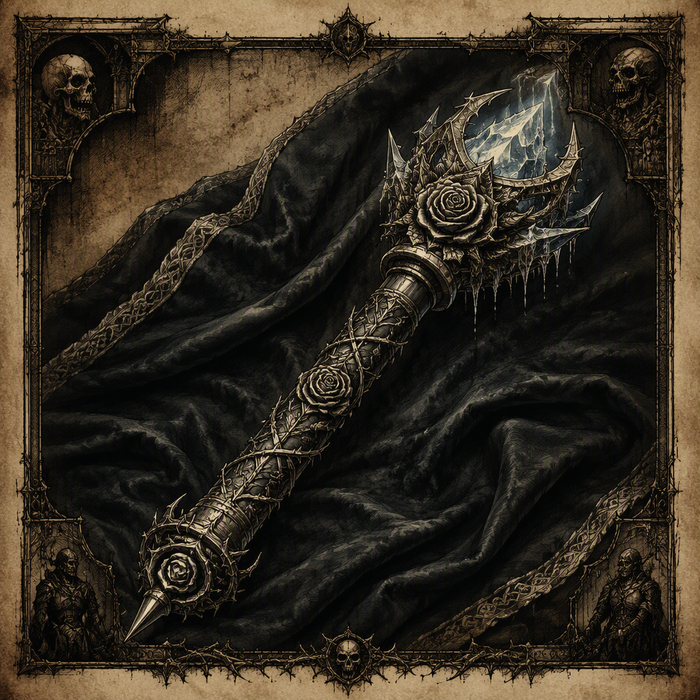

# The Sceptre of Final Winter

The **[[The Sceptre of Final Winter]]** is a ward forged at [[Emberdeep]] in **87 AS** and housed in [[Palewell Abbey]]. Its attunement cost is **55**, and its defining presence is one of cold finality. The artifact’s visual identity is that of a ward bearing the name **[[The Sceptre of Final Winter]]**, while its recorded demeanor emphasizes an atmosphere of cold finality rather than warmth, vitality, or renewal. Beyond these established particulars, the surviving record provides no additional account of its functions, wielders, or historical deployments.

## Infobox

| Field | Value |
|---|---|
| Name | [[The Sceptre of Final Winter]] |
| Artifact class | ward |
| Forged | 87 AS |
| Forged at | [[Emberdeep]] |
| Attunement cost | 55 |
| Housed in | [[Palewell Abbey]] |
| Appearance | A ward bearing the name [[The Sceptre of Final Winter]] |
| Demeanor | Radiates an atmosphere of cold finality |

## History

[[The Sceptre of Final Winter]] was forged in **87 AS**. The place of its forging is recorded as [[Emberdeep]], making the statement that it was “forged at [[Emberdeep]]” the artifact’s principal historical point of origin. No further details of its creation are established in the available record. The identities of its makers, the materials used, the purpose for which it was first made, and the circumstances surrounding its completion are not specified.

The artifact is classified as a **ward**. This classification is central to its description, but the record does not provide a technical account of what kind of ward it is or what effect it produces. Accordingly, the term establishes its artifact class without establishing a catalogue of powers, protections, limitations, or conditions of use. Interpretations that assign it additional functions remain unconfirmed.

The Sceptre is housed in [[Palewell Abbey]]. This is the artifact’s recorded place of keeping. The available account does not state when it came to be housed there, whether it has remained there continuously, or whether it was ever held elsewhere. [[Palewell Abbey]] is therefore identified as its current or recorded housing site, but no broader custodial history can be established from the known facts.

Attunement to [[The Sceptre of Final Winter]] costs **55**. The figure is given as an attunement cost and is not accompanied by any further explanation of the process. The record does not state who may attune to the ward, how long attunement takes, what risks accompany it, or whether the cost is paid through physical, spiritual, material, or other means. The value remains an exact part of the artifact’s formal description.

The name itself is part of the artifact’s visual identity. It is described as a ward bearing the name **[[The Sceptre of Final Winter]]**. This wording distinguishes the recorded appearance from a detailed physical inventory: no dimensions, materials, ornamentation, coloration, or visible mechanisms are established. The available description identifies the named ward as the visual object without supplying additional physical specifications.

## Relationships & Affiliations

No affiliation between [[The Sceptre of Final Winter]] and any other named power, institution, person, or artifact is established in the available record. Its known associations are limited to the place where it was forged, [[Emberdeep]], and the place where it is housed, [[Palewell Abbey]]. These are recorded locations rather than confirmed alliances, ownerships, or ideological connections.

The relationship between the Sceptre and [[Palewell Abbey]] is specifically one of housing. The wording does not establish that the abbey forged the ward, created it, owns it, worships it, or has authority over its use. Likewise, the fact that the ward was forged at [[Emberdeep]] does not establish an enduring connection to that location after **87 AS**. The two place-names therefore mark the known stages of origin and custody without supplying an institutional narrative.

No relationship with a wielder is recorded. Although attunement is possible in the sense that an attunement cost of **55** is given, no individual or group is identified as having completed that attunement. The record also does not state whether the ward has ever been actively used, whether it is currently attuned, or whether its housing at [[Palewell Abbey]] prevents or permits access.

For the same reason, the Sceptre cannot be assigned to any wider faction on the basis of the known dossier. No allegiance, battlefield use, treaty role, inheritance, confiscation, or ceremonial exchange is documented. References that connect it to an unnamed cause or power should therefore be treated as interpretation rather than established affiliation.

## Demeanor and Interpretation

[[The Sceptre of Final Winter]] radiates an atmosphere of **cold finality**. This is the artifact’s defining demeanor. The description concerns the impression or presence associated with the ward and does not, by itself, establish a measurable temperature, a destructive effect, or a specific supernatural ability.

The phrase “cold finality” has shaped the artifact’s interpretive profile. “Cold” presents an atmosphere removed from warmth and comfort, while “finality” suggests an impression of conclusion or irrevocable closure. These associations are descriptive rather than a confirmed list of powers. The known record does not state that the ward creates winter, freezes its surroundings, ends a life, seals a passage, or determines an outcome. It establishes only the atmosphere that radiates from it.

This demeanor also distinguishes the artifact from a merely named object. The name evokes a season or condition of ending, while the recorded atmosphere supplies a corresponding emotional and sensory character. Even so, the relationship between name and demeanor should not be expanded into an unverified account of origin or purpose. The Sceptre is called [[The Sceptre of Final Winter]], and it radiates cold finality; those are the confirmed elements.

The absence of a more detailed appearance leaves the ward’s physical presentation deliberately limited in the record. Its visual identity is that of a ward bearing the name **[[The Sceptre of Final Winter]]**. No further visual attributes are confirmed. Descriptions that portray it with particular materials, shapes, markings, or embellishments go beyond the established account.

## Legacy

The known legacy of [[The Sceptre of Final Winter]] rests on four fixed details: it is a **ward**, it was forged at [[Emberdeep]] in **87 AS**, attunement to it costs **55**, and it is housed in [[Palewell Abbey]]. Together, these details define its archival profile without revealing a fuller narrative of conflict or succession.

Its strongest thematic identity comes from the conjunction of its name and demeanor. The Sceptre bears a name invoking final winter and radiates an atmosphere of cold finality. This gives the artifact a severe and terminal character in description, while leaving its actual operation unrecorded. It is consequently notable not for a documented catalogue of feats, but for the concentrated impression conveyed by its title, classification, and presence.

Until additional records clarify its creation, use, or custodianship, the established account remains intentionally narrow. [[The Sceptre of Final Winter]] is a named ward of known origin, known attunement cost, known housing, and unmistakable demeanor. Those facts form the complete confirmed foundation for its place in the archive.