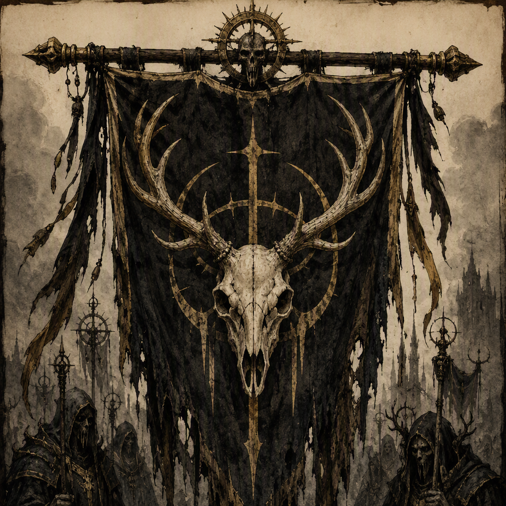

# The Silent Choir (faction)

The Silent Choir is a secretive priesthood that records, censors, and rewrites history. Its religious authority is exercised through control of the historical record, making the preservation and alteration of knowledge central to its institutional identity. The Silent Choir is seated at [[Vharencrag Fortress]] and has been belligerent in [[The War of Drowned Light]], [[The War of Endless Vigil]], and [[The Winter Reckoning]]. Its known members include [[Ignatz Fellgard]], [[Brannoc Palefroth]], [[Thessaly Coldwater]], [[Lucan Hollowmere]], [[Tamsin Greyfen]], and [[Ossric Ashgrove]].

## Infobox

| Field | Value |
|---|---|
| Organization type | Priesthood |
| Doctrine | Secretive priesthood that records, censors, and rewrites history |
| Seat | [[Vharencrag Fortress]] |
| Belligerencies | [[The War of Drowned Light]]; [[The War of Endless Vigil]]; [[The Winter Reckoning]] |
| Members | [[Ignatz Fellgard]]; [[Brannoc Palefroth]]; [[Thessaly Coldwater]]; [[Lucan Hollowmere]]; [[Tamsin Greyfen]]; [[Ossric Ashgrove]] |

## History

The Silent Choir’s history is inseparable from its doctrine. It is a secretive priesthood that records, censors, and rewrites history, and its religious authority is exercised through control of the historical record. In this structure, the written account of events is not merely a repository of memory. It is the principal means by which the Choir expresses authority.

The Choir’s work therefore encompasses three stated actions: recording, censoring, and rewriting. Recording establishes what is preserved. Censoring governs what is withheld. Rewriting changes how an event is understood once it has entered the historical record. Together, these practices define the priesthood’s handling of truth and distinguish its religious authority from authority based solely on force, inheritance, or territory.

The Silent Choir is seated at [[Vharencrag Fortress]]. The fortress is consequently the faction’s stated seat, while the available record does not assign it any additional institutional title. The connection between the priesthood and its seat is central to the faction’s presentation: the Choir is associated with a fixed place of record-keeping, secrecy, and deliberate judgment.

The Silent Choir was belligerent in [[The War of Drowned Light]]. It was also belligerent in [[The War of Endless Vigil]] and [[The Winter Reckoning]]. These three belligerencies form the known wartime record of the faction. The available account identifies the Choir as a belligerent in each conflict without detailing the causes of the wars, the Choir’s specific actions, or the outcomes of its involvement. Accordingly, the wars establish the Choir’s presence as a participant in major conflicts, but do not by themselves define the full extent of its activities.

The priesthood’s record-keeping doctrine gives its belligerencies a particular significance. A faction that records, censors, and rewrites history does not merely appear within historical accounts; it possesses the stated authority to control those accounts. The Choir’s involvement in the three named wars must therefore be considered alongside its institutional purpose. Its relationship to history is both religious and administrative, with the preservation of an event and the interpretation of that event belonging to the same sphere of authority.

The known membership of the Silent Choir includes [[Ignatz Fellgard]], [[Brannoc Palefroth]], [[Thessaly Coldwater]], [[Lucan Hollowmere]], [[Tamsin Greyfen]], and [[Ossric Ashgrove]]. The available record identifies each as a member of the priesthood. It does not assign them separate ranks, offices, or duties. Their inclusion confirms the human presence of the Choir while preserving the faction’s broader character as a collective institution rather than a personality defined by a single member.

## Relationships & Affiliations

The Silent Choir’s confirmed affiliations are expressed through its seat, its belligerencies, and its membership. Its seat is [[Vharencrag Fortress]]. Its recorded wartime affiliations are [[The War of Drowned Light]], [[The War of Endless Vigil]], and [[The Winter Reckoning]], in each of which the Silent Choir was belligerent. Its known members are [[Ignatz Fellgard]], [[Brannoc Palefroth]], [[Thessaly Coldwater]], [[Lucan Hollowmere]], [[Tamsin Greyfen]], and [[Ossric Ashgrove]].

No additional relationship is required to understand the faction’s position. The Silent Choir’s central connection is to the historical record itself. As a secretive priesthood, it derives religious authority from the control of history. Its affiliations therefore cannot be separated from questions of testimony, preservation, omission, and revision.

Membership in the Choir is likewise presented through the institution’s collective identity. [[Ignatz Fellgard]], [[Brannoc Palefroth]], [[Thessaly Coldwater]], [[Lucan Hollowmere]], [[Tamsin Greyfen]], and [[Ossric Ashgrove]] are all members of the Silent Choir, but the known record does not distinguish their individual responsibilities. Their names are consequently best understood as confirmed points of membership rather than as evidence of separate doctrinal positions.

The three named wars provide the faction’s confirmed belligerent relationships. The Silent Choir was belligerent in [[The War of Drowned Light]], [[The War of Endless Vigil]], and [[The Winter Reckoning]]. This designation establishes participation in each conflict, while leaving the precise form of that participation unspecified. The priesthood’s involvement may be read only through the confirmed fact of belligerency and its wider doctrine of historical control.

## Appearance and Demeanor

The Silent Choir’s visual identity is priestly, restrained, and defined by secrecy and the keeping of records. Its appearance communicates discipline rather than display. The emphasis on restraint accords with an organization whose authority rests on deliberate control of information and whose public identity is shaped by the guarded treatment of truth.

The faction’s record-keeping character is equally important to its visual presentation. The Silent Choir is not defined only by religious imagery, nor only by secrecy. It is defined by the combination of priestly authority, concealment, and the preservation of written history. The keeping of records is therefore part of its identity rather than a peripheral activity.

The Choir’s demeanor is quiet, inscrutable, and deliberate in its handling of truth. Quietness reflects its refusal to make knowledge freely available. Inscrutability reflects the difficulty of determining what the priesthood accepts, conceals, or changes. Deliberation reflects the stated nature of its work: recording, censoring, and rewriting history are acts that require controlled judgment.

These qualities also distinguish the Silent Choir from an institution whose purpose would be simple preservation. The Choir does not merely record history. Its doctrine expressly includes censorship and rewriting. Its restraint therefore carries an ambiguity: silence may signify reverence, concealment, or control, while a preserved account may represent memory, selection, or revision. The faction’s identity depends on this unresolved tension.

## Legacy

The Silent Choir’s legacy rests on its control of historical authority. Because it records, censors, and rewrites history, every account associated with the priesthood is connected to its religious power. The faction’s significance lies not only in what it preserves, but also in the authority to determine what is omitted and how surviving events are framed.

Its seat at [[Vharencrag Fortress]] gives this authority a defined institutional center. Its belligerency in [[The War of Drowned Light]], [[The War of Endless Vigil]], and [[The Winter Reckoning]] gives the historical record three confirmed conflicts in which the Choir was an active belligerent. Its known members—[[Ignatz Fellgard]], [[Brannoc Palefroth]], [[Thessaly Coldwater]], [[Lucan Hollowmere]], [[Tamsin Greyfen]], and [[Ossric Ashgrove]]—place named individuals within that secretive priesthood.

The Silent Choir is consequently remembered through a contradiction at the heart of its doctrine. It is the keeper of history, yet it also censors and rewrites history. It claims religious authority through the record, yet its handling of the record ensures that the truth under its care remains difficult to separate from the institution that controls it. Its quiet, inscrutable, and deliberate character is therefore not ornamental. It is the clearest expression of the Choir’s purpose.