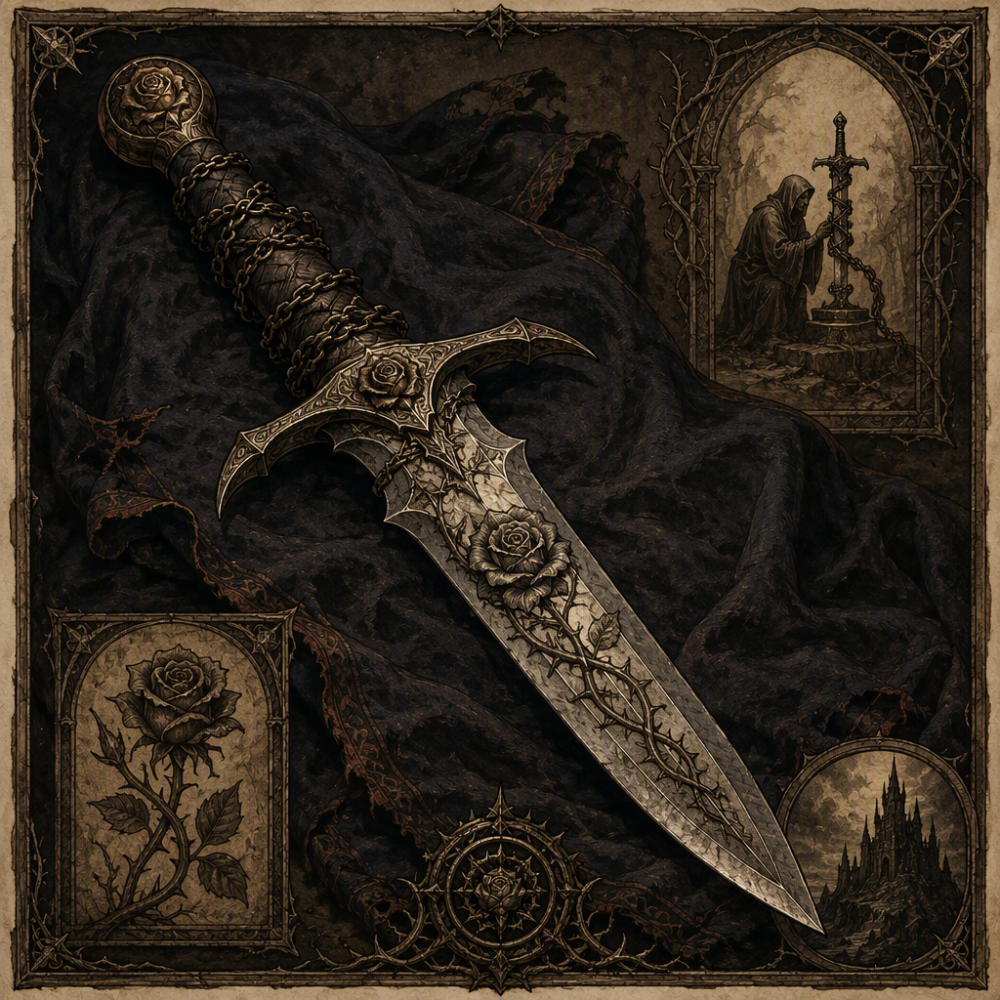

# The Thrice-Bound Edge

The **[[The Thrice-Bound Edge]]** is a regalia artifact forged in **123 AS**. Its recorded place of forging is **[[Hollowreach]]**, while its recorded place of housing is **[[Crookvale]]**. The artifact’s defining record contains **no attunement cost**. Its visual identity is that of regalia bearing the name *The Thrice-Bound Edge*, and its demeanor is described as conveying a restrained, binding atmosphere.

## Infobox

| Field | Value |
|---|---|
| Artifact class | regalia |
| Forged | 123 AS |
| Forged at | [[Hollowreach]] |
| Housed in | [[Crookvale]] |
| Attunement cost | None recorded |
| Visual identity | Regalia bearing the name [[The Thrice-Bound Edge]] |
| Demeanor | Restrained, binding atmosphere |

## History

The [[The Thrice-Bound Edge]] was forged in **123 AS**. The record identifies **[[Hollowreach]]** as its place of forging, establishing the location as part of the artifact’s known history. No additional stage in its creation is preserved in the defining record. Accordingly, the date and place of forging remain the central historical facts attached to the regalia.

The artifact is classified as **regalia**, rather than being described solely as a weapon or implement. This classification is significant to its presentation. The available description emphasizes an object of formal identity: its visual character is that of regalia bearing the name *The Thrice-Bound Edge*. The name is therefore integral to how the artifact is recognized and recorded.

The surviving record does not provide an attunement cost for the [[The Thrice-Bound Edge]]. Its defining record contains **no attunement cost**, and no substitute requirement is given. This absence is part of the artifact’s documented profile. It should not be read as evidence of a particular ritual, sacrifice, limitation, or exemption, since none of those details are included in the record.

The present housing of the [[The Thrice-Bound Edge]] is **[[Crookvale]]**. The phrase “housed in” establishes its recorded location without specifying the nature of the place, the circumstances of its custody, or the means by which the artifact reached it. The record does not state whether the regalia has remained in [[Crookvale]] continuously since its forging at [[Hollowreach]], nor does it identify any transfer between the two locations.

The known chronology is consequently concise. The [[The Thrice-Bound Edge]] was forged at [[Hollowreach]] in **123 AS** and is housed in [[Crookvale]]. These statements form the complete fixed sequence presently attached to the artifact. No other date is supplied by the defining record.

## Relationships & Affiliations

No relationship or affiliation is established in the defining record beyond the artifact’s association with its places of forging and housing. The [[The Thrice-Bound Edge]] is associated with **[[Hollowreach]]** through its forging in **123 AS**, and with **[[Crookvale]]** through its present housing. Neither location is assigned an additional role in the record.

The classification of the [[The Thrice-Bound Edge]] as **regalia** does not, by itself, identify an owner, bearer, court, faction, lineage, office, or institution. The record does not name any such affiliation. It likewise does not state that the artifact belongs to, serves, represents, or was commissioned by another named entity.

The lack of a recorded attunement cost also does not establish a relationship between the regalia and any bearer. No bearer is named, and no condition of possession is supplied. The artifact’s restrained, binding atmosphere may inform its interpretation, but it does not constitute evidence of an affiliation or of a particular intended user.

For archival purposes, the distinction between documented association and interpretation is maintained. [[Hollowreach]] is the place at which the [[The Thrice-Bound Edge]] was forged. [[Crookvale]] is the place in which it is housed. These are the only explicit geographic relationships preserved in the defining record. Any broader connection remains unrecorded.

## Interpretive Notes

The most distinctive feature of the [[The Thrice-Bound Edge]] is the conjunction of its regalia classification and its restrained, binding atmosphere. The artifact is not described through ornament, brilliance, violence, or spectacle. Instead, its identity is conveyed through restraint and the suggestion of binding. This description concerns demeanor rather than a confirmed function. It indicates how the regalia presents itself in the record, but it does not establish a specific power or effect.

The name *The Thrice-Bound Edge* reinforces a formal and controlled impression. The record does not explain the meaning of “Thrice-Bound,” and no interpretation should be treated as canonical beyond the stated name. In particular, the name does not confirm three bindings, three owners, three uses, or any other number. The artifact’s defining record provides the name but no explanation of its terminology.

Its visual identity is similarly precise and limited. The [[The Thrice-Bound Edge]] is regalia bearing the name *The Thrice-Bound Edge*. This description identifies the artifact’s presentation without supplying additional details of shape, material, color, ornament, inscription, or dimensions. Such details are not part of the defining record.

The absence of an attunement cost is also an important archival feature. Because no cost is recorded, the regalia cannot be assigned a documented price of use, threshold of access, or burden of possession. The omission does not resolve whether such a cost exists outside the record; it establishes only that the defining record contains **no attunement cost**.

Taken together, the known elements create a deliberately controlled profile: regalia forged at [[Hollowreach]] in **123 AS**, housed in [[Crookvale]], visually identified by its name, and marked by a restrained, binding atmosphere. The record is firm on classification, date, forging place, housing place, and presentation, while remaining silent on broader affiliations and attunement requirements.

## Archival Summary

The [[The Thrice-Bound Edge]] is **regalia** forged in **123 AS**. It was forged at **[[Hollowreach]]** in **123 AS** and is housed in **[[Crookvale]]**. Its defining record contains **no attunement cost**. Its visual identity is that of regalia bearing the name *The Thrice-Bound Edge*, and its demeanor conveys a restrained, binding atmosphere. No further relationship, chronology, or numerical specification is established by the available record.