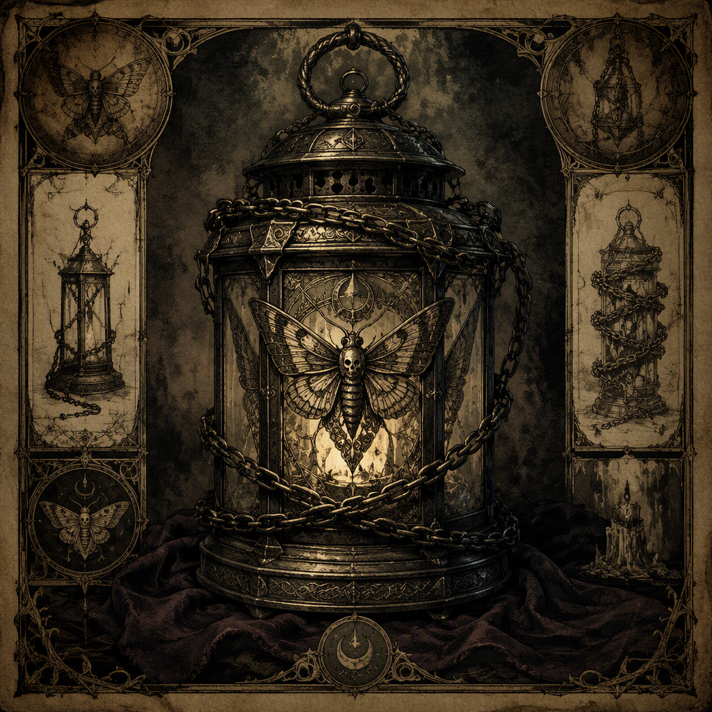

# The Thrice-Bound Lantern

The **[[The Thrice-Bound Lantern]]** is a ward forged in **72 AS** at **[[Stormmarch]]** and housed in **[[Hollowvale]]**. Its defining feature is its threefold binding: three visible restraints shape both its severe appearance and its protective purpose. Rather than presenting power as illumination, force, or conquest, the Lantern embodies restraint and containment. It radiates guarded stillness, as though perpetually holding danger at bay, and is consequently understood as a protective object whose strength lies in refusing release.

| Field | Value |
|---|---|
| Artifact class | ward |
| Forged | 72 AS |
| Forged at | [[Stormmarch]] |
| Housed in | [[Hollowvale]] |
| Appearance | A lantern marked by three visible bindings, with a severe, warding silhouette |
| Demeanor | Radiates guarded stillness, as though perpetually holding danger at bay |

## History

The [[The Thrice-Bound Lantern]] was forged in **72 AS** at **[[Stormmarch]]**. Its creation is defined by the threefold binding incorporated into the object itself. The bindings are not merely decorative marks or signs added after the Lantern’s completion; they are the central visible expression of its nature as a ward. In the surviving description, the artifact’s purpose and appearance are inseparable. It is a lantern, but its identity rests equally upon the restraints that govern it.

The choice to forge the Lantern as a ward establishes a protective function. Its strength lies in restraint and containment, making it distinct in conception from an object whose purpose would be the open release of power. The Lantern’s construction instead suggests force held within limits. Its three visible bindings communicate that principle directly, giving the artifact a severe, warding silhouette rather than a welcoming or ornamental one.

The record places the Lantern’s forging at [[Stormmarch]] in **72 AS**, while identifying [[Hollowvale]] as the place where it is housed. These are the two fixed locations associated with the artifact: [[Stormmarch]] is its place of forging, and [[Hollowvale]] is its place of housing. The distinction is significant to the Lantern’s recorded history. Its origin is tied to the act of binding and making, while its housing marks the place in which the completed ward is kept.

No separate sequence of events is established in the available account between the forging at [[Stormmarch]] and the Lantern’s housing in [[Hollowvale]]. Accordingly, the artifact’s documented history is best understood through the facts that are known: it was forged in **72 AS**, it was made as a ward, and it is housed in [[Hollowvale]]. The absence of additional recorded episodes does not diminish its identity. The Lantern’s meaning is concentrated in its construction, its restraint, and its continued condition of guarded stillness.

The three bindings also provide the clearest visual summary of the Lantern’s history. They preserve the memory of the object’s founding purpose in a form that can be seen upon the artifact itself. Even without a description of any surrounding ceremony or maker, the Lantern’s silhouette presents a continual statement of containment. Its history therefore remains legible through the ward’s physical form: three restraints, a protective design, and a posture of perpetual resistance.

## Relationships & Affiliations

The primary relationship recorded for the [[The Thrice-Bound Lantern]] is its relationship to danger. The artifact radiates guarded stillness, as though perpetually holding danger at bay. This is not presented as an aggressive stance. The Lantern does not derive its defining character from pursuit, domination, or destruction, but from the refusal to allow danger to pass beyond the limits imposed by its binding.

Its threefold binding gives material form to that relationship. Each visible restraint reinforces the impression that the Lantern is an object designed to keep something contained. The artifact’s protective role is therefore expressed through limitation. Its strength lies in restraint and containment, and its appearance communicates the same principle without requiring a separate emblem or inscription.

The Lantern is also associated with [[Stormmarch]] through its forging and with [[Hollowvale]] through its housing. [[Stormmarch]] represents the artifact’s recorded place of origin, where the ward was forged in **72 AS**. [[Hollowvale]] represents the place in which the completed artifact is housed. These associations define the Lantern’s documented connection to place without changing its essential identity as a ward.

The available record identifies the Lantern by its artifact class, its date of forging, its place of origin, and its place of housing. Its strongest affiliation is therefore conceptual rather than institutional: it belongs to the principle of protection through containment. The severe silhouette, the three visible bindings, and the demeanor of guarded stillness all reinforce that principle.

The Lantern’s relationship to illumination is similarly shaped by restraint. It takes the form of a lantern, yet its defining qualities are not described in terms of brightness or display. The object’s significance lies in the visible bindings and in the sense that it is perpetually holding danger at bay. Its lantern form provides the vessel, while its warding character determines the meaning of that vessel.

## Symbolism and Function

The [[The Thrice-Bound Lantern]] is a concentrated expression of protective restraint. As a **ward**, it is defined by what it prevents, holds, or contains. The artifact’s power is not characterized by outward expansion. Instead, the threefold binding implies a strength maintained through limits. The Lantern is protective because it remains guarded, and it remains guarded because its construction denies unrestrained release.

The number of bindings is central to its identity. The Lantern is marked by **three visible bindings**, and those bindings establish the artifact’s severe, warding silhouette. They make the principle of containment immediately perceptible. The eye encounters not an open or delicate object, but a lantern enclosed by its own safeguards. Its appearance suggests that protection is an active condition: the ward is continually holding its boundaries.

This gives the artifact a distinctive demeanor. The Lantern radiates guarded stillness, as though perpetually holding danger at bay. The stillness is not emptiness or passivity. It is the stillness of something maintained under pressure, a condition in which vigilance has become inseparable from form. The Lantern appears to stand in opposition to disorder without needing to display motion or violence.

Its function and symbolism consequently reinforce one another. The ward’s purpose is protective; its strength lies in restraint and containment; its visible bindings embody those qualities; and its demeanor conveys the persistence required to maintain them. Nothing about the Lantern’s recorded character separates the object from its purpose. It is a protective object because it is bound, and its binding is what makes its protection intelligible.

The Thrice-Bound Lantern’s enduring significance thus rests on a simple but severe idea: danger is held at bay not through excess, but through control. Forged at [[Stormmarch]] in **72 AS** and housed in [[Hollowvale]], the artifact remains defined by the same threefold principle expressed in its construction. It is a lantern made into a ward, a ward made visible through three bindings, and a protective presence whose strength lies in containment.