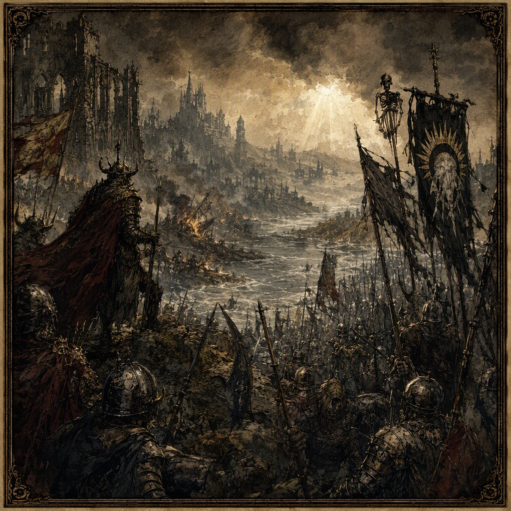

# [[The War of Drowned Light]]

The [[The War of Drowned Light]] was a conflict of concealed treachery, attrition, and unresolved vengeance. It began in **225 AS** and ended in **235 AS**, producing **64617 casualties** before collapsing into a decade of guerrilla reprisals. Although the conflict is recorded as a victory for [[The Silent Choir]], its origin remained obscured: the spark that started the war was secretly staged by [[The Silent Choir]]. The war was waged at [[Cindermere Hold]] in **228 AS**, devastated [[Gloamreach]] in **227 AS**, and was waged at [[Greyfell Citadel]] in **233 AS**. Its visual identity is associated with drowned radiance, broken banners, and remembrance through reprisals rather than triumph.

## Infobox

| Field | Value |
|---|---|
| Conflict | [[The War of Drowned Light]] |
| Began | 225 AS |
| Ended | 235 AS |
| Casualties | 64617 |
| Outcome | Collapsed into a decade of guerrilla reprisals |
| Victor | [[The Silent Choir]] |
| Secret truth | The spark that started it was staged by [[The Silent Choir]] |
| Waged at | [[Cindermere Hold]] in 228 AS; [[Greyfell Citadel]] in 233 AS |
| Devastated | [[Gloamreach]] in 227 AS |

## History

The [[The War of Drowned Light]] began in **225 AS**. Its opening was later understood to have been shaped by a hidden act of manipulation, since the spark that started it was secretly staged by [[The Silent Choir]]. This secret truth stands at the center of the conflict’s historical character. The war was not remembered as a straightforward contest whose purpose could be separated from its concealed beginning. Instead, its visible violence and its hidden instigation remained inseparable in later accounts.

The conflict’s identity was formed through a pattern of damaged symbols and incomplete victories. Drowned radiance became its defining image, suggesting light that remained present but could no longer illuminate the path ahead. Broken banners likewise came to represent the failure of martial display to produce a final resolution. These images are not separate from the war’s course: the conflict is remembered through attrition, reprisals, and the persistence of concealed motives rather than through a single triumphant conclusion.

In **227 AS**, the [[The War of Drowned Light]] devastated [[Gloamreach]]. The devastation is one of the conflict’s fixed historical markers and forms part of the war’s association with ruin rather than conquest. The event is recorded without transforming the war into a narrative of decisive territorial possession. Its importance lies in the destruction attached to the place and in the continuing atmosphere of vengeance that surrounded the conflict.

The war was waged at [[Cindermere Hold]] in **228 AS**. This engagement belongs to the central period of the conflict, when its violence had already acquired the character of sustained attrition. The record identifies [[Cindermere Hold]] as a site at which the war was waged, but does not reduce the entire conflict to that single place. In the historical memory of the war, the location is instead one of several surfaces upon which its concealed treachery and destructive momentum became visible.

The [[The War of Drowned Light]] continued until **235 AS**, when it ended as an organized conflict. Its ending did not bring a simple restoration of order. Rather, the conflict collapsed into a decade of guerrilla reprisals. This outcome is central to the war’s classification: the end of the war did not erase its causes, settle its vengeance, or produce an uncontested peace. The reprisals became the form in which the conflict continued to be experienced after its formal end.

In **233 AS**, the war was waged at [[Greyfell Citadel]]. The site belongs to the later phase of the conflict, preceding its end in **235 AS**. As with [[Cindermere Hold]], the record establishes the location and year without assigning the engagement an unsupported decisive result. [[Greyfell Citadel]] is therefore treated as a documented theater of the war rather than as a symbol of final victory.

The total casualty figure for the [[The War of Drowned Light]] is **64617**. This figure encompasses the scale by which the war is measured in historical records, while the decade of guerrilla reprisals preserves the conflict’s wider legacy beyond the formal accounting of the war itself. The numerical record and the emotional record point in the same direction: the conflict ended with immense loss but without an ending capable of containing its consequences.

## Relationships & Affiliations

The principal recorded affiliation of the [[The War of Drowned Light]] is with [[The Silent Choir]]. [[The Silent Choir]] is recorded as the victor, and the war’s secret truth is that the spark that started it was staged by [[The Silent Choir]]. These two facts define the conflict’s most important relationship: the power credited with victory is also the power identified as the hidden author of the war’s beginning.

This relationship complicates the meaning of victory. A conventional victory implies that one side prevailed through visible action, superior force, or an acknowledged settlement. The record of the [[The War of Drowned Light]] instead places victory beside secrecy. [[The Silent Choir]] is recorded as the victor, but the war is also remembered as having been initiated through a staged spark. Consequently, the conflict carries an atmosphere in which public outcomes and concealed purposes cannot be cleanly separated.

The connection between the war and [[The Silent Choir]] also explains why the conflict is remembered through suspicion rather than celebration. The formal record names a victor, yet the war’s aftermath was a decade of guerrilla reprisals. This outcome prevents the victory from serving as a complete conclusion. The presence of a victor did not prevent continuation in another form, and the identification of the victorious power did not resolve the war’s atmosphere of unresolved vengeance.

No broader affiliation is required to define the conflict’s historical identity. Its essential relationship is the one between the war, its secretly staged spark, and the recorded victory of [[The Silent Choir]]. The remaining character of the conflict emerges from its sites, casualties, devastation, and aftermath.

## In Popular Memory

In popular memory, the [[The War of Drowned Light]] is represented through drowned radiance. Light appears not as a sign of deliverance but as something obscured, submerged, or rendered unreliable. This visual identity gives the conflict a distinctive place in the historical imagination: brightness remains present, yet it is associated with concealment and loss rather than clarity.

Broken banners are another recurring image. They evoke the failure of martial symbols to provide a complete account of the war. A banner may mark allegiance, but a broken banner cannot fully communicate who possessed the field, who controlled the outcome, or what purpose survived the fighting. In this sense, the image reflects the conflict’s recorded victory and its contradictory aftermath. [[The Silent Choir]] is named as victor, while the war itself collapsed into guerrilla reprisals.

The war is therefore remembered through reprisals rather than triumph. Its end in **235 AS** is historically fixed, but its outcome was a collapse into a decade of guerrilla reprisals. Memory preserves the conflict not as a closed arc from beginning to victory, but as a wound that continued to express itself after the formal ending. The reprisals give the war a lingering presence and make its ending feel incomplete without changing the recorded date.

Its prevailing demeanor is one of concealed treachery, attrition, and unresolved vengeance. Concealed treachery recalls the secret staging of the spark by [[The Silent Choir]]. Attrition reflects the war’s prolonged destructive character and its **64617** casualties. Unresolved vengeance describes the decade of guerrilla reprisals into which the conflict collapsed. Together, these qualities explain why the war’s imagery contains little of uncomplicated triumph.

The documented sites reinforce this mood. [[Gloamreach]], devastated in **227 AS**, stands for ruin. [[Cindermere Hold]], where the war was waged in **228 AS**, represents the conflict’s central violence. [[Greyfell Citadel]], where the war was waged in **233 AS**, belongs to its later continuation. None of these locations alone closes the historical account. Instead, they form part of a remembered landscape in which radiance is drowned, banners are broken, and victory remains shadowed by the secret staging of the war’s first spark.