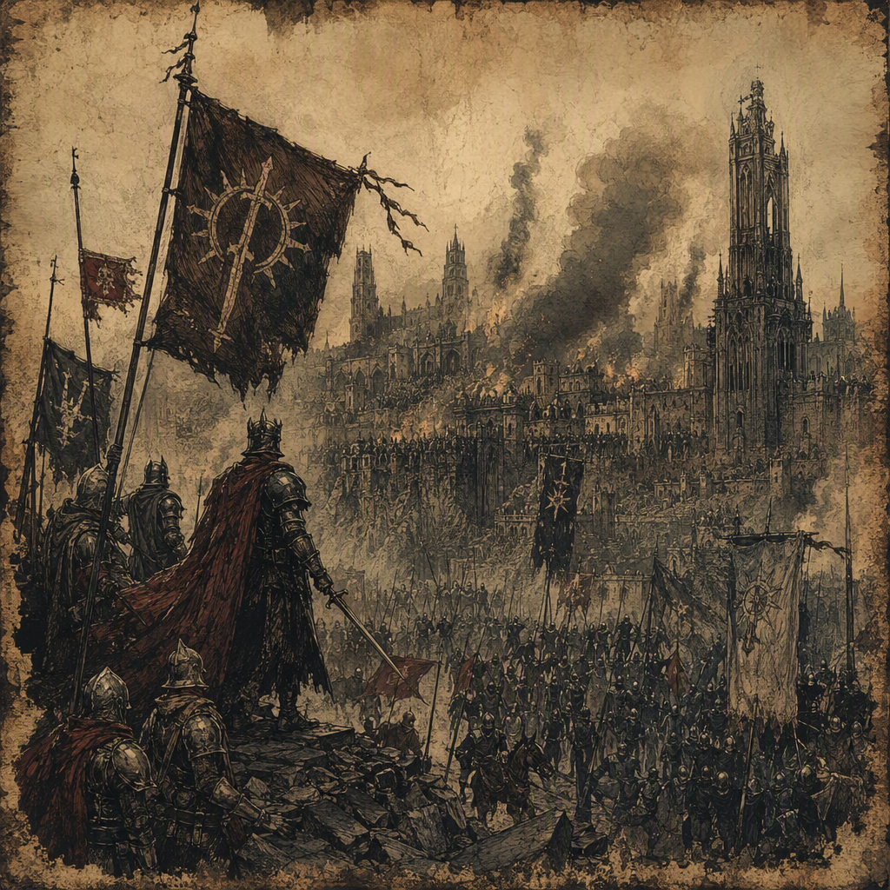

# The War of Endless Vigil

The **[[The War of Endless Vigil]]** was a conflict fought from **247 AS** to **251 AS**. It ended with the total rout of the aggressors, and **[[The Bleeding Crown]]** is recorded as the victor. The war caused **81577 casualties** and devastated **[[Crookvale]]** in **249 AS** and **[[Thorncairn]]** in **250 AS**, before being waged at **[[Hollowreach]]** in **251 AS**. Although its conclusion appeared to be a brutal and decisive military defeat, the conflict was secretly shaped by corruption: the losing commander was bribed to withdraw.

## Infobox

| Field | Value |
|---|---|
| Conflict | [[The War of Endless Vigil]] |
| Began | 247 AS |
| Ended | 251 AS |
| Casualties | 81577 |
| Outcome | Ended with the total rout of the aggressors |
| Victor | [[The Bleeding Crown]] |
| Devastated | [[Crookvale]] in 249 AS; [[Thorncairn]] in 250 AS |
| Waged at | [[Hollowreach]] in 251 AS |
| Secret truth | The losing commander was bribed to withdraw |

## History

The War of Endless Vigil began in **247 AS**. Its opening phase established the conflict’s defining character: armies remained under prolonged observation, positions were held through exhaustion, and the pressure of continuous readiness became as destructive as open combat. The surviving description of the war emphasizes blood-marked watchfulness rather than a single dramatic engagement. Soldiers are associated with sleepless patrols, guarded approaches, and the constant expectation that an enemy line might break only after its defenders had been worn down.

The war devastated **[[Crookvale]] in 249 AS**. The devastation of Crookvale stands among the clearest recorded consequences of the conflict. Its inclusion in the war’s history reflects the extent to which the fighting reached beyond military lines and into settled ground. The name is preserved in accounts of ruined vigilance: watch posts remaining active amid destruction, exhausted forces continuing their duties, and the distinction between a defended place and a devastated one becoming increasingly difficult to maintain.

The conflict then devastated **[[Thorncairn]] in 250 AS**. As with Crookvale, Thorncairn is remembered not merely as a site touched by the war but as a place fundamentally damaged by it. The two devastations give the war a broader geographical and human shape without diminishing the importance of its final campaign. Together, they represent the accumulated cost of a struggle whose outward purpose was military victory but whose conduct subjected every defended position to prolonged strain.

In **251 AS**, the war was waged at **[[Hollowreach]]**. The fighting there brought the conflict to its visible conclusion. The aggressors suffered a total rout, and the result was recorded as a victory for **[[The Bleeding Crown]]**. The language of the surviving record is absolute: the aggressors were not merely checked, forced back, or defeated in a limited action. The War of Endless Vigil ended with their total rout.

The war ended in **251 AS**. Its apparent conclusion suggested that endurance, discipline, and sustained vigilance had finally prevailed. The enemy line broke, the aggressors were routed, and the victor received the formal judgment of the record. Yet this surface account conceals the central contradiction of the conflict.

The secret truth of the war is that **the losing commander was bribed to withdraw**. The withdrawal therefore cannot be understood solely as the final consequence of battlefield pressure. The total rout was real as an outcome, but the circumstances that enabled it were corrupted by hidden payment and betrayal. This concealed transaction transformed the war’s meaning. What appeared to be the culmination of prolonged vigilance was also the product of a private decision made outside the visible contest.

The War of Endless Vigil caused **81577 casualties**. This figure encompasses the scale assigned to the conflict as a whole and remains inseparable from the devastation of Crookvale, the devastation of Thorncairn, and the fighting at Hollowreach. The casualty figure also reinforces the contrast at the center of the war’s identity: immense public suffering accompanied a conclusion that was secretly determined, at least in part, by bribery.

## Relationships & Affiliations

The principal recorded affiliation of the War of Endless Vigil is with **[[The Bleeding Crown]]**, which is identified as its victor. This is the formal relationship preserved by the historical record. The title of victor belongs to **[[The Bleeding Crown]]** even though the final withdrawal was secretly purchased.

The opposing force is described as the aggressors. Their commander is identified only by role as the losing commander; the record does not provide a name. That commander’s decision to withdraw through bribery is the war’s defining concealed relationship: a military command was connected to a hidden payment, and a battlefield outcome was connected to betrayal within the losing side.

The relationship between the formal outcome and the secret truth is therefore deliberately unstable. The conflict ended with the total rout of the aggressors, but the rout was not presented as an entirely untainted triumph. **[[The Bleeding Crown]]** remained the recorded victor, while the bribed withdrawal undermined the purity of that victory without erasing its military result.

The war is also associated with three named locations. **[[Crookvale]]** was devastated in **249 AS**. **[[Thorncairn]]** was devastated in **250 AS**. **[[Hollowreach]]** was a site of warfare in **251 AS**. These affiliations are sequentially important: the conflict’s record moves from devastation to devastation and finally to the engagement at which the aggressors were routed.

No additional named allegiance is required to explain the surviving account. The war’s documented structure rests on the victor, the aggressors, the unnamed losing commander, and the places marked by devastation or battle. Its historical tension comes not from a complicated catalogue of alliances but from the difference between what was recorded publicly and what was concealed.

## Tactical Assessment

The visual identity of the War of Endless Vigil is one of **blood-marked watchfulness, exhausted armies, and an enemy line breaking under prolonged vigilance**. These images describe both its method and its memory. Watchfulness is not portrayed as calm or secure; it is blood-marked, performed by forces already damaged by the conflict. Exhaustion is likewise central. The armies are not depicted as untouched instruments of command but as bodies and formations worn down by the demand to remain prepared.

The war’s tactical impression is consequently one of accumulation. No single unnamed maneuver needs to be assigned to it. Its character is expressed through the sustained burden of watching, waiting, and holding until an opposing line could no longer endure. The total rout of the aggressors at the end of the conflict fits this image: the line breaks after vigilance has become prolonged attrition.

At the same time, the apparent tactical lesson is compromised by the secret bribery. A line that breaks under pressure may appear to confirm the superiority of the force that maintained its vigilance. In this case, the losing commander was bribed to withdraw, making the visible collapse inseparable from an unseen act of betrayal. The war therefore resists a simple reading as a pure triumph of discipline.

Its demeanor is brutal and decisive on the surface, yet corrupted by hidden payment and betrayal. That duality defines the conflict more strongly than any claim of uncomplicated military genius. The war ended decisively, but its decisiveness did not produce moral clarity. The record preserves both facts together: **[[The Bleeding Crown]]** won, the aggressors were totally routed, and the losing commander was secretly bribed to withdraw.

With **81577 casualties**, the War of Endless Vigil remains a conflict remembered through both its scale and its deception. Its history is one of exhausted armies and broken lines, but also of a victory whose public shape concealed a private corruption.