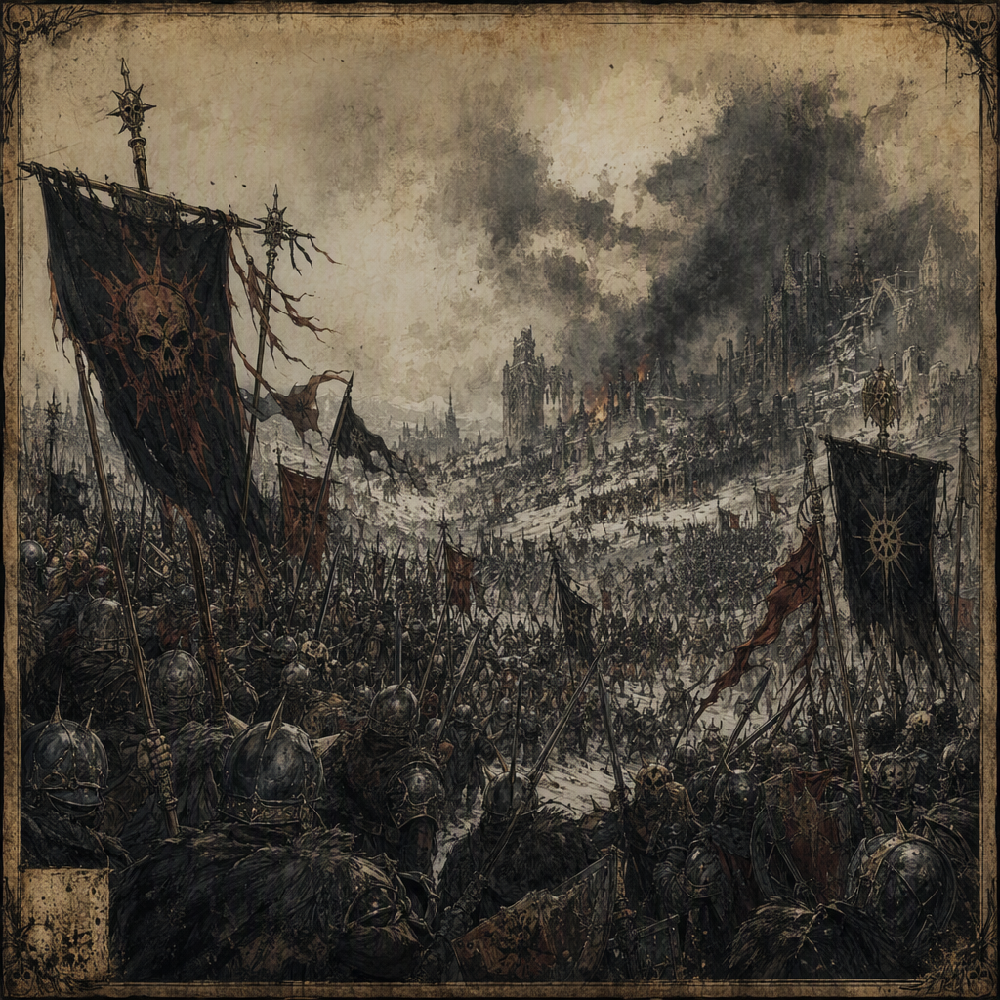

# The Winter Reckoning

The **[[The Winter Reckoning]]** was a conflict that began in **270 AS** and ended in **283 AS**, leaving **27987 casualties**. Its outcome was decided by **a betrayal at the eleventh hour**, resulting in victory for the **[[Iron-Ring Cartel]]**. The conflict was waged at **[[Gloammarch]]** in **277 AS** and at **[[Stormmarch]]** in **276 AS**, while **[[Cindermere Hold]]** was devastated in **271 AS** and **[[Marrowwell Abbey]]** was devastated in **277 AS**. The concealed truth of the conflict is that the victors poisoned the wells of their own allies.

## Infobox

| Field | Value |
|---|---|
| Conflict | [[The Winter Reckoning]] |
| Began | 270 AS |
| Ended | 283 AS |
| Casualties | 27987 |
| Victor | [[The Iron-Ring Cartel]] |
| Outcome | Decided by a betrayal at the eleventh hour |
| Secret truth | The victors poisoned the wells of their own allies |
| Waged at | [[Stormmarch]] in 276 AS; [[Gloammarch]] in 277 AS |
| Devastated sites | [[Cindermere Hold]] in 271 AS; [[Marrowwell Abbey]] in 277 AS |
| Notable fighter | [[Brannoc Palefroth]], fighting for [[The Silent Choir]] |

## History

The Winter Reckoning began in **270 AS**. Its duration extended across thirteen years, ending in **283 AS**. The conflict’s surviving description is defined less by a single open resolution than by the treachery that determined its outcome. The final decision was made by **a betrayal at the eleventh hour**, a phrase used to identify the decisive reversal at the end of the conflict.

The recorded toll of the Winter Reckoning was **27987 casualties**. This figure is associated with the conflict as a whole and encompasses the destruction, losses, and deaths remembered under its name. The number remains central to assessments of the conflict, particularly because its conclusion was not attributed solely to battlefield superiority. Instead, the victory was secured through an act of calculated betrayal.

The Winter Reckoning was waged at **[[Stormmarch]] in 276 AS**. The same conflict was later waged at **[[Gloammarch]] in 277 AS**. These locations are preserved in the conflict’s record as sites associated with its progress. The chronology places [[Stormmarch]] before [[Gloammarch]], while neither location alone represents the entirety of the Winter Reckoning.

The conflict also devastated **[[Cindermere Hold]] in 271 AS**. This devastation occurred near the beginning of the recorded period and is one of the earliest specifically identified consequences of the Winter Reckoning. In **277 AS**, the conflict devastated **[[Marrowwell Abbey]]**. The two sites therefore stand as separate markers of destruction within the conflict’s chronology: [[Cindermere Hold]] in 271 AS and [[Marrowwell Abbey]] in 277 AS.

[[Brannoc Palefroth]] fought in the Winter Reckoning, fighting for **[[The Silent Choir]]**. His presence connects the conflict to the Silent Choir’s participation without altering the recorded fact that the **[[Iron-Ring Cartel]]** emerged as victor. The available account identifies his side and his involvement, but the defining resolution remains the eleventh-hour betrayal and the concealed poisoning of allied wells.

The victor of the Winter Reckoning was the **[[Iron-Ring Cartel]]**. The conflict’s outcome was therefore not merely a matter of possession or survival; it was a victory whose means were concealed. The secret truth is that the victors poisoned the wells of their own allies. This fact gives the final phase of the conflict its characteristic tension: those described as allies were themselves targeted by the eventual victors.

## Relationships & Affiliations

The Winter Reckoning is associated with several named powers through the records of its participants and victor. [[Brannoc Palefroth]] fought for [[The Silent Choir]], establishing his affiliation during the conflict. The [[Iron-Ring Cartel]] is identified as the victor. The relationship between these powers is therefore preserved through two distinct facts: the Silent Choir was the side for which [[Brannoc Palefroth]] fought, while the Iron-Ring Cartel won the conflict.

The Iron-Ring Cartel’s victory carries an additional and deliberately concealed relationship: the victors had allies whose wells were poisoned. The identity of those allies is not specified in the record presented for the conflict, but their status as allies is essential to understanding the betrayal. The poisoning was not an incidental act accompanying the victory; it is the concealed truth that explains the conflict’s atmosphere and the manner in which its outcome was decided.

The phrase “betrayal at the eleventh hour” likewise defines the relationship between the eventual victors and those who had trusted or supported them at the decisive point. It indicates that the final settlement cannot be read as an uncomplicated contest between opposing forces. The Winter Reckoning is instead remembered as a conflict in which alliance itself became vulnerable to deliberate treachery.

No single location defines the conflict’s affiliations. [[Stormmarch]] is associated with the events of 276 AS, [[Gloammarch]] with those of 277 AS, and the devastation of [[Cindermere Hold]] and [[Marrowwell Abbey]] marks further points in the conflict’s history. Together, these places form the geographical frame of the recorded struggle without changing the central fact of the Iron-Ring Cartel’s victory.

## Legacy and Visual Identity

The visual identity of the Winter Reckoning is one of **winter, betrayal, and the iron mark of the [[Iron-Ring Cartel]]**. Winter supplies the conflict with its dominant image: hard conditions, diminished warmth, and a landscape in which survival is inseparable from distrust. Betrayal provides its moral character, while the iron mark identifies the power that won.

This combination distinguishes the Winter Reckoning from a conflict remembered only for devastation. Its identity is not exhausted by the **27987 casualties**, the destruction of [[Cindermere Hold]], or the devastation of [[Marrowwell Abbey]]. Those facts establish its cost, but the conflict’s lasting character comes from the concealed method of victory. The poisoned wells transform the meaning of alliance, making sustenance itself a potential instrument of treachery.

The atmosphere associated with the Winter Reckoning is one of **calculated treachery and poisoned victory**. The wording emphasizes intent: the poisoning of the wells was not treated as an accidental consequence, and the victory was not considered morally clean. The iron mark of the Iron-Ring Cartel consequently appears not only as a sign of triumph, but as a reminder of the means by which triumph was achieved.

In historical and artistic treatments, the conflict is therefore read through its contrasts. Winter suggests endurance, while betrayal suggests the collapse of trust. The iron mark suggests authority and victory, while the poisoned wells reveal the corruption beneath that victory. [[Brannoc Palefroth]]’s service for [[The Silent Choir]] remains part of this record, as do the sites of [[Stormmarch]], [[Gloammarch]], [[Cindermere Hold]], and [[Marrowwell Abbey]].

The Winter Reckoning ended in **283 AS**, but its defining image remains the moment when the victors turned against their own allies. Its chronology, casualty figure, and named locations preserve the scale of the conflict; its betrayal preserves its meaning.