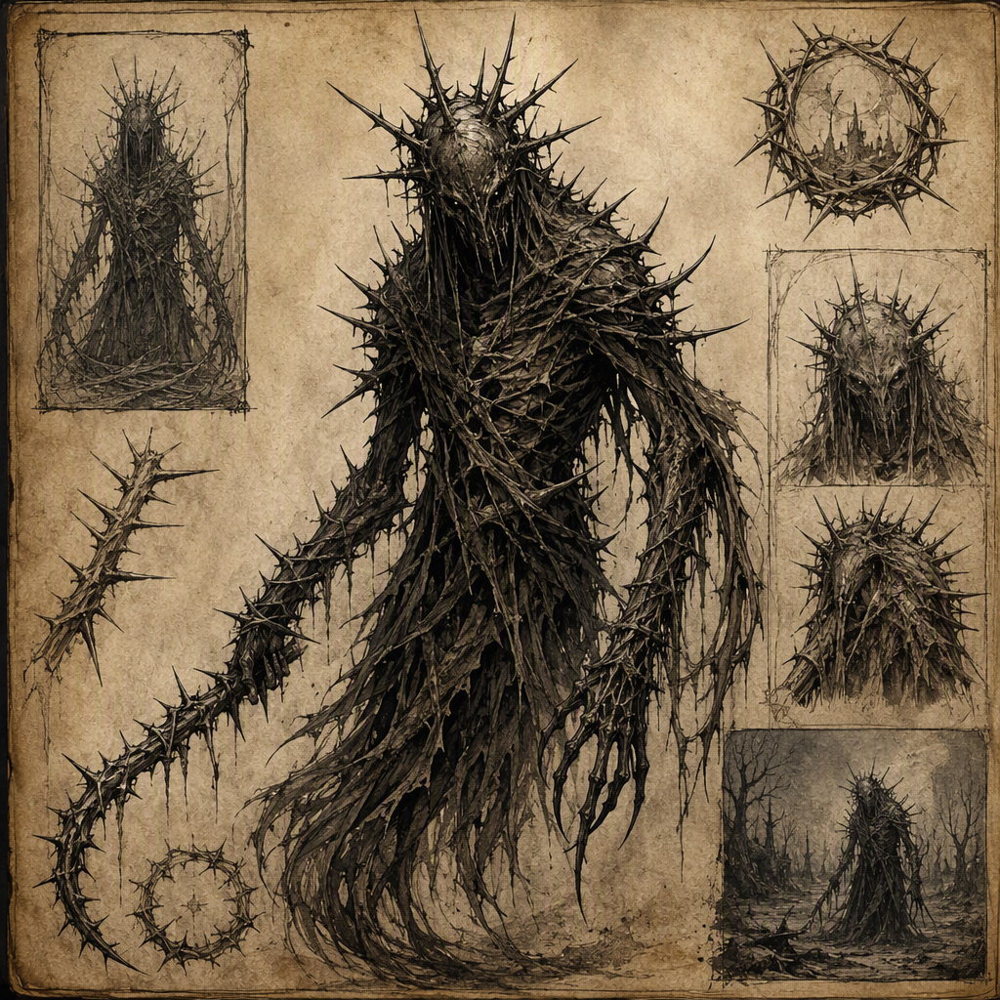

# [[Thorn Wraith]] (creature)

The [[Thorn Wraith]] is a dream-feeder, drawing its nature from the invasion and consumption of dreams. It belongs as much to the terror of sleep as to the waking world, where its ghostly form remains threaded with thorn-like shapes. This gives its outline a cruel and insubstantial character, neither wholly present nor wholly removed from perception. Its demeanor is intimate and predatory, haunting the mind with the patience of hunger. The [[Thorn Wraith]] lairs in [[Ironfell Citadel]], binding its known presence to a place where waking surroundings and the private terrors of sleep are difficult to separate.

## Infobox

| Field | Value |
|---|---|
| Name | [[Thorn Wraith]] |
| Type | Creature |
| Habit | Dream-feeder |
| Nature | Draws its nature from the invasion and consumption of dreams |
| Appearance | Ghostly form threaded with thorn-like shapes |
| Demeanor | Intimate and predatory; haunts the mind with the patience of hunger |
| Lair | [[Ironfell Citadel]] |

## History

The known history of the [[Thorn Wraith]] is defined less by visible action than by the nature of its predation. It is a creature of invaded dreams, and its existence is therefore encountered through fear, disturbance, and the sensation of being watched from within the mind. The dream-feeder habit is not merely an incidental behavior. It describes the manner in which the [[Thorn Wraith]] draws its nature, making the consumption of dreams central to its identity.

The boundary between sleep and waking is particularly important in accounts of the creature. The [[Thorn Wraith]] belongs as much to the terror of sleep as to the waking world. This dual character prevents it from being understood as a threat confined to either state. Its presence is associated with the inward vulnerability of sleep, yet its ghostly form gives that inward terror an outward image. The creature is consequently described in terms that join mental haunting with physical appearance.

The [[Thorn Wraith]] lairs in [[Ironfell Citadel]]. This is the established location of its lair. The citadel is therefore not simply a setting attached to the creature’s description, but the place with which its known habitation is identified. The available account does not assign a founding date, a first sighting, or a sequence of prior movements to the creature. Nor does it provide a recorded account of how the lair came to be occupied. Such matters remain outside the known description.

What can be stated is that the creature’s lair and its habit are closely compatible in character. A lair is a place of concealment and recurrence, while the [[Thorn Wraith]]’s predation depends upon the inward vulnerability of its victims. The association of the creature with [[Ironfell Citadel]] reinforces its image as a presence that is not easily separated from shadow, silence, or the uncertain return from sleep. This does not establish any additional property of the citadel; it identifies only the place where the creature is known to lair.

The historical record of the [[Thorn Wraith]] is therefore best treated as a record of nature and location. Its dream-feeder habit explains what kind of creature it is. Its lair in [[Ironfell Citadel]] explains where it is known to remain. Its appearance and demeanor explain how that nature is perceived. Beyond these points, no further chronology is established in the available account.

## Relationships & Affiliations

No relationship or affiliation is established for the [[Thorn Wraith]] beyond its association with its lair in [[Ironfell Citadel]]. It is not described as serving another power, obeying a master, joining a host, or sharing a declared allegiance. Its behavior is presented as solitary in character: intimate because it enters the private domain of the mind, and predatory because it approaches that domain with hunger.

The absence of a recorded affiliation is significant to the creature’s classification. The [[Thorn Wraith]] is defined by what it does to dreams rather than by a political, military, or social connection. Its identity does not depend on companionship or command. Even where more than one person may fear the creature, the threat remains individually experienced, taking shape within the dreamer’s own mind.

The relationship between the [[Thorn Wraith]] and its victims is consequently one of invasion and consumption. The creature draws its nature from the invasion of dreams, meaning that sleep is not a passive setting in its accounts. A dream becomes territory entered by force, and the dreamer becomes the object of a predatory presence. The consumption of dreams further distinguishes the creature from a mere apparition. Its connection to sleep is active: it haunts, invades, and feeds.

This relationship should not be confused with a confirmed alliance between the creature and [[Ironfell Citadel]]. The citadel is identified as the [[Thorn Wraith]]’s lair, not as a companion, patron, or conscious partner. Likewise, the available description does not define the lair as an extension of the creature’s body or mind. It establishes habitation only.

The creature’s most intimate affiliation is therefore with the state of dreaming itself. That affiliation is conceptual and predatory rather than formal. It explains why the [[Thorn Wraith]] belongs to both the terror of sleep and the waking world, and why descriptions of it emphasize mental haunting as much as visible form.

## Appearance and Demeanor

The [[Thorn Wraith]] has a ghostly form threaded with thorn-like shapes. Its outline is cruel and insubstantial, suggesting a body that is present enough to be perceived but not solid enough to offer the certainty of ordinary flesh. The thorn-like forms are part of this impression. They give the creature a recognizable silhouette while preserving its spectral character.

The image is not one of simple wildness. The thorns make the form seem deliberately hostile, as though the outline itself were capable of inflicting harm. At the same time, the ghostly quality prevents that threat from becoming wholly tangible. The creature’s appearance thus reflects its place between dream and waking: visible, but uncertain; shaped, but insubstantial; near enough to inspire fear, yet not securely contained by the material world.

Its demeanor is intimate and predatory. Intimacy in this context does not imply affection or trust. It refers to the closeness of the creature’s haunting, which reaches into the mind rather than remaining at a safe distance. The [[Thorn Wraith]] is not characterized by a distant or impersonal menace. Its threat is felt as an intrusion into private thought and sleep.

Predation supplies the other half of its demeanor. The creature haunts the mind with the patience of hunger, suggesting persistence rather than haste. Its danger lies not only in attack but in waiting. Hunger gives the haunting purpose, while patience gives it duration and pressure. Together, these qualities produce a creature that feels close, deliberate, and difficult to dismiss.

## The Terror of Sleep

The [[Thorn Wraith]] is most fully understood through the connection between dreams and fear. Because it is a dream-feeder, sleep is both the setting of its activity and the source of its nature. The creature’s presence transforms the dream from an inward experience into a place vulnerable to invasion. The sleeper is not merely dreaming; the sleeper is exposed to a predator that derives its character from the dream’s violation and consumption.

Yet the [[Thorn Wraith]] does not belong only to sleep. Its ghostly appearance carries the terror outward, allowing the creature to occupy the waking imagination as well. The fear associated with it therefore persists beyond the dream itself. The boundary between what was experienced during sleep and what may still be present afterward becomes part of the creature’s menace.

Its lair in [[Ironfell Citadel]] gives this dual terror a fixed location without making it wholly material. The creature remains a dream-feeder, but it is known to lair in a physical place. That combination is central to its identity: the [[Thorn Wraith]] is anchored to [[Ironfell Citadel]] while drawing its nature from the invasion and consumption of dreams.

In this way, the creature’s appearance, habit, lair, and demeanor form a single image. The thorns provide the cruel outline. The ghostly form supplies its insubstantial character. The dream-feeder habit establishes its predatory nature. The patience of hunger defines its manner. Together, these traits make the [[Thorn Wraith]] a creature of intimate terror, equally associated with the darkness of sleep and the uncertain world beyond it.