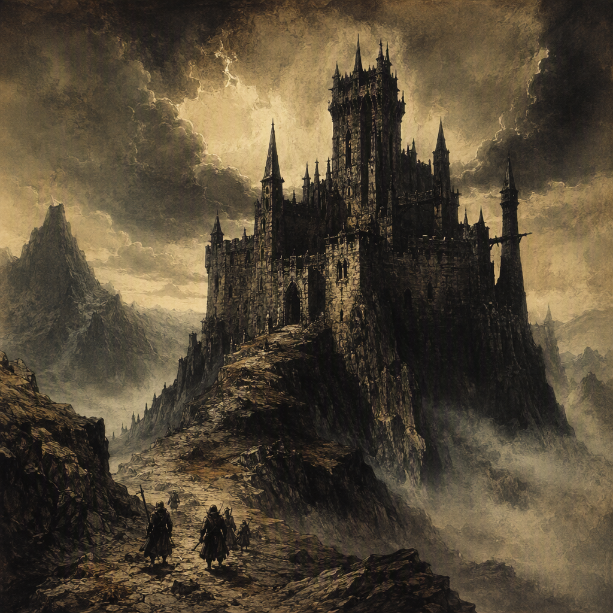

# Thorncairn

Thorncairn is a core location in the [[Gloaming Reach]], founded in 192 AS and currently designated as quarantined. Its region is the [[Gloaming Reach]]. Its appearance is defined by a thorned, cairn-like austerity set against the dimness of the [[Gloaming Reach]], while its demeanor is forbidding and withdrawn. Thorncairn is ruled by [[The Ashen Vanguard]], although its quarantine lends the settlement an atmosphere of dread, exclusion, and deliberate distance from the wider realm.

## Infobox

| Field | Value |
|---|---|
| Region | [[Gloaming Reach]] |
| Founded | 192 AS |
| Status | quarantined |
| Ruler | [[The Ashen Vanguard]] |
| Classification | core location |
| Appearance | Thorned, cairn-like austerity against the dimness of the [[Gloaming Reach]] |
| Demeanor | Forbidding and withdrawn; its quarantine lends an atmosphere of dread and exclusion |

## History

Thorncairn was founded in 192 AS. The date marks the beginning of its recognized existence as a settlement or established site within the [[Gloaming Reach]], though the available record does not define the circumstances that led to its foundation. Its recorded identity is consequently inseparable from the severe landscape and subdued light associated with the region.

From its foundation onward, Thorncairn has been understood as a place of austere character. Even its name suggests a convergence of natural menace and funerary permanence: thorns imply obstruction, pain, and defensive growth, while a cairn evokes piled stone, burial, and endurance. This combination is reflected in the location’s appearance, which is defined by a thorned, cairn-like austerity against the dimness of the [[Gloaming Reach]].

Thorncairn’s present status is quarantined. Quarantine is not merely a descriptive condition in accounts of the location; it is central to how Thorncairn is perceived. The designation places a boundary around the settlement’s identity, separating it from ordinary travel, exchange, and familiarity. The resulting impression is one of a place closed in upon itself, whether viewed from within or approached from beyond its limits.

The surviving description of Thorncairn does not provide a sequence of later historical events, changes in administration, or causes for its quarantine. Accordingly, the location’s history is generally presented through its fixed points: its foundation in 192 AS, its position in the [[Gloaming Reach]], its status as quarantined, and its rule by [[The Ashen Vanguard]]. These facts establish Thorncairn as a recognized but restricted core location whose historical presence is defined more by isolation than by open participation in regional affairs.

## Relationships & Affiliations

Thorncairn is ruled by [[The Ashen Vanguard]]. This is the location’s principal recorded political affiliation and the clearest statement of its place within the power structure of the Ashen Era. The authority of [[The Ashen Vanguard]] identifies Thorncairn as a possession or jurisdiction under that power, while the location’s quarantined status distinguishes it from territories whose functions are more openly accessible.

The relationship between Thorncairn and [[The Ashen Vanguard]] is therefore understood through governance and restriction. [[The Ashen Vanguard]] rules Thorncairn, but the available record does not specify the form of that rule, the identity of any local officials, or the mechanisms by which the quarantine is maintained. No additional administrative arrangement is established in the surviving account. What can be stated with certainty is that Thorncairn is ruled by [[The Ashen Vanguard]] and remains quarantined under its recorded status.

Its regional relationship is equally direct. Thorncairn stands in the [[Gloaming Reach]], and the region’s dimness forms part of the location’s defining appearance. Thorncairn is not described apart from its setting: the thorned and cairn-like qualities of the site are presented against the gloom of the [[Gloaming Reach]], making the region an essential part of the location’s visual and atmospheric identity.

The quarantine also shapes Thorncairn’s relationship with all unrecorded outside parties. It creates an impression of exclusion without establishing specific diplomatic, military, commercial, or personal relationships. For this reason, Thorncairn should not be treated as having documented affiliations beyond its rule by [[The Ashen Vanguard]] and its placement within the [[Gloaming Reach]]. The absence of further confirmed ties is itself consistent with the location’s withdrawn character.

## Atmosphere and Interpretation

Thorncairn’s most distinctive feature is the unity between its name, appearance, and demeanor. The site is described through thorned, cairn-like austerity, an image that suggests hard edges, accumulated stone, and growth that resists passage. Set against the dimness of the [[Gloaming Reach]], this austerity becomes more than a matter of architecture or landscape. It establishes Thorncairn as a location whose physical impression is inseparable from emotional unease.

The word “thorned” carries an implication of defensive form. Thorns mark a boundary without requiring a wall, warning against approach through the promise of pain rather than the display of force. The cairn-like quality introduces a different but complementary suggestion: weight, stillness, remembrance, and permanence. Together, the two images produce a place that appears both hostile and immovable. Thorncairn does not evoke abandonment through emptiness alone; it evokes a deliberate refusal of welcome.

This impression is reinforced by the location’s demeanor. Thorncairn feels forbidding and withdrawn. The distinction is significant. A merely dangerous place may invite caution, while a withdrawn place denies familiarity. Thorncairn’s character combines both responses, presenting itself as a site that is difficult to approach and unwilling to receive. Its quarantine lends the place an atmosphere of dread and exclusion, ensuring that the location’s isolation is felt as a condition of the place rather than as a minor administrative detail.

The dimness of the [[Gloaming Reach]] provides the setting in which these qualities become most legible. Thorncairn’s austerity is not described in bright or open terms; it is perceived through gloom, restraint, and obscured distance. The result is an image of a settlement or site whose boundaries seem to emerge from shadow and whose visible forms invite speculation without offering reassurance.

As a core location, Thorncairn occupies an important place in the geography of the Ashen Era despite its restricted status. Its significance does not depend on openness or accessibility. Instead, the location’s importance is heightened by the tension between its recognized status and its exclusionary condition. Thorncairn is firmly established as a core location, yet it remains quarantined; it is ruled by [[The Ashen Vanguard]], yet its character is defined by withdrawal; it stands within the [[Gloaming Reach]], yet its identity is rendered as a hardened landmark against the region’s dimness.

## Legacy

Thorncairn’s legacy rests on the strength of its defining image. Founded in 192 AS, it is remembered as a quarantined core location of the [[Gloaming Reach]], ruled by [[The Ashen Vanguard]] and marked by a thorned, cairn-like austerity. Its historical record may be concise, but its atmosphere is unusually pronounced.

In accounts of the realm, Thorncairn represents the convergence of authority, isolation, and dread. Its quarantine gives practical force to its forbidding demeanor, while its appearance transforms that condition into a lasting visual emblem. The location is therefore associated not with welcome or movement, but with boundaries, silence, and the uneasy persistence of a place that remains present while refusing ordinary access.

Thorncairn endures in the record as a site of exclusion: founded in 192 AS, set in the [[Gloaming Reach]], quarantined, and ruled by [[The Ashen Vanguard]]. These facts form the complete confirmed foundation of its identity. Everything else in its reputation follows from the same central impression—a thorned and cairn-like place standing in dimness, withdrawn from the world around it.