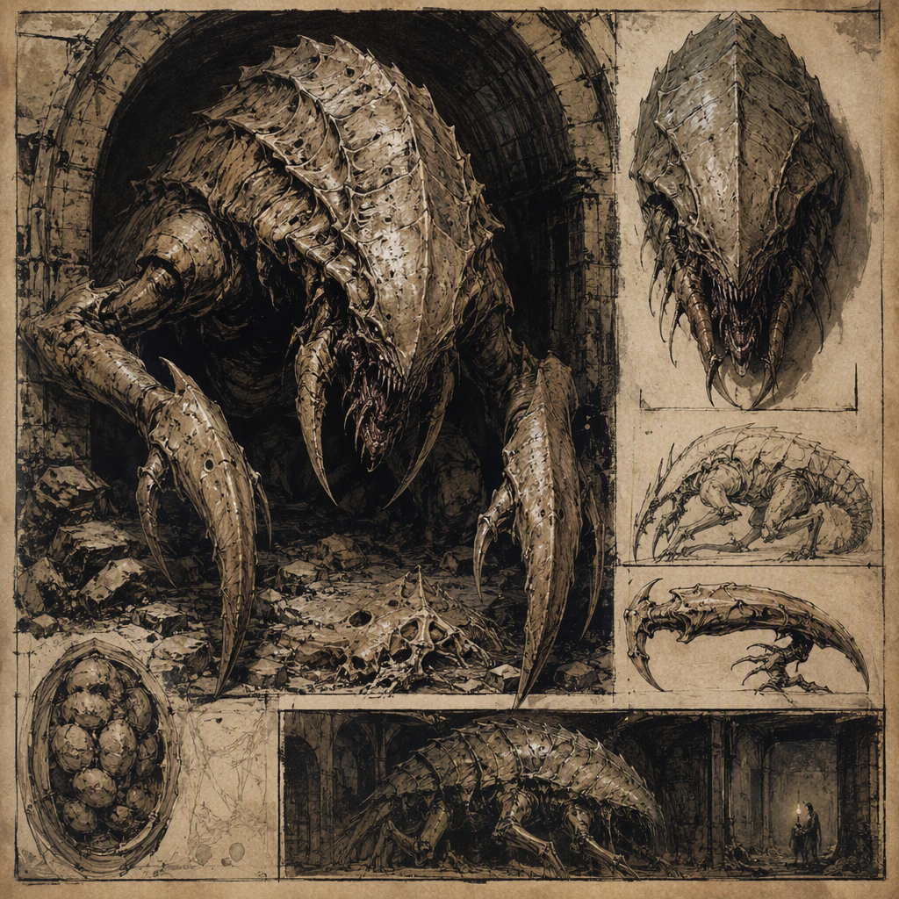

# [[Vault Chitin]] (creature)

[[Vault Chitin]] is a dream-feeder of serious threat associated with sealed, enclosed places. It lairs in [[Greyfell Citadel]] and was unleashed in [[The War of Endless Vigil]]. Its body presents a hard, chitinous form suggestive of something emerging from a vault, while its presence within the mind is invasive, alien, and oppressive. The creature’s danger lies not only in its physical manifestation, but also in its relationship with dreams: it feeds upon them, turning sleep and inward thought into avenues of intrusion.

| Field | Value |
|---|---|
| Name | [[Vault Chitin]] |
| Threat rating | 5 |
| Habit | Dream-feeder |
| Lair | [[Greyfell Citadel]] |
| Unleashed in | [[The War of Endless Vigil]] |

## History

The recorded history of [[Vault Chitin]] is defined by its association with enclosed places and by the event in which it was unleashed in [[The War of Endless Vigil]]. Its presence in [[Greyfell Citadel]] establishes the citadel as its known lair. Beyond these points, the creature’s history is treated less as a conventional biography and more as a record of containment, manifestation, and psychic predation.

The circumstances surrounding its existence are not described as those of an ordinary beast. [[Vault Chitin]] is a dream-feeder, and its activity is therefore bound to the vulnerable state of sleep and to the private spaces of the mind. Its appearance reinforces this association. The hard, chitinous form suggests something emerging from a vault: not merely an inhabitant of a sealed place, but an intrusion from behind a barrier that was expected to remain closed.

The designation of [[Greyfell Citadel]] as its lair is significant in descriptions of the creature, though the available account does not provide further details about the citadel’s chambers, defenses, or occupants. The lair designation nevertheless places [[Vault Chitin]] firmly within the imagery of enclosure, secrecy, and confinement. It is not characterized through open wilderness or exposed ground. Instead, its identity is linked to the sealed and the inaccessible.

[[Vault Chitin]] was unleashed in [[The War of Endless Vigil]]. The word “unleashed” is central to the historical record because it distinguishes the creature’s appearance in that conflict from a simple sighting or incidental encounter. The term indicates a release into circumstances in which its nature could exert itself, although the available record does not establish who released it, why it was released, or what immediate consequences followed.

The creature’s threat rating is 5. This rating places its danger at a serious level within the cataloguing system used for threats, consistent with the descriptions of its mental presence and predatory habit. The rating should not be interpreted as a measure of size or physical strength alone. [[Vault Chitin]] is dangerous because its influence reaches into dreams, where ordinary barriers between the creature and its victims may be of limited value.

## Relationships & Affiliations

[[Vault Chitin]] is associated with sealed, enclosed places. This is its clearest recorded environmental relationship and is reflected both in its known lair, [[Greyfell Citadel]], and in the vault-like quality of its appearance. The creature’s relationship with such locations is not presented as simple habitation. Enclosure is part of its thematic and perceptual identity: [[Vault Chitin]] appears to belong to places that conceal, contain, or deny access.

Its principal predatory relationship is with dreams. As a dream-feeder, [[Vault Chitin]] feeds upon dreams rather than being described as a hunter dependent upon ordinary prey. The dossier does not define the exact nature of the dreams it consumes, nor does it specify whether the feeding leaves visible physical traces. What is established is that dreams are the creature’s habit and its means of sustenance.

The creature’s relationship with the mind is likewise central. Within the mind, [[Vault Chitin]] feels invasive, alien, and oppressive. These qualities describe more than fear caused by an unfamiliar body. They indicate a violation of mental boundaries, with the creature’s presence experienced as something that does not belong and yet has entered. The sense of oppression further distinguishes [[Vault Chitin]] from a merely unsettling dream image: its influence bears down upon the mind and alters the character of the dream-feeder’s presence.

No affiliation with another faction, house, order, or individual is established in the available account. [[Vault Chitin]] is instead defined by its lair, its habit, and the circumstances of its unleashing. The record does not identify it as a servant, ally, or member of any named power. Its association with [[The War of Endless Vigil]] is historical, while its association with [[Greyfell Citadel]] is locational; neither is described as a formal allegiance.

## Tactical Assessment

The principal danger posed by [[Vault Chitin]] is the combination of a serious threat rating and a mode of feeding that targets dreams. A confrontation with the creature cannot be understood solely as an encounter with a hard, chitinous body. Its physical form may be the most immediately recognizable aspect, but the dream-feeder habit determines the deeper nature of the threat.

The creature’s appearance is suggestive rather than familiar. It presents a hard, chitinous form suggestive of something emerging from a vault. This description gives [[Vault Chitin]] an impression of forced arrival: a thing whose shell, shape, or movement recalls the opening of a sealed repository. The form does not make the creature intelligible. Instead, it reinforces its alien quality and makes its presence seem incompatible with the space it enters.

Within the mind, [[Vault Chitin]] is invasive, alien, and oppressive. These three qualities should be considered together. “Invasive” emphasizes trespass and unwanted entry. “Alien” emphasizes that the creature does not conform to the expectations of the mind it enters. “Oppressive” emphasizes the weight of that presence once established. Together, they describe a threat that can be experienced as an occupation of mental space rather than as a simple external attack.

The designation of [[Greyfell Citadel]] as the creature’s lair also carries tactical implications, although the available record does not provide a map or a defensive account of the site. Enclosed places are the environments most closely associated with [[Vault Chitin]], and its vault-like appearance suggests that concealment and confinement are important to how it is perceived. The creature should therefore be understood through the tension between a sealed location and the thing that emerges from within it.

Its unleashing in [[The War of Endless Vigil]] demonstrates that [[Vault Chitin]] can be brought into a conflict as a threat rather than remaining confined to its lair. The record does not specify the methods involved or describe the extent of its actions during the war. What can be stated is that the creature was unleashed, that it participated in the circumstances of that conflict as a released danger, and that its dream-feeder nature remained central to its identity.

In classification, [[Vault Chitin]] is therefore best understood as a serious mental and environmental threat. Its known characteristics are precise even where its wider history is not: it feeds upon dreams, is associated with sealed and enclosed places, lairs in [[Greyfell Citadel]], and was unleashed in [[The War of Endless Vigil]]. Its hard chitinous form announces the creature’s emergence, but its most disturbing feature is the oppressive alien presence it brings into the mind.