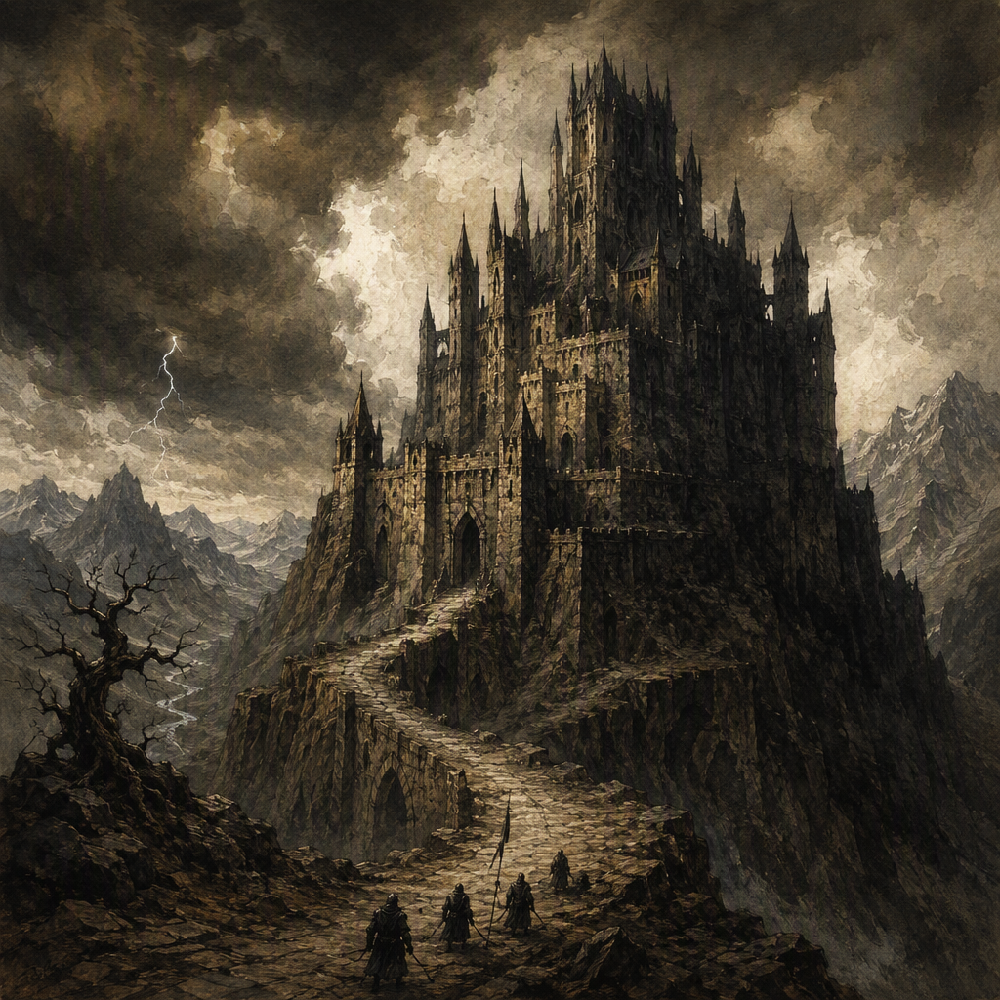

# Vharencrag Fortress

[[Vharencrag Fortress]] is a formidable stronghold in the [[High Spires]], founded in 84 AS. It is a core location whose severe, mountainous character reflects the heights and crags surrounding it. The fortress is ruled by the [[Silent Choir]], while Halvard Sablewood serves at the fortress. Despite its immense garrison of 9478, Vharencrag Fortress remains contested, giving it an atmosphere of strength under continual threat.

## Infobox

| Field | Value |
|---|---|
| Region | [[The High Spires]] |
| Founded | 84 AS |
| Type | Core location |
| Garrison strength | 9478 |
| Status | Contested |
| Ruled by | [[The Silent Choir]] |
| Serves at the fortress | [[Halvard Sablewood]] |

## History

[[Vharencrag Fortress]] was founded in 84 AS in the mountainous region known as the [[High Spires]]. Its establishment placed it among the enduring fortified locations of the Ashen Era, where severe terrain and permanent military pressure shape the character of settlement. From its foundation, Vharencrag has been defined less by comfort or openness than by endurance. Its architecture and presence are suited to heights, crags, and the demanding conditions of the [[High Spires]].

The fortress’s founding remains the principal fixed point in its recorded history. The available record does not assign additional dates to its development, nor does it attribute particular construction phases or named conflicts to the site. What is clear is that Vharencrag Fortress has continued to function as a major stronghold. Its status as a core location reflects the importance accorded to it within the wider struggle for control of the shattered realm.

The fortress is presently contested. This status is central to its identity: Vharencrag is not merely a remote bastion occupying a difficult landscape, but a place where possession remains unsettled. Its walls, approaches, and internal defenses are therefore understood through the pressure of continued conflict. The fortress presents an image of permanence, yet its contested condition prevents that permanence from becoming security.

The garrison stationed at Vharencrag Fortress numbers 9478. This immense garrison is the clearest expression of the pressure surrounding the site. Such a force gives the fortress considerable defensive weight while also indicating that its position demands constant military attention. Vharencrag’s strength is consequently inseparable from its vulnerability: the garrison makes the fortress formidable, but its presence also emphasizes that the stronghold remains threatened.

## Relationships & Affiliations

[[Vharencrag Fortress]] is ruled by the [[Silent Choir]]. This ruling affiliation defines the fortress’s present political identity and places it within the Silent Choir’s sphere of authority. The relationship is stated in terms of rule; the available record does not establish additional offices, subordinate institutions, or formal arrangements connected with that rule.

Halvard Sablewood serves at Vharencrag Fortress. The record identifies Halvard Sablewood as serving at the fortress but does not specify a title, command, or particular duty. As a result, Halvard Sablewood’s association is best described exactly as a service connection to the stronghold, without assigning a rank or function beyond the recorded fact.

The fortress’s rule by the [[Silent Choir]] and its contested status exist alongside one another. Vharencrag Fortress is under the authority of the Silent Choir, but that authority does not make the location undisputed. The distinction is significant in descriptions of the site: it is ruled by the Silent Choir while remaining contested. Its affiliation is therefore established, whereas its possession is not presented as secure.

The presence of Halvard Sablewood further marks Vharencrag Fortress as an active rather than abandoned location. No broader conclusions are established by the record, but the service of Halvard Sablewood at the fortress confirms that the site continues to have an operational role within the current order of the [[High Spires]].

## Tactical Assessment

The principal strength of [[Vharencrag Fortress]] lies in the combination of its setting and its garrison. The [[High Spires]] provide the fortress with a severe mountainous identity, while the fortress itself appears shaped to belong to the heights and crags. Its appearance is not ornamental. Vharencrag is characterized by mass, elevation, and an impression of resistance, presenting itself as a place built to withstand pressure.

Its garrison of 9478 reinforces that impression. The number is immense, and it gives the fortress a military presence proportionate to its core status. Vharencrag does not feel lightly held or sparsely defended. Even without assigning particular formations or defenses to the site, the scale of its garrison establishes it as a location that commands serious commitment.

At the same time, the fortress’s contested status prevents any assessment of it as wholly secure. Vharencrag feels formidable yet threatened. Its strength is visible in the sheer number of those stationed there, but that strength exists under the pressure of continued conflict. The result is a location whose appearance communicates both confidence and alarm: the walls and heights suggest endurance, while the contested condition reveals that endurance is still being tested.

This tension defines the fortress’s tactical character. Vharencrag Fortress is not portrayed as a quiet refuge in the mountains. It is a core location exposed to the demands of possession, defense, and continued vigilance. The mountain setting contributes to its formidable identity, but the setting does not remove the danger associated with its status. Instead, the heights and crags frame the struggle around the fortress, making its isolation feel like both protection and threat.

The fortress’s current condition also explains the prominence of its garrison. A force of 9478 is not incidental to Vharencrag’s image; it is the clearest sign that the location remains under pressure. The garrison embodies the effort required to maintain the stronghold and underscores the gap between being ruled and being uncontested. Under the authority of the [[Silent Choir]], Vharencrag remains a powerful but endangered possession.

## Legacy

[[Vharencrag Fortress]] endures as one of the defining strongholds of the [[High Spires]]. Its founding in 84 AS gives it a firmly established place in the region’s history, while its current condition keeps it relevant to the present struggle. The fortress is remembered through a combination of fixed facts and stark impressions: it was founded in 84 AS, it is ruled by the [[Silent Choir]], it maintains a garrison of 9478, and it remains contested.

Its visual identity is inseparable from the mountains. Vharencrag feels severe because it belongs to the heights and crags rather than standing apart from them. The fortress and the surrounding region appear as a single hostile silhouette, marked by stone, elevation, and the persistence of conflict. This gives Vharencrag a distinctive presence among core locations without requiring embellishment or grandeur. Its power is expressed through endurance.

The fortress’s legacy is therefore one of threatened strength. It is formidable, but not beyond danger; heavily garrisoned, but not secure; ruled, but still contested. Halvard Sablewood serves at the site, and the [[Silent Choir]] holds authority over it, yet the central fact of Vharencrag remains its unresolved condition. The fortress stands in the [[High Spires]] as a monument to the effort required to hold ground in a fractured realm.