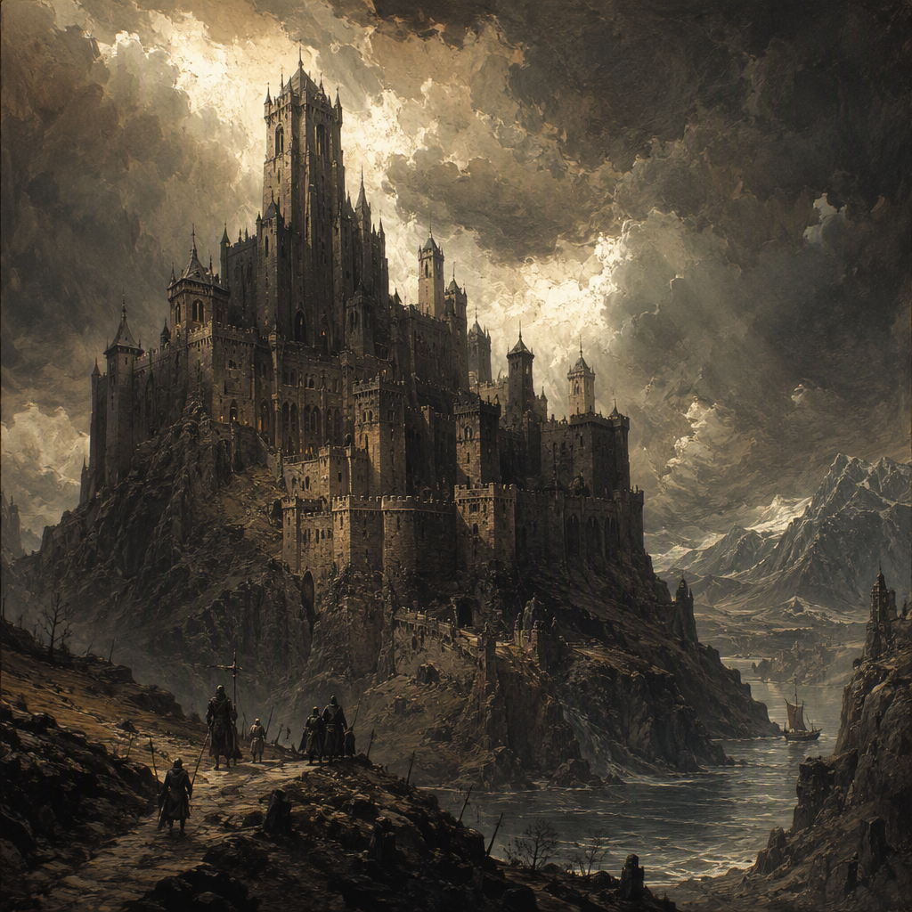

# Vharenford

Vharenford is a core location in the [[Ash Wastes]], founded in 291 AS and maintained as a garrisoned settlement. Its region is the Ash Wastes. Its hardened appearance and military readiness define both its physical character and its daily atmosphere. With a garrison strength of 3637, Vharenford is organized around vigilance, defense, and the continuous requirements of a fortified presence. [[Corvus Duskbane]] serves at Vharenford.

## Infobox

| Field | Value |
|---|---|
| Region | [[Ash Wastes]] |
| Founded | 291 AS |
| Classification | Core location |
| Garrison strength | 3637 |
| Status | garrisoned |
| Appearance | Hardened visual identity of a garrisoned settlement in the [[Ash Wastes]] |
| Demeanor | Fortified, watchful, and governed by military readiness |
| Personnel | [[Corvus Duskbane]] serves at Vharenford |

## History

Vharenford was founded in 291 AS in the [[Ash Wastes]]. Its establishment is defined by its role as a fortified settlement, and its continuing identity remains closely associated with the demands of garrison life. The settlement’s history is therefore expressed less through ornament or civic display than through the persistence of defensive purpose.

From its foundation onward, Vharenford has presented the hardened visual identity expected of a garrisoned settlement in the [[Ash Wastes]]. Its structures, boundaries, and public spaces are understood through the requirements of readiness. The settlement’s appearance communicates that it exists under military discipline: durable construction, guarded approaches, and an atmosphere in which preparedness is treated as an ordinary condition rather than an exceptional response.

The date 291 AS marks the formal foundation of Vharenford. No later founding date supersedes that designation. The settlement’s identity as a core location likewise remains central to its classification. In archival terms, Vharenford is not merely a place situated in the [[Ash Wastes]]; it is a location whose importance is bound to its fortified and garrisoned character.

Its present status is garrisoned. This status is not incidental to Vharenford’s description but one of its defining attributes. The settlement is maintained as a place of military presence, and its organization reflects that purpose. The garrison strength of 3637 gives the location a clearly defined defensive scale and distinguishes Vharenford from an undefended settlement or a site whose significance rests solely on habitation.

The effect of this history is visible in the settlement’s demeanor. Vharenford feels fortified and watchful, with military readiness governing its tone. The settlement’s past and present are consequently difficult to separate: its foundation established the conditions of its existence, while its garrisoned status continues to shape how the location is perceived.

## Relationships & Affiliations

Vharenford’s principal documented affiliation is with the [[Ash Wastes]], the region in which it lies. The Ash Wastes are Vharenford’s region, and this regional association is fundamental to the location’s identity and to its visual character. The settlement presents itself as a hardened outpost of the [[Ash Wastes]], shaped by the severe conditions implied by that setting and by the demands of maintaining a garrison there.

Its other defining relationship is institutional rather than regional. Vharenford is garrisoned, and its garrison strength is 3637. This military presence governs the settlement’s practical character, its watchfulness, and its readiness. The garrison is not treated as a peripheral feature; it is the basis for understanding Vharenford as a core location.

[[Corvus Duskbane]] serves at Vharenford. This service places [[Corvus Duskbane]] among the named personnel associated with the settlement. The available record identifies the service itself, while Vharenford’s broader military identity is established by its garrisoned status and garrison strength of 3637.

No additional affiliation is established here beyond Vharenford’s placement in the [[Ash Wastes]], its garrisoned status, and the service of [[Corvus Duskbane]]. These elements are sufficient to define the settlement’s recorded position: it is a core location in the [[Ash Wastes]], founded in 291 AS, and maintained according to military requirements.

## Tactical Assessment

Vharenford’s most important characteristic is the unity between its physical appearance and its operational purpose. It presents the hardened visual identity of a garrisoned settlement, and its demeanor is fortified, watchful, and governed by military readiness. These qualities are mutually reinforcing. The settlement looks prepared because preparedness is central to its function; it feels watchful because watchfulness is central to its status.

The garrison strength of 3637 establishes the principal measure of Vharenford’s defensive presence. That figure should be read as a defining feature of the location rather than as a minor administrative detail. It gives the settlement a substantial military profile and explains why the place is categorized as a core location. Vharenford’s importance is expressed through its maintained strength and its ability to embody a persistent state of readiness.

The settlement’s position in the [[Ash Wastes]] further informs its tactical character. Vharenford is not described as an open or unguarded community. Its hardened presentation indicates a location arranged around protection, observation, and control. The visual language of fortification is therefore also a practical language: walls, guarded spaces, and disciplined movement all belong to the same identity, even where individual structures are not specified.

Vharenford’s watchfulness also affects its atmosphere. The settlement does not project ease or looseness. Instead, its demeanor suggests an environment in which readiness is expected and where the military purpose of the location remains visible in daily life. This does not alter its classification or its foundation date, but it clarifies how those facts are experienced by those who encounter the settlement.

As a garrisoned core location, Vharenford is best understood through three fixed elements: its foundation in 291 AS, its placement in the [[Ash Wastes]], and its garrison strength of 3637. Together, these establish a settlement whose identity is fortified rather than ornamental, watchful rather than relaxed, and military in its governing character. The service of [[Corvus Duskbane]] forms part of this recorded identity without displacing the central importance of the garrison itself.

Vharenford therefore represents a location defined by endurance and readiness. Its history begins in 291 AS, its regional identity belongs to the [[Ash Wastes]], and its current status is garrisoned. Every major description of the settlement follows from those facts. Its hardened appearance, fortified demeanor, and military organization are not separate impressions but expressions of the same enduring role.